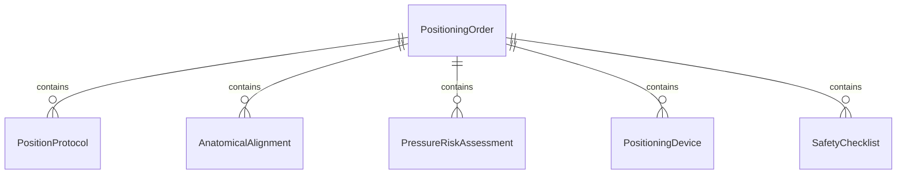
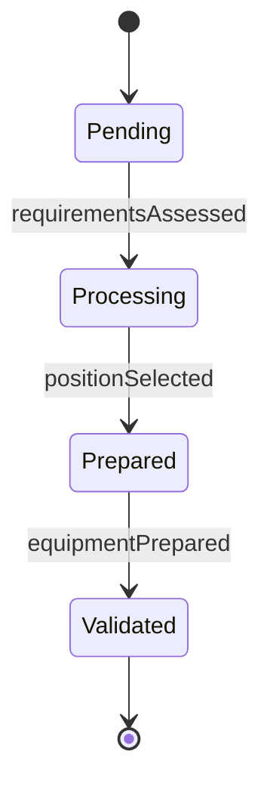
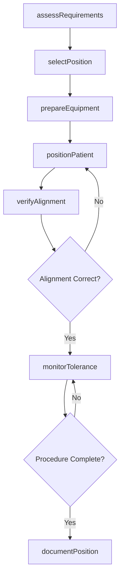
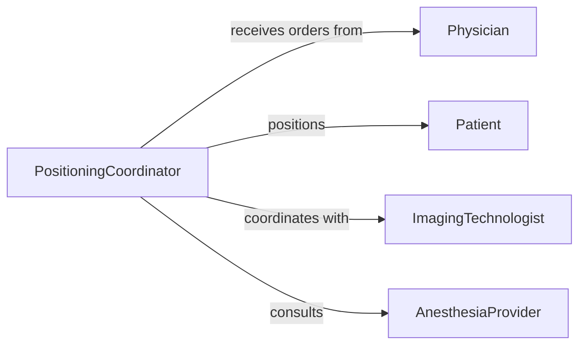

# Position Patients Treatment Examination

> Business-as-Code definition for placing patients in anatomically correct and procedure-appropriate positions to facilitate medical examinations, diagnostic imaging, and therapeutic interventions.

## Overview

Patient positioning for treatment and examination involves assessing procedure requirements, selecting appropriate position, safely moving patients, and verifying optimal alignment. This definition covers positioning protocols for diagnostic procedures, surgical interventions, imaging studies, and therapeutic treatments while ensuring patient comfort and safety.

## Actors

| Actor | Description |
|-------|-------------|
| Patient | Requires positioning for medical procedure |
| Physician | Orders specific position for examination or treatment |
| ImagingTechnologist | Requires precise positioning for diagnostic imaging |
| SurgicalTeam | Needs optimal surgical access and patient safety |
| AnesthesiaProvider | Manages airway and monitors patient during positioning |
| EquipmentVendor | Provides positioning devices and support surfaces |

## Roles

| Role | Description |
|------|-------------|
| PositioningCoordinator | Plans and directs patient positioning activities |
| RadiologyTechnologist | Positions patients for imaging procedures |
| SurgicalNurse | Ensures proper positioning during operations |
| PhysicalTherapist | Advises on body mechanics and pressure distribution |

## Entities

| Entity | Description |
|--------|-------------|
| PositioningOrder | Instructions for required patient position |
| PositionProtocol | Guidelines for specific procedure positioning |
| AnatomicalAlignment | Assessment of body positioning correctness |
| PressureRiskAssessment | Evaluation of skin breakdown potential |
| PositioningDevice | Equipment used to achieve or maintain position |
| SafetyChecklist | Verification of proper positioning elements |

## Actions

| Action | Description |
|--------|-------------|
| assessRequirements | Evaluate procedure needs and patient capabilities |
| selectPosition | Determine optimal position for procedure |
| prepareEquipment | Gather positioning devices and support surfaces |
| positionPatient | Move patient into required anatomical position |
| verifyAlignment | Confirm correct body positioning and support |
| monitorTolerance | Assess patient comfort and physiological response |
| documentPosition | Record positioning details and patient status |

## Events

| Event | Description |
|-------|-------------|
| requirementsAssessed | Procedure and patient needs evaluated |
| positionSelected | Target position determined for procedure |
| equipmentPrepared | Positioning devices ready for use |
| patientPositioned | Patient placed in required position |
| alignmentVerified | Body positioning confirmed as correct |
| toleranceMonitored | Patient response to positioning assessed |
| positionDocumented | Positioning details recorded in medical record |

## Searches

| Search | Description |
|--------|-------------|
| findPositioningOrders | Retrieve position requirements by procedure type |
| getPositionProtocols | Query standard positioning guidelines |
| getPressureAssessments | Find skin risk evaluations by patient |
| getPositioningDevices | Search available equipment by position type |


## Entity Relationships



## State Diagram


## Workflow



## Actor Relationships



## Usage

### Calling Actions

```typescript
import { positionPatientsTreatmentExamination } from '@headlessly/position-patients-treatment-examination'

const positioning = positionPatientsTreatmentExamination()

// Assess requirements for CT scan
const assessment = await positioning.assessRequirements({
  patientId: 'PT-223344',
  procedureType: 'ct-abdomen-pelvis',
  patientMobility: 'limited',
  painLevel: 3,
  respiration: 'adequate'
})

// Select appropriate position
const selected = await positioning.selectPosition({
  procedureType: 'ct-abdomen-pelvis',
  standardPosition: 'supine',
  armPosition: 'above-head',
  modifications: ['pillow-under-knees']
})

// Prepare positioning equipment
await positioning.prepareEquipment({
  position: selected.position,
  devices: [
    'radiolucent-table-pad',
    'arm-positioning-straps',
    'knee-support-bolster'
  ],
  location: 'ct-suite-2'
})

// Position patient on CT table
await positioning.positionPatient({
  patientId: 'PT-223344',
  position: 'supine',
  armPosition: 'above-head',
  legPosition: 'slightly-flexed',
  assistanceProvided: ['RT-Martinez', 'RT-Kim']
})

// Verify alignment for imaging
await positioning.verifyAlignment({
  patientId: 'PT-223344',
  bodyAlignment: 'centered-to-table',
  armPosition: 'symmetrical-above-head',
  legSupport: 'bolster-in-place',
  imageQuality: 'acceptable'
})

// Monitor during procedure
await positioning.monitorTolerance({
  patientId: 'PT-223344',
  duration: 15,
  discomfort: 'minimal',
  movement: 'none',
  vitalSigns: 'stable'
})
```

### Event-Driven Automation

```typescript
// Alert on prolonged positioning
positioning.toleranceMonitored(async ({ patientId, duration, discomfort }) => {
  if (duration > 60 && discomfort !== 'minimal') {
    await notify({
      to: 'procedure-team',
      message: `Patient ${patientId} experiencing discomfort after ${duration} minutes`,
      priority: 'review-required'
    })
  }
})

// Auto-document high-risk positioning
positioning.patientPositioned(async ({ patientId, position, devices }) => {
  const riskFactors = await assessRiskFactors(patientId)
  if (riskFactors.pressureUlcerRisk === 'high') {
    await createPressureMonitoringPlan({
      patientId,
      position,
      devices,
      checkInterval: 30
    })
  }
})
```
