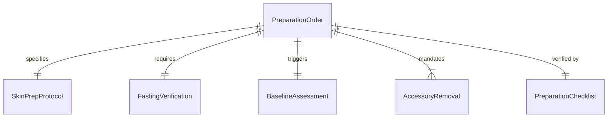
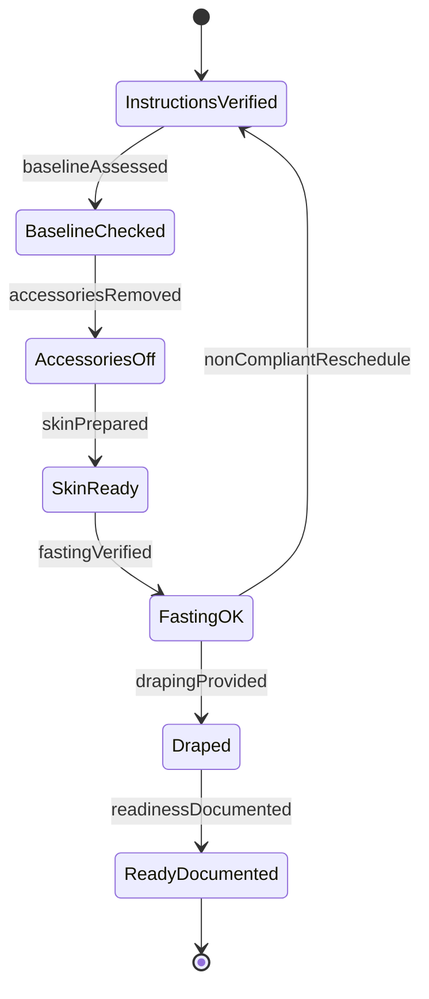
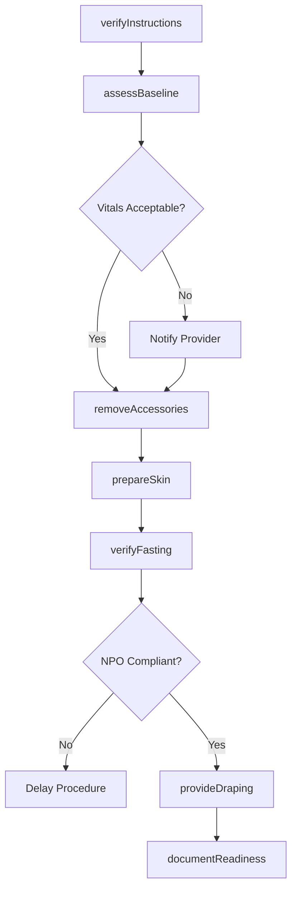
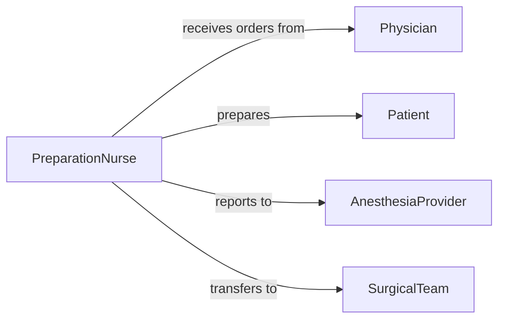

# Prepare Patients Physically Medical Procedures

> Business-as-Code definition for readying patients' bodies and physical state prior to medical procedures through skin preparation, removal of accessories, fasting verification, and pre-procedural assessments.

## Overview

Physical patient preparation encompasses all activities to ensure patient readiness for procedures, including skin cleansing, hair removal, jewelry removal, bowel preparation, fasting compliance, and baseline vital sign assessment. This definition models the complete pre-procedure workflow from initial assessment through final verification before procedure start.

## Actors

| Actor | Description |
|-------|-------------|
| Patient | Undergoes physical preparation for medical procedure |
| Physician | Orders procedure and specific preparation requirements |
| AnesthesiaProvider | Reviews preparation status before sedation |
| SurgicalTeam | Requires properly prepared surgical site |
| PreOpNurse | Verifies preparation compliance in holding area |
| PharmacyServices | Provides bowel preparation or pre-procedure medications |

## Roles

| Role | Description |
|------|-------------|
| PreparationNurse | Conducts physical preparation activities |
| PreAdmissionCoordinator | Educates patient on preparation requirements |
| SkinPrepSpecialist | Performs surgical site preparation |
| VitalSignsTechnician | Obtains baseline physiological measurements |

## Entities

| Entity | Description |
|--------|-------------|
| PreparationOrder | Instructions for physical preparation requirements |
| SkinPrepProtocol | Guidelines for surgical site cleansing |
| FastingVerification | Confirmation of NPO compliance |
| BaselineAssessment | Pre-procedure vital signs and physical status |
| AccessoryRemoval | Documentation of jewelry, devices, and prosthetics removed |
| PreparationChecklist | Verification of all preparation steps completed |

## Actions

| Action | Description |
|--------|-------------|
| verifyInstructions | Confirm patient completed pre-procedure requirements |
| assessBaseline | Obtain vital signs and physical examination |
| removeAccessories | Remove jewelry, prosthetics, and personal items |
| prepareSkin | Cleanse and disinfect surgical or procedure site |
| verifyfasting | Confirm NPO compliance and last oral intake |
| provideDraping | Apply procedure-appropriate gowns and drapes |
| documentReadiness | Record completion of all preparation steps |

## Events

| Event | Description |
|-------|-------------|
| instructionsVerified | Pre-procedure requirements confirmed completed |
| baselineAssessed | Vital signs and physical status documented |
| accessoriesRemoved | Personal items and devices removed and secured |
| skinPrepared | Surgical site cleansed and disinfected |
| fastingVerified | NPO compliance confirmed |
| drapingProvided | Procedure gown and drapes applied |
| readinessDocumented | All preparation steps completed and recorded |

## Searches

| Search | Description |
|--------|-------------|
| findPreparationOrders | Retrieve preparation requirements by procedure type |
| getSkinPrepProtocols | Query site preparation guidelines by procedure |
| getBaselineAssessments | Find pre-procedure vital signs by patient |
| getPreparationChecklists | Search completed preparation verifications |


## Entity Relationships



## State Diagram


## Workflow



## Actor Relationships



## Usage

### Calling Actions

```typescript
import { preparePatientsPhysicallyMedicalProcedures } from '@headlessly/prepare-patients-physically-medical-procedures'

const preparation = preparePatientsPhysicallyMedicalProcedures()

// Verify pre-procedure instructions compliance
const verification = await preparation.verifyInstructions({
  patientId: 'PT-667788',
  procedureType: 'colonoscopy',
  bowelPrepCompleted: true,
  fastingSince: '2026-02-04T22:00:00Z',
  medicationsHeld: ['aspirin', 'warfarin']
})

// Assess baseline status
await preparation.assessBaseline({
  patientId: 'PT-667788',
  vitalSigns: {
    bloodPressure: '132/78',
    heartRate: 68,
    temperature: 98.2,
    oxygenSaturation: 98
  },
  weight: 185,
  allergies: ['penicillin']
})

// Remove accessories and secure belongings
await preparation.removeAccessories({
  patientId: 'PT-667788',
  itemsRemoved: [
    { item: 'wedding-ring', secured: 'taped-to-finger' },
    { item: 'partial-denture', secured: 'labeled-container' },
    { item: 'hearing-aid', secured: 'bedside-drawer' }
  ],
  valuablesInventory: 'completed'
})

// Prepare skin for procedure
await preparation.prepareSkin({
  patientId: 'PT-667788',
  procedureType: 'colonoscopy',
  sitePrep: 'perineal-cleansing',
  solution: 'chlorhexidine',
  preparedBy: 'RN-Thompson'
})

// Verify fasting compliance
await preparation.verifyFasting({
  patientId: 'PT-667788',
  lastOralIntake: '2026-02-04T22:00:00Z',
  hoursNPO: 10,
  compliant: true
})

// Provide procedure draping
await preparation.provideDraping({
  patientId: 'PT-667788',
  gownProvided: 'open-back',
  privacyDraping: 'applied',
  warmBlankets: 2
})
```

### Event-Driven Automation

```typescript
// Alert on abnormal baseline vitals
preparation.baselineAssessed(async ({ patientId, vitalSigns }) => {
  if (vitalSigns.systolic > 180 || vitalSigns.diastolic > 110) {
    await notify({
      to: 'anesthesia-provider',
      urgent: true,
      message: `Elevated BP in patient ${patientId} - review before procedure`
    })
  }
})

// Auto-delay procedure for fasting non-compliance
preparation.fastingVerified(async ({ patientId, compliant, lastOralIntake }) => {
  if (!compliant) {
    await delayProcedure({
      patientId,
      reason: 'npo-non-compliance',
      lastIntake: lastOralIntake,
      minimumDelay: 2
    })
    await notifyScheduling({
      patientId,
      action: 'reschedule-required'
    })
  }
})
```
