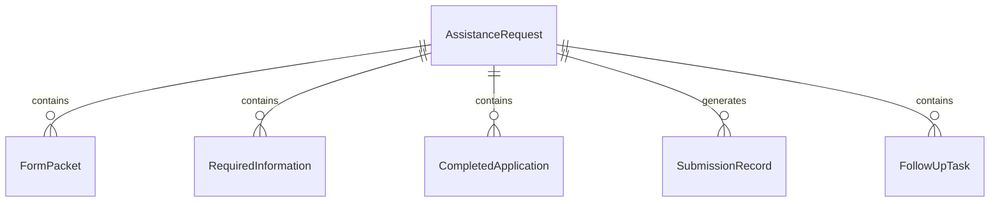
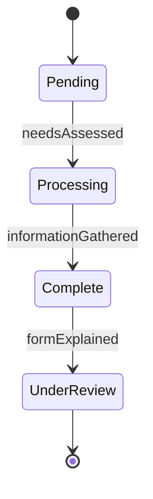
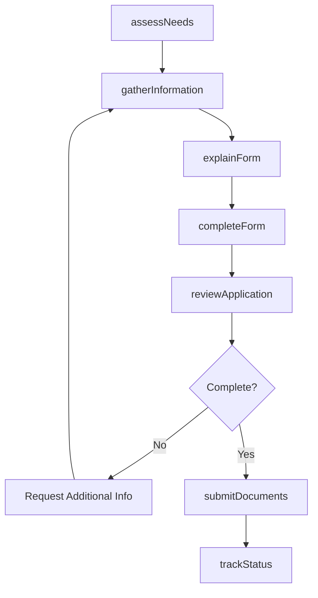
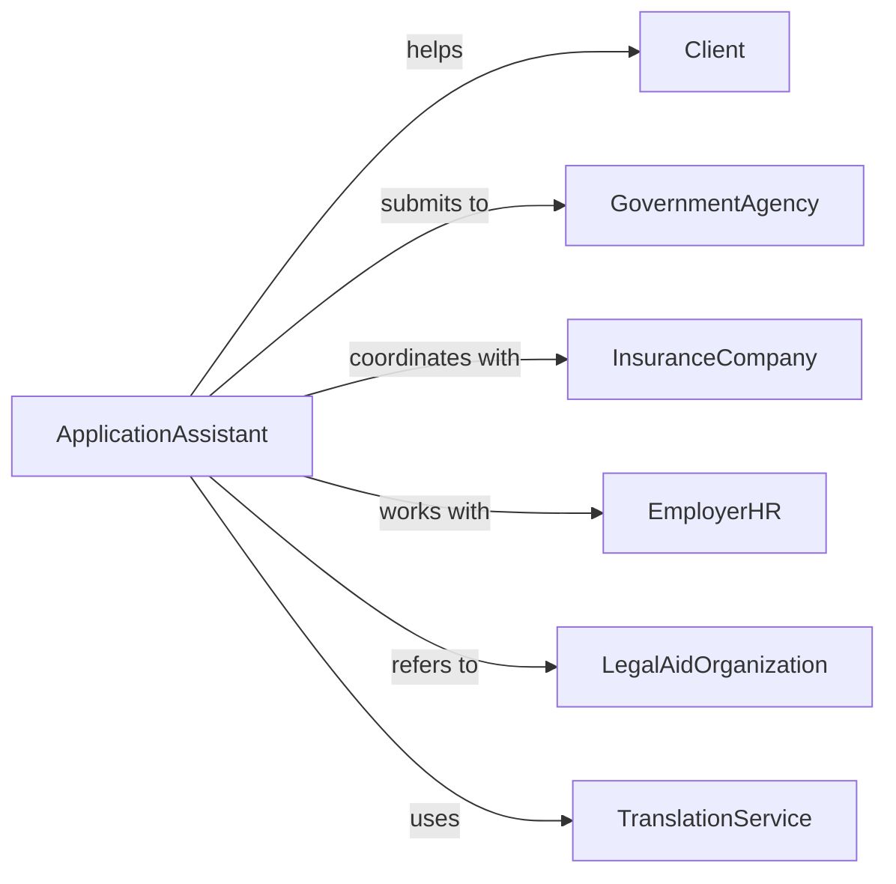

# Assist Individuals Paperwork

> Business-as-Code definition for paperwork assistance services. Models form completion, document preparation, and administrative support for individuals navigating complex documentation requirements.

## Overview

Paperwork assistance involves helping individuals understand forms, gather required information, complete applications, and submit documentation correctly. This definition supports social services, healthcare enrollment, legal aid, and benefits administration by streamlining document workflows and reducing errors.

## Actors

| Actor | Description |
|-------|-------------|
| Client | Individual requiring assistance with forms and documents |
| GovernmentAgency | Receives applications for benefits or services |
| InsuranceCompany | Processes enrollment and claims paperwork |
| EmployerHR | Manages employee onboarding and benefits forms |
| LegalAidOrganization | Provides guidance on legal document preparation |
| TranslationService | Converts forms into client's preferred language |

## Roles

| Role | Description |
|------|-------------|
| IntakeSpecialist | Assesses client needs and identifies required forms |
| ApplicationAssistant | Guides clients through form completion process |
| DocumentReviewer | Verifies completeness and accuracy before submission |
| SubmissionCoordinator | Routes completed paperwork to appropriate agencies |

## Entities

| Entity | Description |
|--------|-------------|
| AssistanceRequest | Client inquiry for help with specific paperwork |
| FormPacket | Collection of documents required for application |
| RequiredInformation | Data elements needed to complete forms |
| CompletedApplication | Filled forms ready for review and submission |
| SubmissionRecord | Tracking information for submitted paperwork |
| FollowUpTask | Action needed to complete application process |

## Actions

| Action | Description |
|--------|-------------|
| assessNeeds | Determine what forms and assistance client requires |
| gatherInformation | Collect required data and supporting documents |
| explainForm | Help client understand form questions and requirements |
| completeForm | Fill out application with client-provided information |
| reviewApplication | Check for completeness, accuracy, and required signatures |
| submitDocuments | File paperwork with appropriate agency or organization |
| trackStatus | Monitor application progress and follow up as needed |

## Events

| Event | Description |
|-------|-------------|
| needsAssessed | Client requirements identified and documented |
| informationGathered | Required data and documents collected |
| formExplained | Client understands form sections and requirements |
| formCompleted | Application filled out and ready for review |
| applicationReviewed | Completeness and accuracy verified |
| documentsSubmitted | Paperwork filed with receiving organization |
| statusTracked | Application progress monitored and updated |

## Searches

| Search | Description |
|--------|-------------|
| findRequests | List assistance requests by client, status, or type |
| getForms | Retrieve form templates by agency or purpose |
| getApplications | Find completed applications by client or submission date |
| getFollowUps | View pending tasks by due date or client |


## Entity Relationships



## State Diagram


## Workflow



## Actor Relationships



## Usage

### Calling Actions

```typescript
import { assistIndividualsPaperwork } from '@headlessly/assist-individuals-paperwork'

const paperwork = assistIndividualsPaperwork()

// Assess client's paperwork needs
const assessment = await paperwork.assessNeeds({
  clientId: 'CLT-2026-890',
  situation: 'Need to apply for Medicaid and SNAP benefits',
  challenges: ['Limited English', 'Never completed government forms'],
  urgency: 'High - benefits expired last month'
})

// Gather required information
await paperwork.gatherInformation({
  requestId: assessment.id,
  requiredDocs: [
    'Photo ID',
    'Proof of income (last 2 pay stubs)',
    'Proof of residence',
    'Social Security card'
  ],
  dataNeeded: {
    household: { size: 3, members: ['Self', 'Spouse', 'Child age 5'] },
    income: { monthly: 2400, source: 'Part-time employment' },
    expenses: { rent: 1200, utilities: 150 }
  }
})

// Complete Medicaid application
await paperwork.completeForm({
  requestId: assessment.id,
  formType: 'Medicaid Application',
  responses: {
    personalInfo: { name: 'Jane Doe', ssn: '***-**-1234', dob: '1985-03-15' },
    householdInfo: { size: 3, totalIncome: 2400 },
    contactInfo: { phone: '555-0123', address: '123 Main St' }
  },
  signatures: ['Client signature obtained']
})

// Submit completed application
await paperwork.submitDocuments({
  requestId: assessment.id,
  submissionMethod: 'Online portal',
  agency: 'State Department of Health Services',
  confirmationNumber: 'MCD-2026-78901',
  submittedDate: '2026-02-05'
})
```

### Event-Driven Automation

```typescript
// Auto-create follow-up tasks after submission
paperwork.documentsSubmitted(async ({ requestId, agency, confirmationNumber }) => {
  await paperwork.trackStatus({
    requestId,
    followUpTasks: [
      { action: 'Check application status', dueDate: '2026-02-19' },
      { action: 'Respond to any agency requests', status: 'Pending' }
    ]
  })
})

// Alert on missing required documents
paperwork.applicationReviewed(async ({ requestId, missingDocs }) => {
  if (missingDocs.length > 0) {
    await notify({
      to: 'intake-specialist',
      message: `Request ${requestId} missing: ${missingDocs.join(', ')}`
    })
  }
})
```
