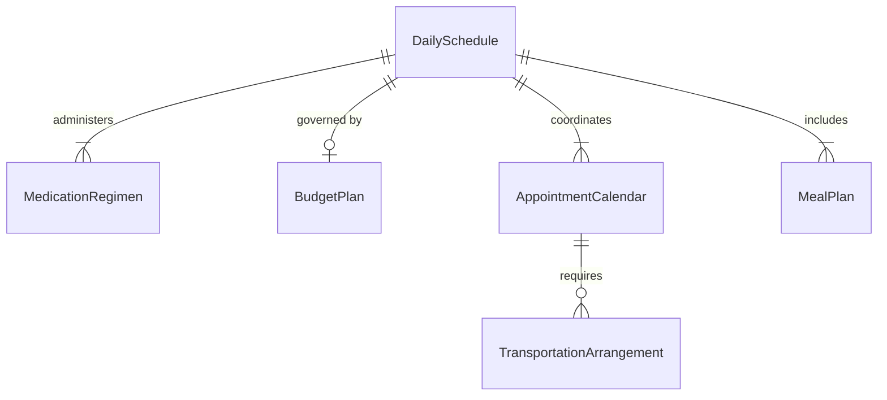
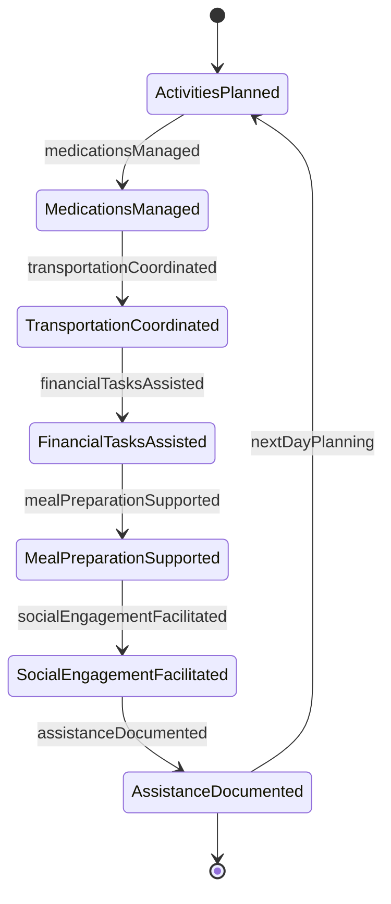
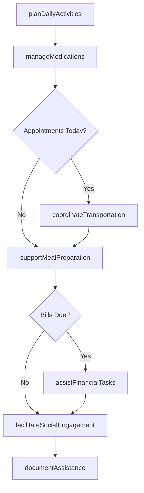
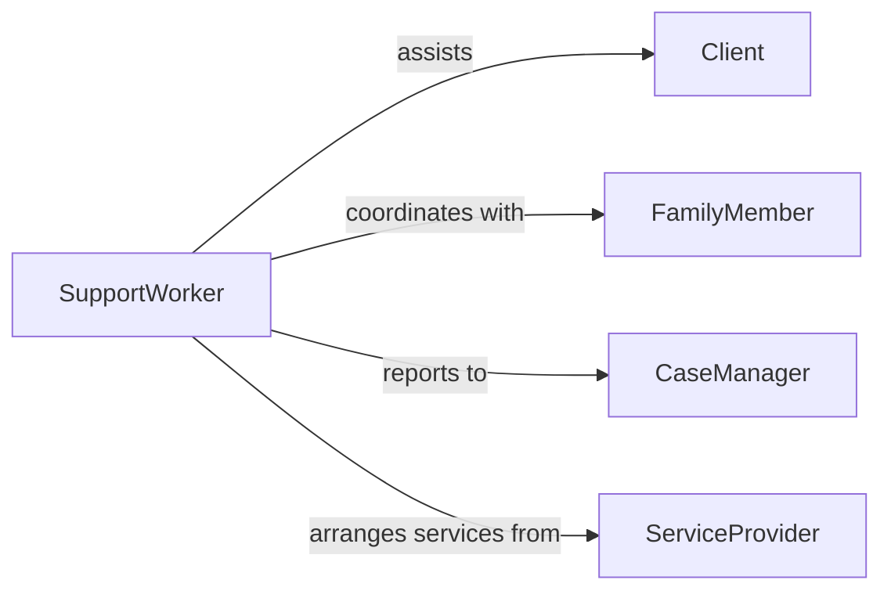

# Assist Clients Handling Details Daily

> Business-as-Code definition for supporting individuals with disabilities or special needs in managing daily living tasks, financial matters, household management, and community engagement.

## Overview

Daily life assistance encompasses helping clients navigate routine activities including meal planning, medication management, appointment scheduling, bill payment, transportation coordination, and social engagement. This definition models comprehensive support services that promote independence while ensuring safety and well-being for individuals with cognitive, physical, or developmental challenges.

## Actors

| Actor | Description |
|-------|-------------|
| Client | Individual requiring assistance with daily living tasks |
| FamilyMember | Provides informal support and oversight |
| CaseManager | Coordinates services and monitors client well-being |
| ServiceProvider | Delivers specialized support services |
| HealthcareProvider | Manages medical needs and treatment plans |
| FinancialInstitution | Provides banking and payment services |

## Roles

| Role | Description |
|------|-------------|
| SupportWorker | Provides direct daily living assistance |
| LifeSkillsCoach | Teaches independent living capabilities |
| MedicationManager | Oversees medication adherence and refills |
| TransportationCoordinator | Arranges rides and travel support |

## Entities

| Entity | Description |
|--------|-------------|
| DailySchedule | Planned activities and tasks for the day |
| MedicationRegimen | Prescribed medications and administration schedule |
| BudgetPlan | Financial resources and spending guidelines |
| AppointmentCalendar | Healthcare and service appointments |
| MealPlan | Nutritional planning and grocery needs |
| TransportationArrangement | Travel logistics and ride coordination |

## Actions

| Action | Description |
|--------|-------------|
| planDailyActivities | Schedule tasks and appointments for the day |
| manageMedications | Ensure proper medication administration and tracking |
| coordinateTransportation | Arrange rides to appointments and activities |
| assistFinancialTasks | Help with bill payment and budget management |
| supportMealPreparation | Aid in meal planning and food preparation |
| facilitateSocialEngagement | Connect client with community activities |
| documentAssistance | Record support provided and client progress |

## Events

| Event | Description |
|-------|-------------|
| activitiesPlanned | Daily schedule created and reviewed with client |
| medicationsManaged | Medications administered or supervised |
| transportationCoordinated | Rides arranged and confirmed |
| financialTasksAssisted | Bills paid or budget reviewed |
| mealPreparationSupported | Meals planned or prepared with client |
| socialEngagementFacilitated | Community activity arranged or attended |
| assistanceDocumented | Support services recorded in care log |

## Searches

| Search | Description |
|--------|-------------|
| findDailySchedules | Retrieve planned activities by client or date |
| getMedicationRegimens | Query medication schedules and adherence |
| getAppointments | Find upcoming healthcare and service appointments |
| getTransportationArrangements | Search ride coordination by date |


## Entity Relationships



## State Diagram


## Workflow



## Actor Relationships



## Usage

### Calling Actions

```typescript
import { assistClientsHandlingDetailsDaily } from '@headlessly/assist-clients-handling-details-daily'

const assistance = assistClientsHandlingDetailsDaily()

// Plan daily activities with client
const schedule = await assistance.planDailyActivities({
  clientId: 'CL-445566',
  date: '2026-02-06',
  activities: [
    { time: '08:00', task: 'morning-routine', assistance: 'supervision' },
    { time: '09:00', task: 'breakfast', assistance: 'meal-prep' },
    { time: '10:30', task: 'physical-therapy-appointment', assistance: 'transportation' },
    { time: '14:00', task: 'grocery-shopping', assistance: 'full-support' },
    { time: '17:00', task: 'dinner-preparation', assistance: 'partial-support' }
  ],
  notes: 'client-prefers-afternoon-activities'
})

// Manage medication administration
await assistance.manageMedications({
  clientId: 'CL-445566',
  scheduledTime: '08:30',
  medications: [
    { name: 'levothyroxine', dose: '50mcg', administered: true },
    { name: 'multivitamin', dose: '1-tablet', administered: true }
  ],
  administeredBy: 'SW-Davis',
  clientCompliance: 'cooperative'
})

// Coordinate transportation to appointment
await assistance.coordinateTransportation({
  clientId: 'CL-445566',
  destination: 'physical-therapy-clinic',
  pickupTime: '10:15',
  appointmentTime: '10:30',
  transportMode: 'paratransit',
  returnTime: '12:00',
  accompaniment: 'support-worker'
})

// Assist with bill payment
await assistance.assistFinancialTasks({
  clientId: 'CL-445566',
  taskType: 'bill-payment',
  bills: [
    { payee: 'electric-company', amount: 87.43, dueDate: '2026-02-10' },
    { payee: 'internet-provider', amount: 59.99, dueDate: '2026-02-08' }
  ],
  paymentMethod: 'online-banking',
  assistedBy: 'SW-Davis'
})

// Support meal preparation
await assistance.supportMealPreparation({
  clientId: 'CL-445566',
  meal: 'dinner',
  menuItem: 'spaghetti-with-salad',
  assistanceLevel: 'partial',
  clientParticipation: ['stirring-sauce', 'setting-table'],
  safetySupervision: 'stove-monitoring'
})
```

### Event-Driven Automation

```typescript
// Alert on missed medication
assistance.medicationsManaged(async ({ clientId, medications, scheduledTime }) => {
  const missedMeds = medications.filter(m => !m.administered)
  if (missedMeds.length > 0) {
    await notify({
      to: 'case-manager',
      message: `Client ${clientId} missed ${missedMeds.length} medications at ${scheduledTime}`,
      priority: 'high'
    })
  }
})

// Auto-document transportation completion
assistance.transportationCoordinated(async ({ clientId, destination, returnTime }) => {
  if (new Date() > new Date(returnTime)) {
    await assistance.documentAssistance({
      clientId,
      date: new Date(),
      service: 'transportation',
      details: `Completed trip to ${destination}`,
      outcome: 'successful'
    })
  }
})
```
