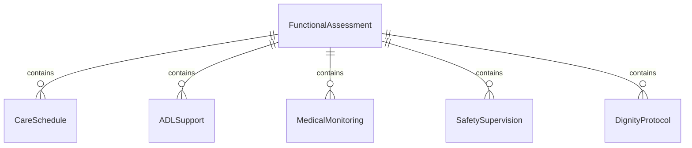
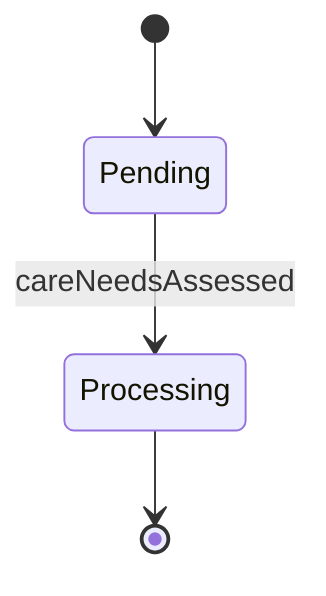
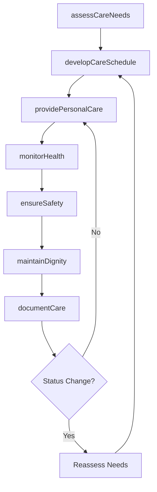
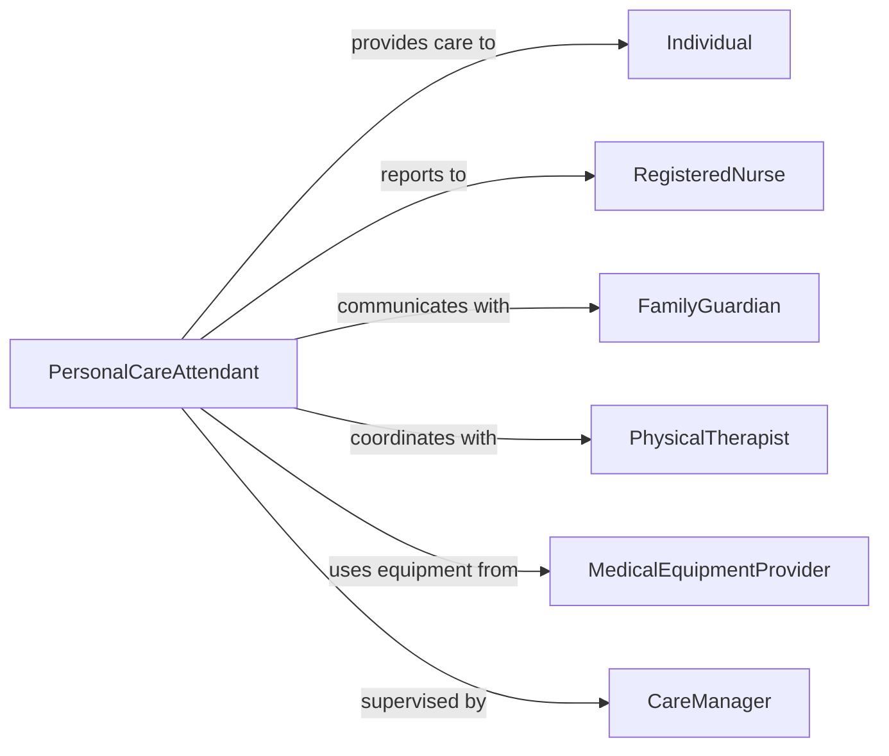

# Assist Disabled Incapacitated Individuals

> Business-as-Code definition for disability and incapacitation support services. Models comprehensive care delivery for individuals with severe limitations requiring extensive assistance with all aspects of daily living.

## Overview

Assisting disabled or incapacitated individuals involves providing total care support for those unable to perform activities of daily living independently due to physical, cognitive, or medical conditions. This definition coordinates personal care, medical monitoring, safety supervision, and dignity-centered assistance.

## Actors

| Actor | Description |
|-------|-------------|
| Individual | Person with disability or incapacitation requiring care |
| FamilyGuardian | Legal decision-maker and care coordinator |
| MedicalProvider | Oversees health status and prescribes treatments |
| PhysicalTherapist | Provides mobility and positioning interventions |
| MedicalEquipmentProvider | Supplies hospital bed, lift, and assistive devices |
| LongTermCareFacility | Residential care setting for 24-hour support |

## Roles

| Role | Description |
|------|-------------|
| PersonalCareAttendant | Provides hands-on assistance with all ADLs |
| RegisteredNurse | Manages medical needs and supervises care staff |
| CertifiedNursingAssistant | Delivers direct care under nursing supervision |
| CareManager | Coordinates services and oversees care quality |

## Entities

| Entity | Description |
|--------|-------------|
| FunctionalAssessment | Evaluation of total care needs and support level |
| CareSchedule | 24-hour plan for personal care and medical tasks |
| ADLSupport | Assistance with bathing, dressing, toileting, feeding, mobility |
| MedicalMonitoring | Vital signs tracking, medication administration, wound care |
| SafetySupervision | Fall prevention, wandering prevention, emergency response |
| DignityProtocol | Person-centered approaches respecting autonomy and privacy |

## Actions

| Action | Description |
|--------|-------------|
| assessCareNeeds | Evaluate total support requirements and dependencies |
| developCareSchedule | Create 24-hour plan for all personal and medical care |
| providePersonalCare | Assist with bathing, dressing, toileting, grooming, feeding |
| monitorHealth | Track vital signs, administer medications, manage medical devices |
| ensureSafety | Prevent falls, supervise activity, respond to emergencies |
| maintainDignity | Respect privacy, provide choices, preserve personal identity |
| documentCare | Record all care activities, health status, and incidents |

## Events

| Event | Description |
|-------|-------------|
| careNeedsAssessed | Total support requirements documented |
| careScheduleDeveloped | 24-hour care plan created and approved |
| personalCareProvided | ADL assistance completed with dignity maintained |
| healthMonitored | Medical status assessed and documented |
| safetyEnsured | Supervision provided and hazards mitigated |
| dignityMaintained | Person-centered care delivered respectfully |
| careDocumented | Activities and status recorded in care log |

## Searches

| Search | Description |
|--------|-------------|
| findIndividuals | List clients by care level, location, or staff assignment |
| getCareSchedules | Retrieve 24-hour care plans by individual or date |
| getHealthRecords | Find medical monitoring data and vital sign trends |
| getIncidents | Review safety events, falls, or care concerns |


## Entity Relationships



## State Diagram


## Workflow



## Actor Relationships



## Usage

### Calling Actions

```typescript
import { assistDisabledIncapacitatedIndividuals } from '@headlessly/assist-disabled-incapacitated-individuals'

const care = assistDisabledIncapacitatedIndividuals()

// Assess total care needs
const assessment = await care.assessCareNeeds({
  individualId: 'IND-2026-567',
  condition: 'Advanced Parkinson disease with severe mobility impairment',
  adlStatus: {
    bathing: 'Total dependence - requires 2-person assist with lift',
    dressing: 'Total dependence - requires full assistance',
    toileting: 'Total dependence - uses catheter and incontinence products',
    feeding: 'Moderate dependence - requires setup and supervision',
    mobility: 'Total dependence - bedbound, requires lift for transfers'
  },
  medicalNeeds: ['Medication administration 4x daily', 'Vital sign monitoring', 'Skin integrity checks'],
  cognitiveStatus: 'Alert and oriented, communicates needs verbally'
})

// Develop 24-hour care schedule
await care.developCareSchedule({
  assessmentId: assessment.id,
  schedule: [
    { time: '07:00', tasks: ['Morning care', 'Bed bath', 'Dressing', 'Medications'] },
    { time: '08:00', tasks: ['Breakfast setup', 'Feeding assistance', 'Oral care'] },
    { time: '10:00', tasks: ['Repositioning', 'Skin check', 'Toileting'] },
    { time: '12:00', tasks: ['Lunch setup', 'Feeding assistance', 'Medications'] },
    { time: '14:00', tasks: ['Repositioning', 'Toileting', 'Recreation activity'] },
    { time: '17:00', tasks: ['Dinner setup', 'Feeding assistance', 'Medications'] },
    { time: '19:00', tasks: ['Evening care', 'Dressing for bed', 'Oral care'] },
    { time: '22:00', tasks: ['Final repositioning', 'Nighttime medications'] }
  ],
  staffing: '2 CNAs per shift for safe transfers'
})

// Document care provided
await care.documentCare({
  individualId: 'IND-2026-567',
  date: '2026-02-05',
  shift: 'Day shift',
  careProvided: [
    'Complete bed bath with 2-person assist, skin intact, no redness noted',
    'Dressed in comfortable clothing per individual preference',
    'Medications administered on schedule, no adverse reactions',
    'Fed 3 meals with setup and supervision, adequate intake',
    'Repositioned every 2 hours, pressure relief maintained'
  ],
  healthStatus: 'Vital signs stable, alert and conversational, no concerns',
  dignityMaintained: 'Offered choices for clothing and meal timing, privacy maintained during personal care'
})
```

### Event-Driven Automation

```typescript
// Alert on health status changes
care.healthMonitored(async ({ individualId, vitalSigns, alerts }) => {
  if (alerts.length > 0) {
    await notify({
      to: 'registered-nurse',
      priority: 'urgent',
      message: `Health alerts for ${individualId}: ${alerts.join(', ')}`
    })
  }
})

// Schedule reassessment on functional decline
care.careDocumented(async ({ individualId, functionalChange }) => {
  if (functionalChange === 'decline') {
    await scheduleAssessment({
      individualId,
      type: 'Comprehensive reassessment',
      reason: 'Functional status decline noted',
      dueDate: 'Within 72 hours'
    })
  }
})
```
