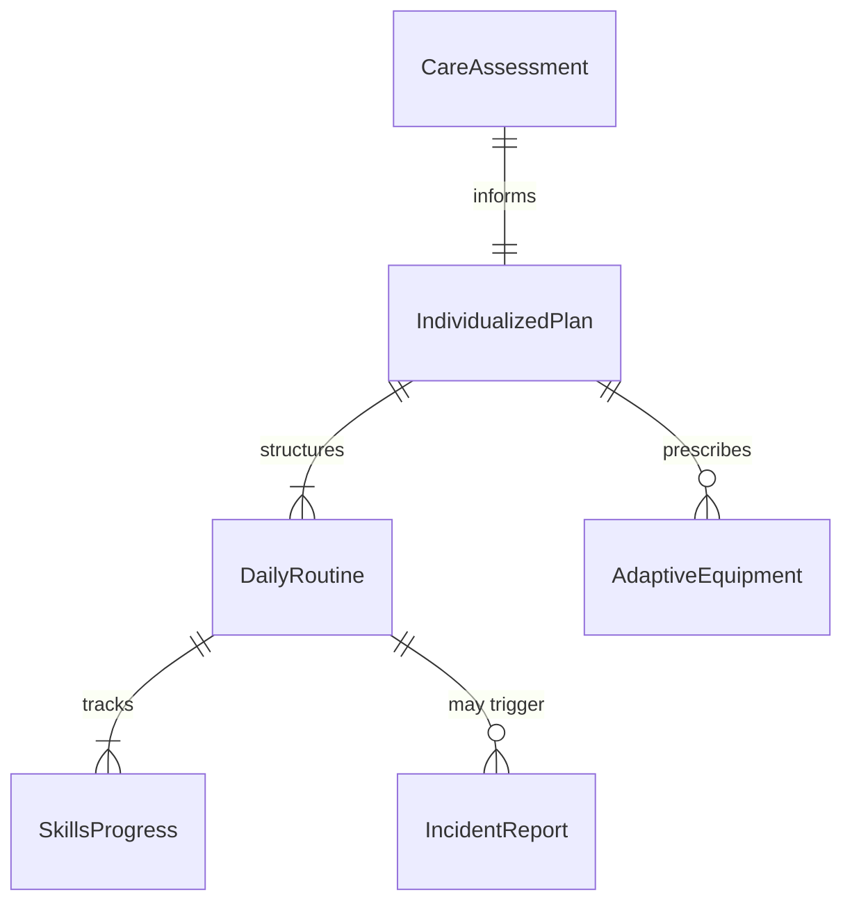
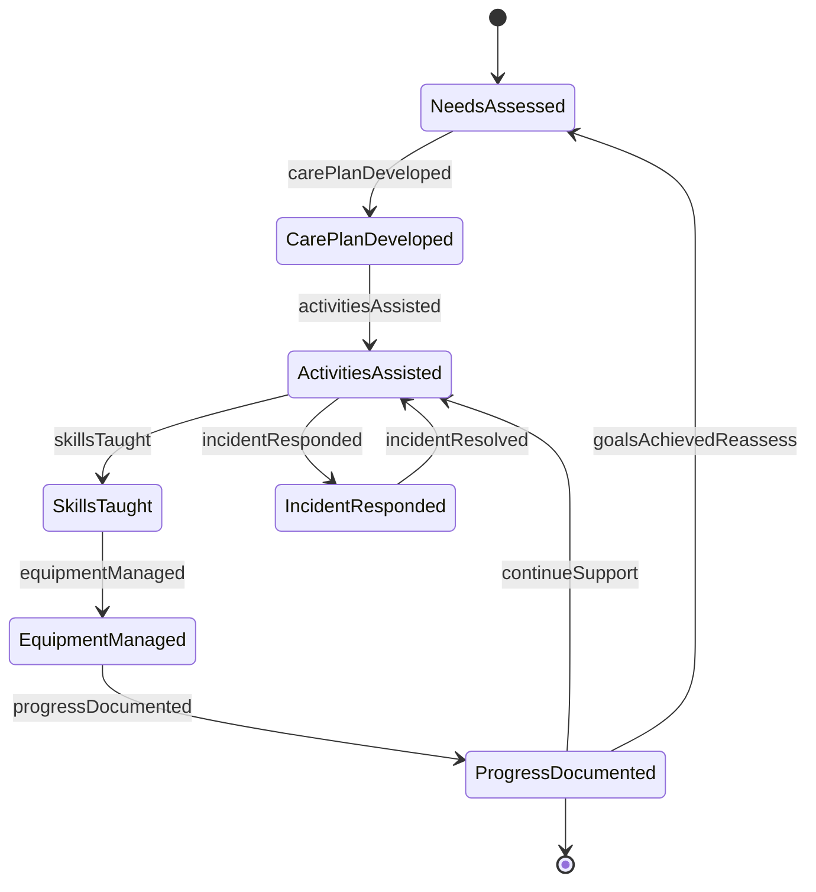
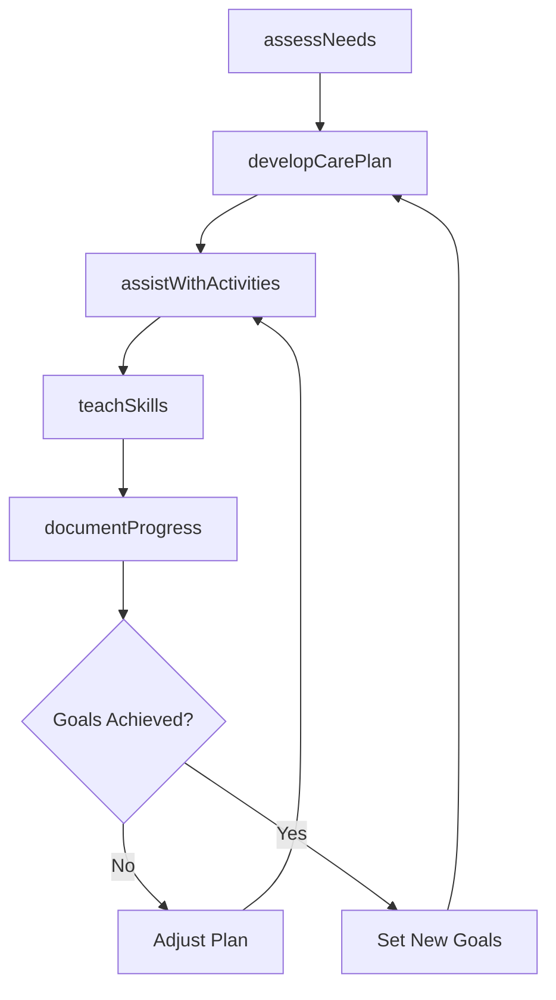
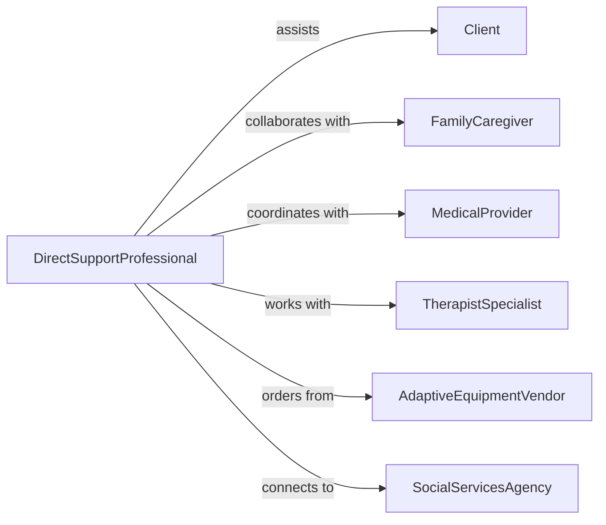

# Assist Individuals Special Needs

> Business-as-Code definition for special needs assistance services. Models comprehensive support for individuals with disabilities or functional limitations across daily living, healthcare, and community integration.

## Overview

Special needs assistance involves providing personalized support for individuals with physical, cognitive, or developmental disabilities. This definition coordinates care planning, activity assistance, adaptive equipment management, and progress tracking to promote independence and quality of life.

## Actors

| Actor | Description |
|-------|-------------|
| Client | Individual with special needs requiring assistance |
| FamilyCaregiver | Provides informal support and participates in care |
| MedicalProvider | Prescribes treatments and adaptive equipment |
| TherapistSpecialist | Delivers occupational, physical, or speech therapy |
| AdaptiveEquipmentVendor | Supplies assistive devices and modifications |
| SocialServicesAgency | Coordinates benefits and community resources |

## Roles

| Role | Description |
|------|-------------|
| DirectSupportProfessional | Provides hands-on daily living assistance |
| CareCoordinator | Develops and oversees individualized care plans |
| SkillsDevelopmentSpecialist | Teaches self-care and independence skills |
| CommunityIntegrationCoach | Facilitates participation in social activities |

## Entities

| Entity | Description |
|--------|-------------|
| CareAssessment | Evaluation of functional abilities and support needs |
| IndividualizedPlan | Personalized goals and support strategies |
| DailyRoutine | Scheduled activities and assistance requirements |
| AdaptiveEquipment | Assistive devices supporting independence |
| SkillsProgress | Tracked improvements in self-care capabilities |
| IncidentReport | Documentation of accidents, behaviors, or health changes |

## Actions

| Action | Description |
|--------|-------------|
| assessNeeds | Evaluate functional abilities and support requirements |
| developCarePlan | Create individualized goals and support strategies |
| assistWithActivities | Provide hands-on help with daily living tasks |
| teachSkills | Train client in self-care and independence activities |
| manageEquipment | Maintain and adapt assistive devices as needed |
| documentProgress | Record skill development and goal achievement |
| respondToIncidents | Handle emergencies, behaviors, or health changes |

## Events

| Event | Description |
|-------|-------------|
| needsAssessed | Functional evaluation completed with support recommendations |
| carePlanDeveloped | Individualized plan created and approved |
| activitiesAssisted | Daily living support provided and documented |
| skillsTaught | Training session completed with client |
| equipmentManaged | Assistive device adjusted or replaced |
| progressDocumented | Skills assessment updated with current status |
| incidentResponded | Emergency or unusual situation addressed |

## Searches

| Search | Description |
|--------|-------------|
| findClients | List individuals by support level, location, or status |
| getCarePlans | Retrieve individualized plans by client or goal area |
| getRoutines | Find daily schedules by client or time period |
| getIncidents | Review documented events by client, type, or date |


## Entity Relationships



## State Diagram


## Workflow



## Actor Relationships



## Usage

### Calling Actions

```typescript
import { assistIndividualsSpecialNeeds } from '@headlessly/assist-individuals-special-needs'

const support = assistIndividualsSpecialNeeds()

// Assess client's support needs
const assessment = await support.assessNeeds({
  clientId: 'CLT-2026-234',
  functionalAreas: {
    mobility: 'Requires wheelchair, transfers with assistance',
    communication: 'Uses augmentative device for speech',
    selfCare: 'Needs help with bathing, dressing, toileting',
    cognition: 'Difficulty with multi-step tasks, benefits from visual cues'
  },
  supportLevel: 'Extensive - requires assistance throughout day'
})

// Develop individualized care plan
await support.developCarePlan({
  assessmentId: assessment.id,
  goals: [
    { area: 'Self-care', goal: 'Complete tooth brushing independently', timeframe: '3 months' },
    { area: 'Social', goal: 'Participate in community outing weekly', timeframe: 'Ongoing' },
    { area: 'Communication', goal: 'Use AAC device for all requests', timeframe: '6 months' }
  ],
  strategies: [
    'Break tasks into simple steps with visual schedule',
    'Provide verbal and physical prompting as needed',
    'Use positive reinforcement for skill attempts'
  ]
})

// Assist with daily activities
await support.assistWithActivities({
  clientId: 'CLT-2026-234',
  date: '2026-02-05',
  activities: [
    { type: 'Morning routine', support: 'Physical assistance with dressing, verbal cues for hygiene' },
    { type: 'Meal preparation', support: 'Hand-over-hand guidance using adaptive utensils' },
    { type: 'Community outing', support: 'Accompanied to library program, facilitated social interaction' }
  ]
})

// Document skill development progress
await support.documentProgress({
  clientId: 'CLT-2026-234',
  reportingPeriod: 'Q1 2026',
  skillAreas: [
    { skill: 'Tooth brushing', status: 'Completes with verbal prompts, working toward independence' },
    { skill: 'AAC device use', status: 'Requests preferred items, expanding vocabulary' },
    { skill: 'Community participation', status: 'Attended 4 outings, increased comfort with public settings' }
  ]
})
```

### Event-Driven Automation

```typescript
// Alert on incident requiring immediate attention
support.incidentResponded(async ({ clientId, incidentType, severity }) => {
  if (severity === 'high' || incidentType === 'medical emergency') {
    await notify({
      to: ['care-coordinator', 'emergency-contact'],
      priority: 'urgent',
      message: `${incidentType} reported for client ${clientId}`
    })
  }
})

// Schedule review when goals achieved
support.progressDocumented(async ({ clientId, goalsAchieved }) => {
  if (goalsAchieved >= 3) {
    await scheduleReview({
      clientId,
      purpose: 'Update care plan with new goals',
      dueDate: 'Within 2 weeks'
    })
  }
})
```
