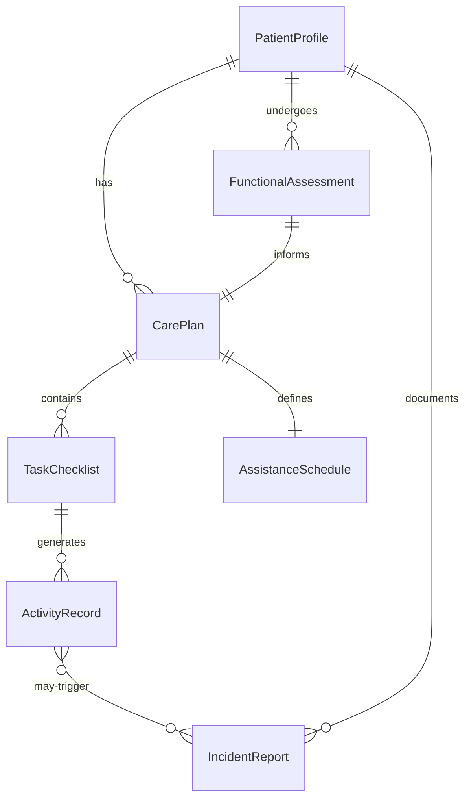
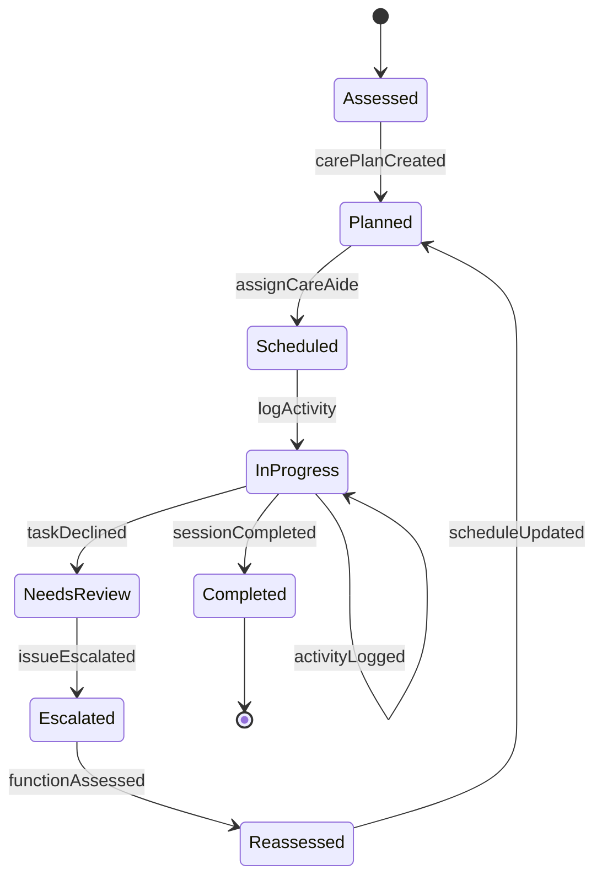
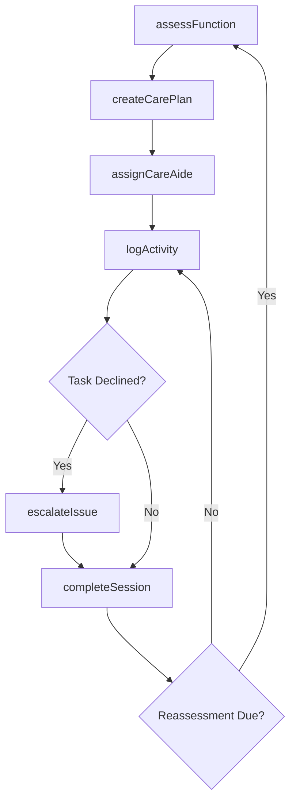
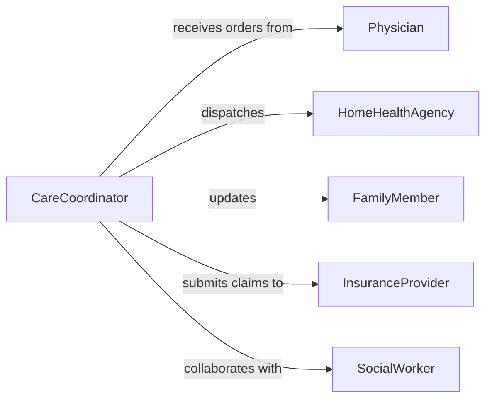

# Assist Patients with Daily Activities

> Business-as-Code definition for patient daily activity assistance. Models the coordination of personal care support, mobility aid, and routine task completion for individuals requiring supervised or hands-on help.

## Overview

Patient daily activity assistance encompasses the planning, delivery, and documentation of support services that help individuals perform activities of daily living such as bathing, dressing, eating, and mobility. This definition exposes actions for care plan execution, event triggers for status changes, and searches for retrieving patient assistance records across care settings.

## Actors

| Actor | Description |
|-------|-------------|
| Patient | Individual receiving daily living assistance |
| FamilyMember | Relative or guardian involved in care decisions |
| Physician | Orders care levels and reviews functional assessments |
| InsuranceProvider | Authorizes and reimburses assistance services |
| HomeHealthAgency | Supplies trained caregiving personnel |
| SocialWorker | Coordinates community resources and discharge planning |

## Roles

| Role | Description |
|------|-------------|
| CareAide | Delivers hands-on daily living support |
| ChargeNurse | Oversees aide assignments and care quality |
| CareCoordinator | Manages scheduling and care plan adherence |
| OccupationalTherapist | Assesses functional ability and recommends interventions |

## Entities

| Entity | Description |
|--------|-------------|
| CarePlan | Documented set of daily assistance tasks for a patient |
| ActivityRecord | Log entry for a completed or skipped daily task |
| FunctionalAssessment | Evaluation of patient ability across ADL categories |
| AssistanceSchedule | Timetable of caregiver visits and task assignments |
| IncidentReport | Record of falls, refusals, or adverse events during care |
| PatientProfile | Demographics, diagnoses, and preference data |
| TaskChecklist | Itemized list of ADL tasks for a single care session |

## Actions

| Action | Description |
|--------|-------------|
| createCarePlan | Initialize a daily assistance plan for a patient |
| assignCareAide | Match a caregiver to a patient schedule |
| logActivity | Record completion of a specific daily living task |
| assessFunction | Evaluate patient independence across ADL categories |
| updateSchedule | Modify visit times or task assignments |
| escalateIssue | Flag a patient concern for clinical review |
| completeSession | Finalize and sign off on a care visit |

## Events

| Event | Description |
|-------|-------------|
| carePlanCreated | A new daily assistance plan has been established |
| activityLogged | A daily living task has been recorded as complete |
| functionAssessed | A functional assessment has been finalized |
| scheduleUpdated | Care visit schedule has been modified |
| issueEscalated | A patient concern has been flagged for review |
| sessionCompleted | A care visit has been signed off |
| taskDeclined | Patient refused a scheduled assistance task |

## Searches

| Search | Description |
|--------|-------------|
| findCarePlans | List care plans by patient, status, or facility |
| getActivityHistory | Retrieve task completion records for a patient |
| getAssessments | Find functional assessments by date or score range |
| getSchedule | Retrieve upcoming care visits for a patient or aide |
| findIncidents | List incident reports by type, severity, or date |

## Entity Relationships



## State Diagram



## Workflow



## Actor Relationships



## Usage

### Calling Actions

```typescript
import { assistPatientsDailyActivities } from '@headlessly/assist-patients-daily-activities'

const care = assistPatientsDailyActivities()

// Create a care plan for a new patient
const plan = await care.createCarePlan({
  patientId: 'PT-2026-2201',
  tasks: ['bathing', 'dressing', 'mealPrep', 'mobility'],
  frequency: 'daily',
  startDate: '2026-02-10'
})

// Log a completed activity
await care.logActivity({
  carePlanId: plan.id,
  task: 'bathing',
  status: 'completed',
  notes: 'Patient required minimal assistance with transfers'
})

// Run a functional assessment
const assessment = await care.assessFunction({
  patientId: 'PT-2026-2201',
  categories: ['bathing', 'dressing', 'eating', 'toileting', 'transferring']
})
```

### Event-Driven Automation

```typescript
// Notify family when an issue is escalated
care.issueEscalated(async ({ patientId, issue, severity }) => {
  await notify({
    to: 'family-contacts',
    message: `Care concern for patient ${patientId}: ${issue}`
  })
})

// Trigger reassessment after repeated task declines
care.taskDeclined(async ({ patientId, task, count }) => {
  if (count >= 3) {
    await care.assessFunction({
      patientId,
      categories: [task],
      reason: 'repeated-decline'
    })
  }
})

// Auto-escalate if session takes too long
care.sessionCompleted(async ({ patientId, duration, scheduledDuration }) => {
  if (duration > scheduledDuration * 1.5) {
    await care.escalateIssue({
      patientId,
      issue: 'Extended care session may indicate increased assistance needs',
      severity: 'medium'
    })
  }
})
```
