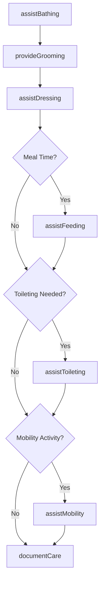
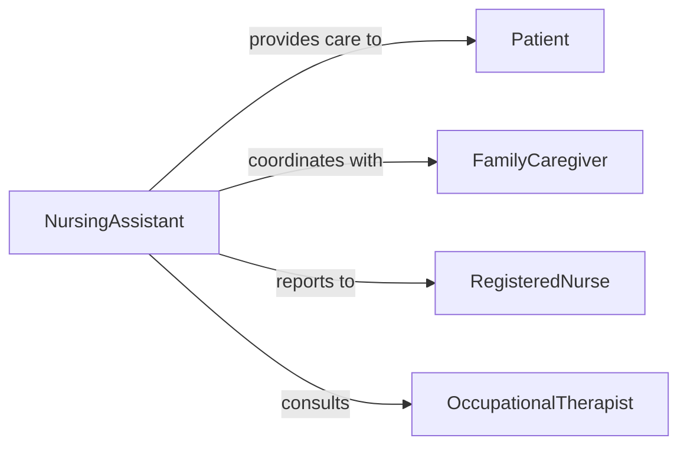

# Assist Patients Hygiene Daily Living

> Business-as-Code definition for providing personal care assistance with bathing, grooming, dressing, toileting, eating, and mobility activities for patients unable to perform these tasks independently.

## Overview

Patient hygiene and daily living assistance involves helping individuals with activities of daily living including personal hygiene, dressing, feeding, toileting, and mobility. This definition models comprehensive personal care services that maintain dignity, promote independence, and ensure patient safety while performing essential self-care activities.

## Actors

| Actor | Description |
|-------|-------------|
| Patient | Requires assistance with personal care activities |
| FamilyCaregiver | Provides informal care and support at home |
| RegisteredNurse | Oversees care plan and complex needs |
| PhysicalTherapist | Advises on mobility and transfer techniques |
| OccupationalTherapist | Recommends adaptive equipment and strategies |
| EquipmentSupplier | Provides assistive devices and mobility aids |

## Roles

| Role | Description |
|------|-------------|
| NursingAssistant | Delivers direct personal care assistance |
| HomeCareAide | Provides hygiene and ADL support in home setting |
| HospitalAttendant | Assists with patient care in facility setting |
| BathingSpecialist | Focuses on bathing and skin care procedures |

## Entities

| Entity | Description |
|--------|-------------|
| CarePlan | Individualized instructions for assistance needs |
| HygieneSchedule | Timing and frequency of personal care activities |
| AssistanceLevel | Degree of support required for each task |
| SkinAssessment | Evaluation of skin integrity and pressure areas |
| MobilityAid | Equipment used to assist with movement |
| PersonalCareLog | Documentation of care provided and patient response |

## Actions

| Action | Description |
|--------|-------------|
| assistBathing | Help patient with washing and personal hygiene |
| assistDressing | Support patient in putting on and removing clothing |
| assistToileting | Aid with elimination needs and perineal care |
| assistFeeding | Help patient consume meals and maintain nutrition |
| assistMobility | Support patient with transfers and ambulation |
| provideGrooming | Assist with hair care, shaving, and oral hygiene |
| documentCare | Record assistance provided and patient condition |

## Events

| Event | Description |
|-------|-------------|
| bathingAssisted | Patient bathing or hygiene care completed |
| dressingAssisted | Clothing assistance provided |
| toiletingAssisted | Elimination needs addressed |
| feedingAssisted | Meal or nutrition support provided |
| mobilityAssisted | Transfer or ambulation assistance given |
| groomingProvided | Personal grooming tasks completed |
| careDocumented | Personal care activities recorded |

## Searches

| Search | Description |
|--------|-------------|
| findCarePlans | Retrieve assistance plans by patient or needs level |
| getHygieneSchedules | Query personal care schedules and frequencies |
| getSkinAssessments | Find skin integrity evaluations by patient |
| getPersonalCareLogs | Search documentation of care provided |

## Workflow



## Actor Relationships



## Usage

### Calling Actions

```typescript
import { assistPatientsHygieneDailyLiving } from '@headlessly/assist-patients-hygiene-daily-living'

const care = assistPatientsHygieneDailyLiving()

// Assist with morning bathing routine
await care.assistBathing({
  patientId: 'PT-112233',
  bathType: 'bed-bath',
  waterTemperature: 'warm',
  skinCondition: 'intact-no-breakdown',
  assistanceLevel: 'total',
  areasWashed: ['face', 'arms', 'torso', 'legs', 'back', 'perineal'],
  patientTolerance: 'good',
  caregiverName: 'CNA-Rodriguez'
})

// Provide grooming assistance
await care.provideGrooming({
  patientId: 'PT-112233',
  activities: [
    { task: 'oral-care', method: 'brushing-teeth', assistance: 'total' },
    { task: 'hair-combing', method: 'gentle-detangling', assistance: 'partial' },
    { task: 'face-shaving', method: 'electric-razor', assistance: 'total' }
  ],
  patientPreferences: 'prefers-morning-shave',
  caregiverName: 'CNA-Rodriguez'
})

// Assist with dressing
await care.assistDressing({
  patientId: 'PT-112233',
  clothingItems: ['underwear', 'pants', 'shirt', 'socks'],
  assistanceLevel: 'moderate',
  adaptiveTechniques: ['dressing-stick-for-socks'],
  patientParticipation: 'cooperative',
  timeRequired: 15
})

// Assist with feeding at breakfast
await care.assistFeeding({
  patientId: 'PT-112233',
  meal: 'breakfast',
  consistencyModification: 'mechanical-soft',
  fluidThickness: 'nectar-thick',
  assistanceLevel: 'setup-and-supervision',
  amountConsumed: '75-percent',
  feedingDuration: 25,
  aspirationPrecautions: 'upright-positioning'
})

// Assist with toileting
await care.assistToileting({
  patientId: 'PT-112233',
  eliminationType: 'bowel-movement',
  toiletingMethod: 'bedside-commode',
  assistanceLevel: 'transfer-and-cleanup',
  skinCare: 'perineal-wash-with-barrier-cream',
  patientComfort: 'maintained'
})

// Assist with mobility
await care.assistMobility({
  patientId: 'PT-112233',
  activity: 'transfer-bed-to-chair',
  assistiveDevice: 'gait-belt',
  personnelAssisting: 2,
  transferTechnique: 'pivot-transfer',
  patientWeightBearing: 'partial',
  safetyMaintained: true
})
```

### Event-Driven Automation

```typescript
// Alert on skin breakdown during bathing
care.bathingAssisted(async ({ patientId, skinCondition }) => {
  if (skinCondition.includes('redness') || skinCondition.includes('breakdown')) {
    await notify({
      to: 'wound-care-nurse',
      message: `Skin integrity concern noted in patient ${patientId}`,
      priority: 'high'
    })
  }
})

// Track nutritional intake
care.feedingAssisted(async ({ patientId, amountConsumed, meal }) => {
  const intake = parsePercentage(amountConsumed)
  if (intake < 50) {
    await logNutritionConcern({
      patientId,
      meal,
      intake,
      alertDietitian: true
    })
  }
})

// Monitor toileting patterns
care.toiletingAssisted(async ({ patientId, eliminationType, timestamp }) => {
  await updateBowelBladderLog({
    patientId,
    type: eliminationType,
    time: timestamp
  })

  const lastBM = await getLastBowelMovement(patientId)
  if (daysBetween(lastBM, timestamp) > 3) {
    await notify({
      to: 'primary-nurse',
      message: `Patient ${patientId} has not had BM in over 3 days`
    })
  }
})
```
