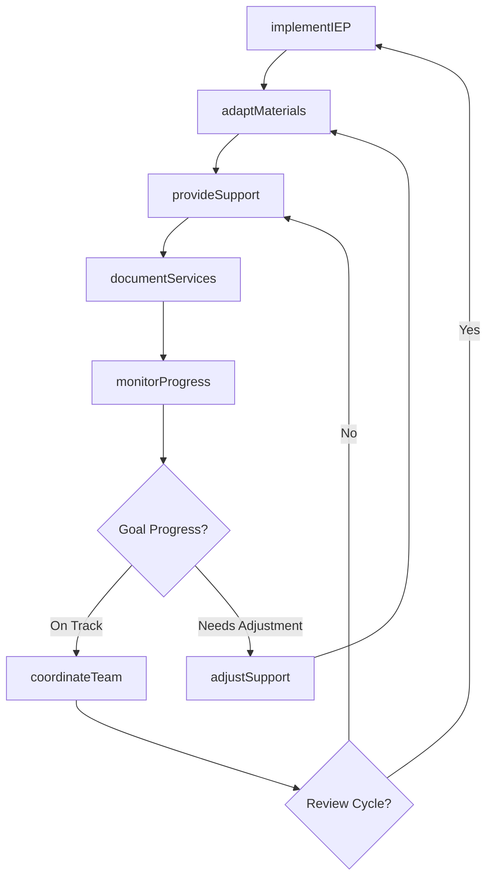
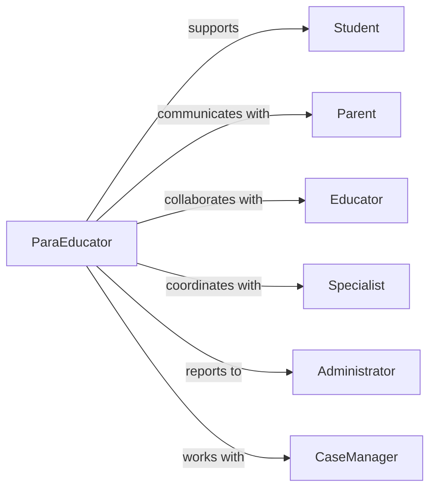

# Assist Students Special Educational Needs

> Business-as-Code definition for special education support services. Models individualized assistance, accommodation implementation, progress monitoring, and collaborative planning for students with disabilities and learning differences.

## Overview

Assisting students with special educational needs involves providing targeted support, implementing individualized education plans, adapting instruction and materials, and coordinating with educators, specialists, and families to ensure equitable access to learning. This definition exposes actions for student support activities, events for tracking progress, and searches for accommodation and outcome data.

## Actors

| Actor | Description |
|-------|-------------|
| Student | Learner with identified special educational needs |
| Parent | Family member involved in education planning |
| Educator | Classroom teacher delivering instruction |
| Specialist | Therapist or clinician providing interventions |
| Administrator | School leader overseeing programs and compliance |
| CaseManager | Professional coordinating services and planning |

## Roles

| Role | Description |
|------|-------------|
| ParaEducator | Provides direct support to students in classroom |
| LearningSupport | Implements accommodations and modifications |
| ProgressMonitor | Tracks student achievement and growth |
| CollaborationLiaison | Coordinates team communication and planning |

## Entities

| Entity | Description |
|--------|-------------|
| Student | Individual with special educational needs profile |
| IEP | Individualized education plan with goals and services |
| Accommodation | Modification to instruction, materials, or environment |
| SupportSession | Instance of assistance provided to student |
| ProgressReport | Documentation of student achievement and growth |
| ServiceRecord | Log of interventions and support delivered |

## Actions

| Action | Description |
|--------|-------------|
| implementIEP | Execute individualized education plan components |
| provideSupport | Deliver direct assistance during instruction |
| adaptMaterials | Modify curriculum for accessibility |
| monitorProgress | Track student achievement toward goals |
| coordinateTeam | Facilitate communication among stakeholders |
| documentServices | Record support activities and interventions |
| adjustSupport | Modify assistance based on student response |

## Events

| Event | Description |
|-------|-------------|
| iepImplemented | Education plan components activated |
| supportProvided | Direct assistance delivered |
| materialsAdapted | Curriculum modifications completed |
| progressMonitored | Achievement tracking updated |
| teamCoordinated | Stakeholder communication facilitated |
| servicesDocumented | Intervention records created |
| supportAdjusted | Assistance strategies modified |

## Searches

| Search | Description |
|--------|-------------|
| findStudents | List learners by needs, services, or classroom |
| getIEPs | Retrieve education plans by student or goal |
| getAccommodations | Access modifications by type or student |
| getProgressReports | Find achievement data by student or period |
| getServiceLogs | Retrieve intervention records by date or type |

## Workflow



## Actor Relationships



## Usage

### Calling Actions

```typescript
import { assistStudentsSpecialEducationalNeeds } from '@headlessly/assist-students-special-educational-needs'

const support = assistStudentsSpecialEducationalNeeds()

// Implement IEP accommodations
await support.implementIEP({
  studentId: 'student-4512',
  accommodations: [
    'extended time on assessments',
    'preferential seating',
    'assistive technology for writing'
  ],
  services: [
    { type: 'speech therapy', frequency: '2x per week' },
    { type: 'occupational therapy', frequency: '1x per week' }
  ]
})

// Provide direct support during instruction
await support.provideSupport({
  studentId: 'student-4512',
  activity: 'math lesson',
  assistance: [
    'read word problems aloud',
    'provide manipulatives',
    'break tasks into steps'
  ]
})

// Monitor progress toward IEP goals
const progress = await support.monitorProgress({
  studentId: 'student-4512',
  goals: [
    { id: 'reading-fluency', current: 75, target: 100, unit: 'words per minute' },
    { id: 'social-interaction', current: 'improving', target: 'proficient' }
  ]
})
```

### Event-Driven Automation

```typescript
// Alert team when progress falls behind
support.progressMonitored(async ({ studentId, goals }) => {
  const behindGoals = goals.filter(g => g.percentComplete < 50 && g.timeline < 50)
  if (behindGoals.length > 0) {
    await support.coordinateTeam({
      studentId,
      meeting: {
        purpose: 'discuss progress concerns',
        attendees: ['parent', 'educator', 'specialist']
      }
    })
  }
})

// Adjust support when accommodations ineffective
support.supportProvided(async ({ studentId, effectiveness }) => {
  if (effectiveness === 'low') {
    await support.adjustSupport({
      studentId,
      changes: 'increase frequency of check-ins and provide additional scaffolding'
    })
  }
})

// Document all services for compliance
support.supportProvided(async ({ studentId, activity, assistance }) => {
  await support.documentServices({
    studentId,
    entry: {
      timestamp: new Date(),
      activity,
      assistance,
      duration: '30 minutes'
    }
  })
})
```
