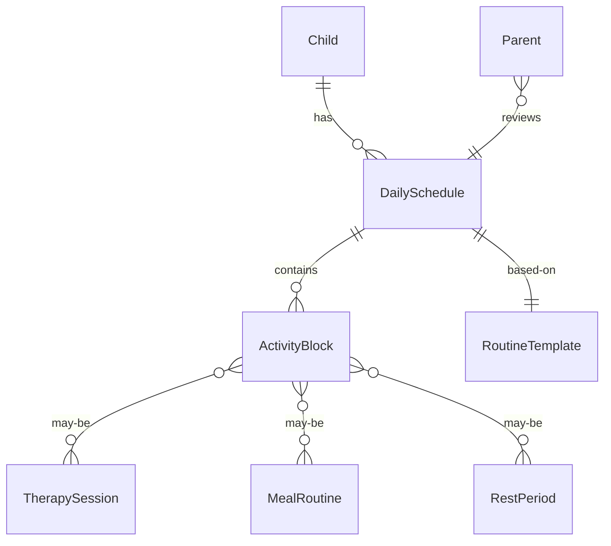
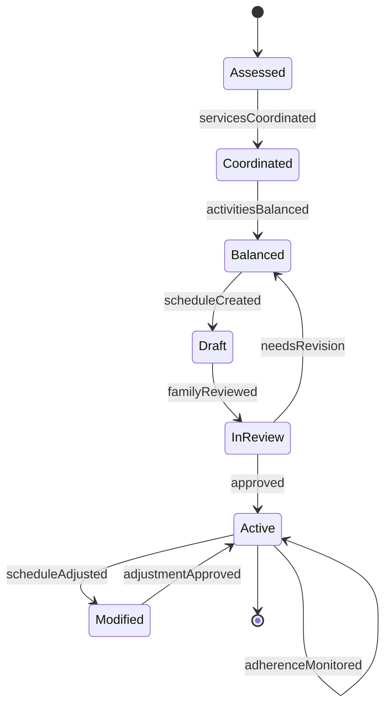
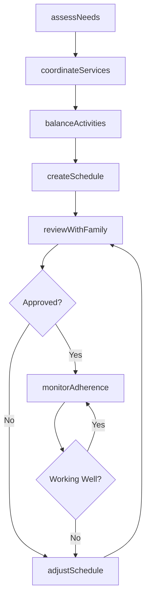
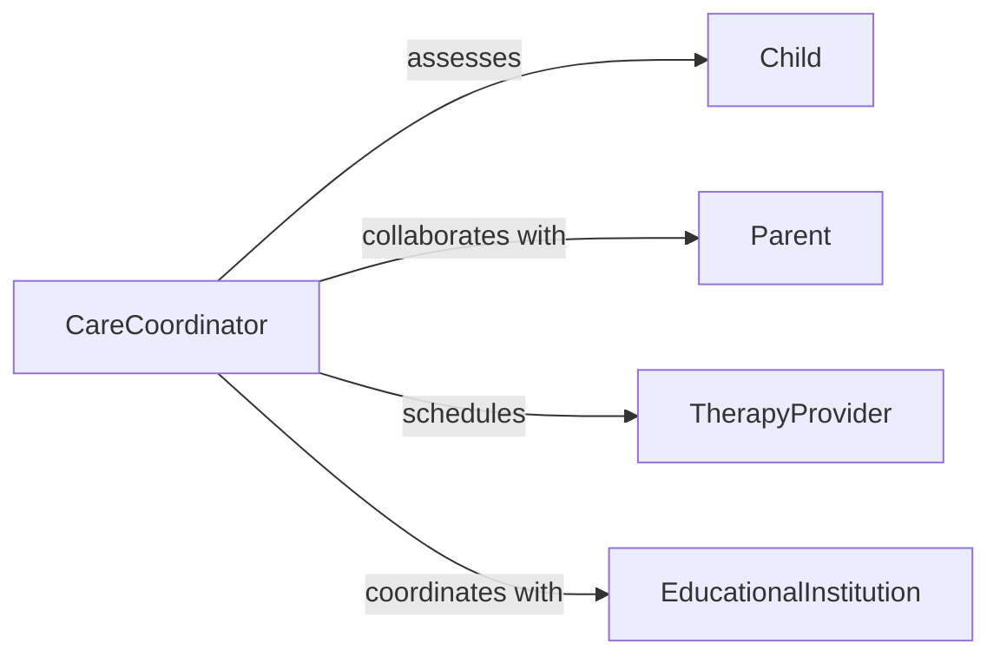

# Develop Daily Schedules Children Families

> Business-as-Code definition for creating structured daily routines and schedules that organize activities, therapies, meals, education, and rest periods for children with special needs and their families.

## Overview

Daily schedule development for children and families involves assessing individual needs, coordinating multiple services, balancing therapeutic activities with family time, and creating predictable routines that promote child development and family well-being. This definition models comprehensive scheduling that accommodates medical appointments, therapies, educational activities, and family routines while maintaining flexibility for unexpected needs.

## Actors

| Actor | Description |
|-------|-------------|
| Child | Requires structured schedule to support development and needs |
| Parent | Participates in schedule planning and implementation |
| TherapyProvider | Delivers therapeutic services at scheduled times |
| EducationalInstitution | Provides schooling or early intervention services |
| MedicalProvider | Requires scheduled appointments for care and monitoring |
| RespiteCareProvider | Offers temporary relief care for families |

## Roles

| Role | Description |
|------|-------------|
| CareCoordinator | Develops and manages comprehensive daily schedules |
| FamilySupport | Assists families with routine implementation |
| SchedulingSpecialist | Coordinates multiple service appointments |
| DevelopmentalSpecialist | Advises on age-appropriate activities and timing |

## Entities

| Entity | Description |
|--------|-------------|
| DailySchedule | Complete timeline of activities and routines for a day |
| ActivityBlock | Scheduled time period for specific activity or therapy |
| RoutineTemplate | Standard schedule pattern for weekdays or weekends |
| TherapySession | Scheduled intervention appointment |
| MealRoutine | Planned eating times and nutritional activities |
| RestPeriod | Scheduled nap or quiet time for child |

## Actions

| Action | Description |
|--------|-------------|
| assessNeeds | Evaluate child and family scheduling requirements |
| coordinateServices | Align therapy and medical appointments |
| balanceActivities | Distribute therapeutic, educational, and leisure time |
| createSchedule | Develop comprehensive daily timeline |
| reviewWithFamily | Confirm schedule feasibility and preferences |
| adjustSchedule | Modify routines based on changing needs |
| monitorAdherence | Track schedule implementation and effectiveness |

## Events

| Event | Description |
|-------|-------------|
| needsAssessed | Child and family requirements evaluated |
| servicesCoordinated | Multiple appointments aligned in schedule |
| activitiesBalanced | Appropriate mix of activities determined |
| scheduleCreated | Daily timeline developed and finalized |
| familyReviewed | Schedule reviewed and approved by family |
| scheduleAdjusted | Modifications made to existing routine |
| adherenceMonitored | Schedule implementation tracked and evaluated |

## Searches

| Search | Description |
|--------|-------------|
| findSchedules | Retrieve daily routines by child or date |
| getTherapySessions | Query scheduled therapeutic interventions |
| getRoutineTemplates | Find standard schedule patterns by day type |
| getActivityBlocks | Search scheduled activities by type or time |

## Entity Relationships



## State Diagram



## Workflow



## Actor Relationships



## Usage

### Calling Actions

```typescript
import { developDailySchedulesChildrenFamilies } from '@headlessly/develop-daily-schedules-children-families'

const scheduling = developDailySchedulesChildrenFamilies()

// Assess child and family scheduling needs
const assessment = await scheduling.assessNeeds({
  childId: 'CH-2026-998877',
  age: 5,
  diagnoses: ['autism-spectrum-disorder', 'speech-delay'],
  therapies: ['speech-therapy', 'occupational-therapy', 'applied-behavior-analysis'],
  schoolSchedule: 'half-day-preschool',
  familyConstraints: ['working-parents', 'sibling-activities'],
  transportationNeeds: 'parent-provided'
})

// Coordinate therapy and medical services
await scheduling.coordinateServices({
  childId: 'CH-2026-998877',
  services: [
    { type: 'speech-therapy', frequency: 'twice-weekly', duration: 45, provider: 'SLP-Johnson' },
    { type: 'occupational-therapy', frequency: 'weekly', duration: 60, provider: 'OT-Smith' },
    { type: 'ABA-therapy', frequency: 'daily', duration: 120, provider: 'BCBA-Davis' },
    { type: 'developmental-pediatrics', frequency: 'quarterly', provider: 'Dr-Martinez' }
  ],
  preferredTimes: 'afternoon',
  avoidConflicts: ['preschool-hours', 'sibling-pickup']
})

// Balance therapeutic and family activities
await scheduling.balanceActivities({
  childId: 'CH-2026-998877',
  therapeuticHours: 4,
  educationalHours: 3,
  familyTime: 2,
  freePlay: 1.5,
  meals: 1.5,
  rest: 1,
  considerationFactors: [
    'sensory-needs',
    'attention-span',
    'energy-levels',
    'family-meals'
  ]
})

// Create comprehensive daily schedule
const schedule = await scheduling.createSchedule({
  childId: 'CH-2026-998877',
  dayType: 'weekday',
  timeline: [
    { time: '07:00', activity: 'wake-up-routine', duration: 30 },
    { time: '07:30', activity: 'breakfast', duration: 30 },
    { time: '08:30', activity: 'preschool', duration: 180 },
    { time: '12:00', activity: 'lunch-at-school', duration: 30 },
    { time: '12:30', activity: 'return-home-quiet-time', duration: 60 },
    { time: '13:30', activity: 'ABA-therapy', duration: 120 },
    { time: '15:30', activity: 'snack-break', duration: 15 },
    { time: '15:45', activity: 'speech-therapy', duration: 45, days: ['Monday', 'Wednesday'] },
    { time: '15:45', activity: 'occupational-therapy', duration: 60, days: ['Thursday'] },
    { time: '17:00', activity: 'family-time-outdoor-play', duration: 60 },
    { time: '18:00', activity: 'dinner', duration: 45 },
    { time: '19:00', activity: 'bath-bedtime-routine', duration: 60 }
  ]
})

// Review with family
await scheduling.reviewWithFamily({
  childId: 'CH-2026-998877',
  scheduleId: schedule.id,
  reviewedWith: ['mother', 'father'],
  concerns: ['too-much-structure', 'limited-free-play'],
  requestedChanges: ['add-30min-free-play-after-dinner']
})
```

### Event-Driven Automation

```typescript
// Auto-adjust when therapy cancelled
scheduling.servicesCoordinated(async ({ childId, services }) => {
  for (const service of services) {
    if (service.status === 'cancelled') {
      await scheduling.adjustSchedule({
        childId,
        modification: 'reschedule-therapy',
        serviceType: service.type,
        proposedTimes: await findAlternativeSlots(childId, service)
      })
    }
  }
})

// Monitor schedule adherence and flag issues
scheduling.adherenceMonitored(async ({ childId, scheduleId, adherenceRate }) => {
  if (adherenceRate < 70) {
    await notify({
      to: 'care-coordinator',
      message: `Low schedule adherence (${adherenceRate}%) for child ${childId}`,
      action: 'review-and-modify-schedule'
    })
  }
})

// Alert family of upcoming schedule changes
scheduling.scheduleAdjusted(async ({ childId, modifications, effectiveDate }) => {
  const family = await getFamilyContacts(childId)
  await notify({
    to: family,
    message: `Daily schedule updated for ${effectiveDate}: ${modifications.join(', ')}`,
    includeAttachment: 'updated-schedule-pdf'
  })
})
```
