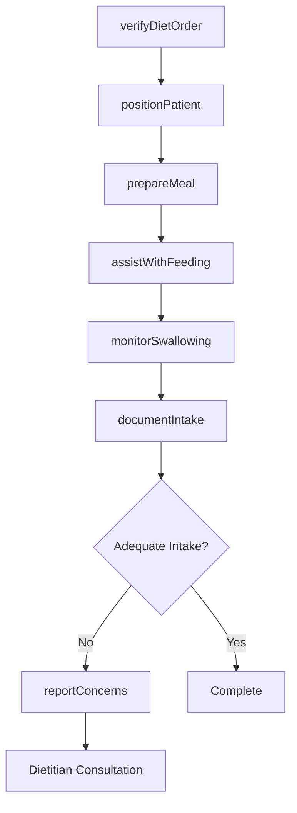
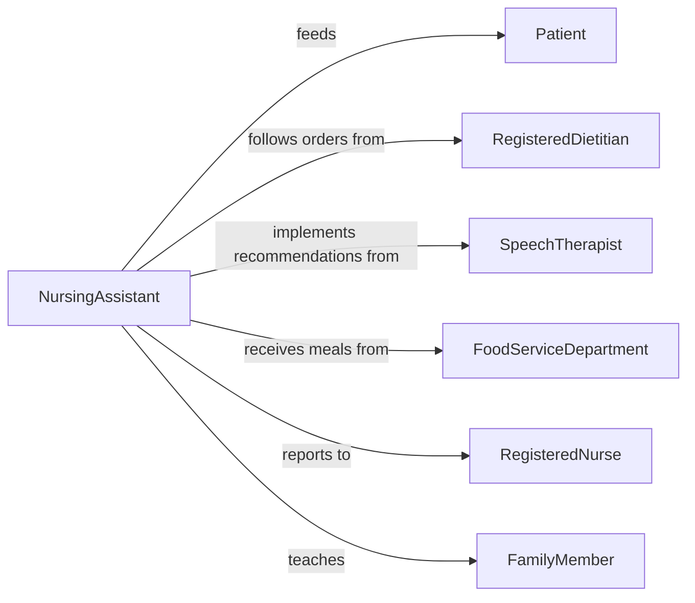

# Feed Patients

> Business-as-Code definition for patient feeding services. Models meal delivery, feeding assistance, dietary compliance, and nutrition monitoring for patients unable to feed themselves independently.

## Overview

Patient feeding involves preparing meals according to dietary restrictions, safely assisting with eating and drinking, monitoring intake, and documenting nutrition status. This definition supports hospitals, nursing homes, and home care settings by coordinating dietary orders, feeding techniques, and aspiration risk management.

## Actors

| Actor | Description |
|-------|-------------|
| Patient | Individual requiring feeding assistance |
| RegisteredDietitian | Prescribes therapeutic diets and monitors nutrition |
| SpeechTherapist | Evaluates swallowing safety and recommends modifications |
| FoodServiceDepartment | Prepares meals according to dietary orders |
| PhysicianProvider | Orders diet level and addresses nutrition concerns |
| FamilyMember | May participate in feeding or observe techniques |

## Roles

| Role | Description |
|------|-------------|
| NursingAssistant | Provides hands-on feeding assistance |
| RegisteredNurse | Oversees feeding safety and monitors intake |
| DietaryAide | Delivers meal trays and collects dietary preferences |
| NutritionMonitor | Tracks intake patterns and reports concerns |

## Entities

| Entity | Description |
|--------|-------------|
| DietaryOrder | Prescribed food consistency, restrictions, and supplements |
| MealPlan | Scheduled meals with preferences and portion sizes |
| FeedingAssistance | Technique and support level required for safe eating |
| IntakeRecord | Documentation of food and fluid consumption |
| AspirationsRisk | Swallowing safety assessment and precautions |
| NutritionStatus | Weight trends, albumin levels, and malnutrition screening |

## Actions

| Action | Description |
|--------|-------------|
| verifyDietOrder | Confirm meal matches prescribed diet restrictions |
| positionPatient | Place patient safely for eating to prevent aspiration |
| prepareMeal | Modify food consistency and set up tray for feeding |
| assistWithFeeding | Provide hands-on help with eating and drinking |
| monitorSwallowing | Watch for signs of choking or aspiration |
| documentIntake | Record percentage eaten and fluids consumed |
| reportConcerns | Alert team to poor intake or nutrition decline |

## Events

| Event | Description |
|-------|-------------|
| dietOrderVerified | Meal confirmed appropriate for patient's dietary needs |
| patientPositioned | Safe eating position achieved before feeding |
| mealPrepared | Food modified to correct consistency and set up |
| feedingAssisted | Hands-on support provided during meal |
| swallowingMonitored | Patient observed for safe swallowing throughout meal |
| intakeDocumented | Food and fluid consumption recorded |
| concernsReported | Poor intake or nutrition issue escalated to clinical team |

## Searches

| Search | Description |
|--------|-------------|
| findPatients | List patients requiring feeding assistance by unit or status |
| getDietOrders | Retrieve dietary prescriptions by patient or restriction type |
| getIntakeRecords | Find nutrition documentation by patient or date range |
| getNutritionConcerns | Review patients with poor intake or weight loss |

## Workflow



## Actor Relationships



## Usage

### Calling Actions

```typescript
import { feedPatients } from '@headlessly/feed-patients'

const feeding = feedPatients()

// Verify diet order before meal
const verification = await feeding.verifyDietOrder({
  patientId: 'PT-2026-789',
  mealType: 'Lunch',
  dietOrder: 'Mechanical soft, thin liquids, low sodium',
  mealTray: {
    items: ['Chopped chicken', 'Mashed potatoes', 'Soft vegetables', 'Pudding'],
    consistency: 'Mechanical soft',
    restrictions: 'No added salt'
  },
  matches: true
})

// Position patient safely for eating
await feeding.positionPatient({
  patientId: 'PT-2026-789',
  position: 'Head of bed elevated 90 degrees',
  supportProvided: 'Pillow behind back for stability',
  aspirationRisk: 'Moderate - requires upright position and small bites'
})

// Assist with feeding
await feeding.assistWithFeeding({
  patientId: 'PT-2026-789',
  mealType: 'Lunch',
  startTime: '12:15',
  technique: 'Verbal cues for each bite, patient self-feeds with setup',
  biteSize: 'Small amounts on spoon',
  pace: 'Slow - allow time to chew and swallow between bites',
  fluidOffered: 'Water with each few bites',
  patientResponse: 'Cooperative, no coughing or distress noted'
})

// Document intake
await feeding.documentIntake({
  patientId: 'PT-2026-789',
  mealType: 'Lunch',
  percentageEaten: 75,
  fluidsConsumed: 180, // ml
  items: {
    protein: 'Ate most chicken',
    carbs: 'Finished mashed potatoes',
    vegetables: 'Ate half of vegetables',
    dessert: 'Finished pudding'
  },
  duration: 25, // minutes
  concerns: 'None - ate well, no swallowing difficulties'
})
```

### Event-Driven Automation

```typescript
// Alert on poor intake requiring intervention
feeding.intakeDocumented(async ({ patientId, percentageEaten, mealsBelow50Percent }) => {
  if (percentageEaten < 50 && mealsBelow50Percent >= 3) {
    await feeding.reportConcerns({
      patientId,
      concern: 'Inadequate intake for 3+ meals',
      recommendation: 'Dietitian consult for supplements or alternative nutrition'
    })
  }
})

// Monitor swallowing safety
feeding.swallowingMonitored(async ({ patientId, signs }) => {
  if (signs.includes('coughing') || signs.includes('choking')) {
    await notify({
      to: 'registered-nurse',
      priority: 'urgent',
      message: `Swallowing difficulty noted for ${patientId} - speech therapy consult may be needed`
    })
  }
})
```
