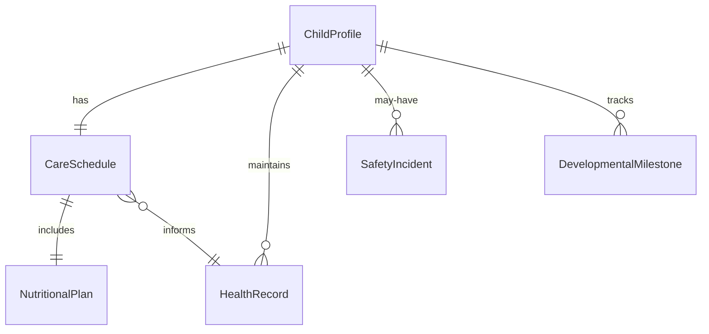
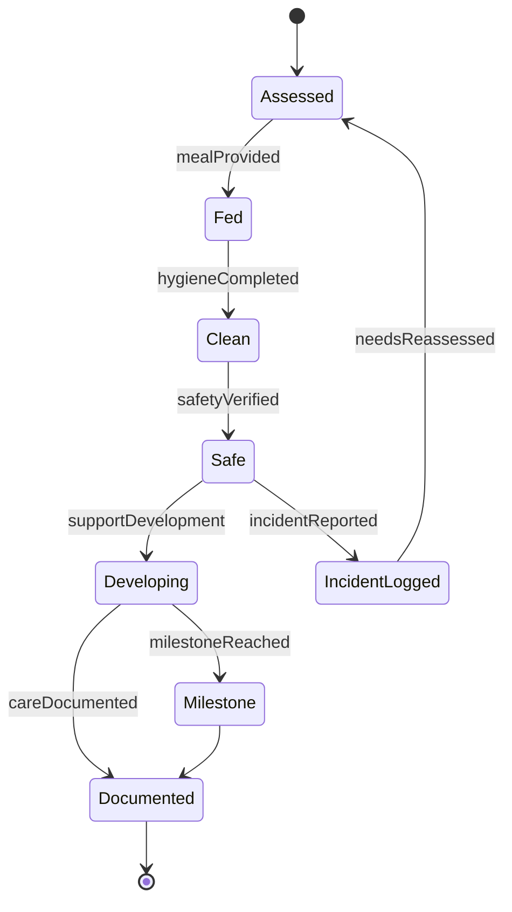
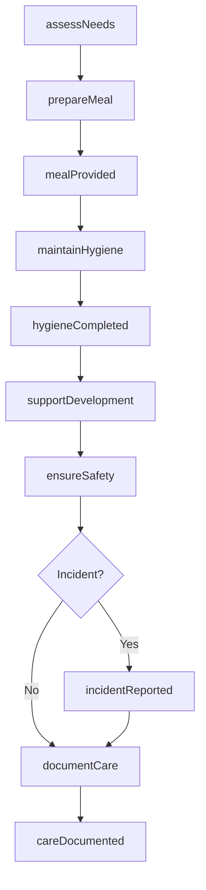
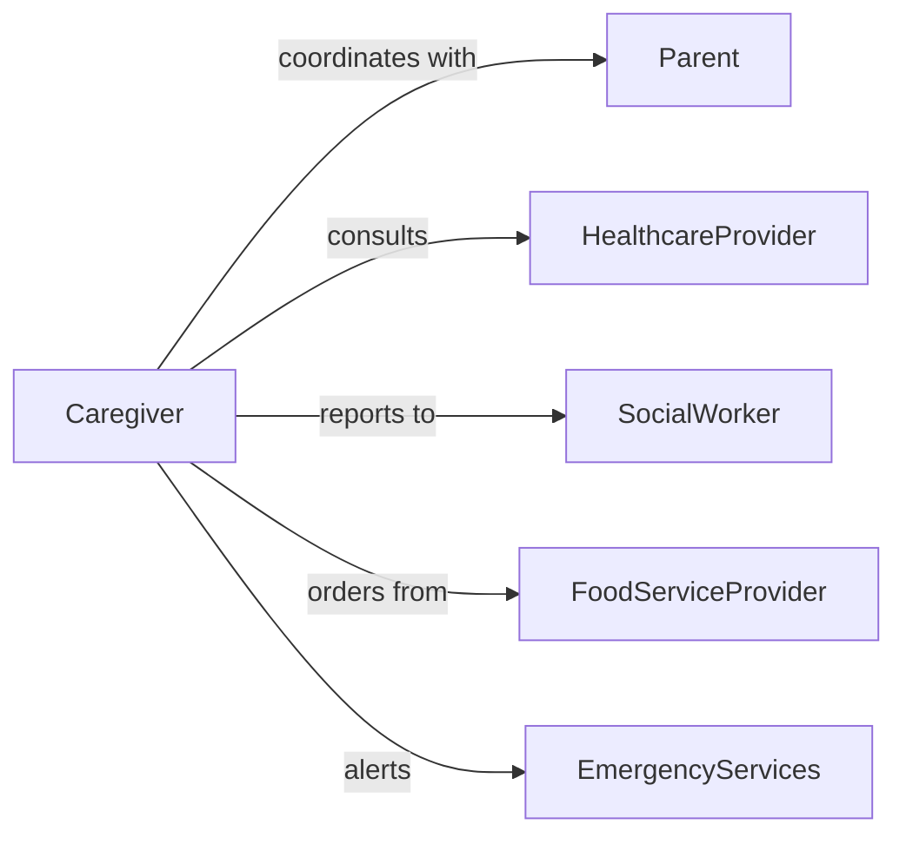

# Provide Basic Needs Children

> Business-as-Code definition for providing essential care and support services for children. Models nutrition, hygiene, safety, and developmental needs management.

## Overview

Providing basic needs for children encompasses the full spectrum of essential care including nutrition, hygiene, safety, shelter, and emotional support. This definition exposes actions for daily care routines, events for monitoring child welfare, and searches for tracking developmental milestones and care requirements across diverse settings including childcare centers, schools, residential facilities, and home care environments.

## Actors

| Actor | Description |
|-------|-------------|
| Parent | Legal guardian responsible for child welfare |
| HealthcareProvider | Medical professionals monitoring child health |
| SocialWorker | Case manager coordinating services and support |
| FoodServiceProvider | Prepares and delivers nutritious meals |
| TransportationProvider | Ensures safe travel to activities and appointments |
| EmergencyServices | Responds to urgent health or safety situations |

## Roles

| Role | Description |
|------|-------------|
| Caregiver | Direct care provider managing daily needs |
| NurseAide | Administers basic health and hygiene support |
| ChildDevelopmentSpecialist | Monitors growth and developmental progress |
| FacilityCoordinator | Manages care environment and resources |

## Entities

| Entity | Description |
|--------|-------------|
| ChildProfile | Demographic and developmental information |
| CareSchedule | Daily routine for meals, hygiene, and activities |
| NutritionalPlan | Dietary requirements and meal planning |
| HealthRecord | Medical history, allergies, and medications |
| SafetyIncident | Documentation of accidents or hazards |
| DevelopmentalMilestone | Age-appropriate growth markers |

## Actions

| Action | Description |
|--------|-------------|
| assessNeeds | Evaluate current physical and emotional requirements |
| prepareMeal | Provide age-appropriate nutrition |
| maintainHygiene | Ensure cleanliness and personal care |
| ensureSafety | Monitor environment and prevent hazards |
| provideShelter | Maintain appropriate living conditions |
| supportDevelopment | Facilitate learning and growth activities |
| documentCare | Record care activities and observations |

## Events

| Event | Description |
|-------|-------------|
| needsAssessed | Child requirements have been evaluated |
| mealProvided | Nutrition has been delivered and consumed |
| hygieneCompleted | Personal care routine has been performed |
| safetyVerified | Environment checked and secured |
| incidentReported | Safety issue or concern has been documented |
| milestoneReached | Developmental progress has been achieved |
| careDocumented | Daily care activities have been recorded |

## Searches

| Search | Description |
|--------|-------------|
| findChildren | List children by age, facility, or care requirements |
| getCareSchedules | Retrieve daily routines for specific children |
| getIncidents | Find safety reports by date or severity |
| getMilestones | Track developmental progress across age groups |

## Entity Relationships



## State Diagram



## Workflow



## Actor Relationships



## Usage

### Calling Actions

```typescript
import { provideBasicNeedsChildren } from '@headlessly/provide-basic-needs-children'

const childcare = provideBasicNeedsChildren()

// Assess a child's current needs
const assessment = await childcare.assessNeeds({
  childId: 'CHILD-2026-0789',
  areas: ['nutrition', 'hygiene', 'safety', 'development']
})

// Prepare and provide a meal
await childcare.prepareMeal({
  childId: 'CHILD-2026-0789',
  mealType: 'lunch',
  dietaryRestrictions: ['nut-free', 'dairy-free'],
  servingTime: '12:00'
})

// Document daily care activities
await childcare.documentCare({
  childId: 'CHILD-2026-0789',
  date: '2026-02-05',
  activities: ['breakfast', 'outdoor-play', 'nap', 'hygiene'],
  observations: 'Active participation in group activities'
})
```

### Event-Driven Automation

```typescript
// Alert caregivers when incidents occur
childcare.incidentReported(async ({ childId, incident, severity }) => {
  if (severity === 'high') {
    await notify({
      to: ['parent', 'supervisor', 'health-provider'],
      message: `Incident reported for child ${childId}: ${incident.description}`
    })
  }
})

// Track developmental milestones
childcare.milestoneReached(async ({ childId, milestone }) => {
  await updateRecord({
    childId,
    milestoneType: milestone.category,
    achievedDate: new Date()
  })
})

// Monitor nutritional patterns
childcare.mealProvided(async ({ childId, amountConsumed, mealType }) => {
  if (amountConsumed < 50) {
    const recentMeals = await childcare.getCareSchedules({
      childId,
      activityType: 'meals',
      daysBack: 3
    })

    const lowIntakeCount = recentMeals.filter(m => m.amountConsumed < 50).length
    if (lowIntakeCount >= 4) {
      await childcare.assessNeeds({
        childId,
        focusArea: 'nutrition',
        reason: 'Consistently low meal intake'
      })
    }
  }
})
```
