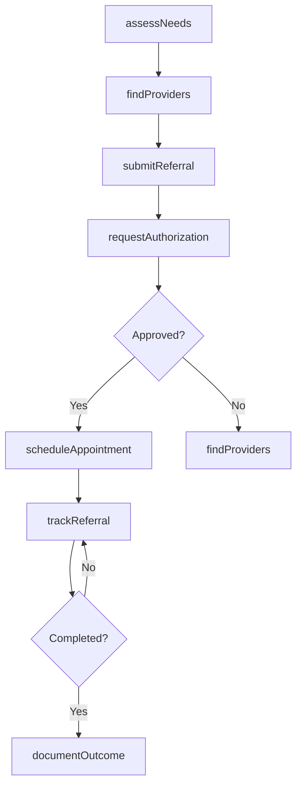
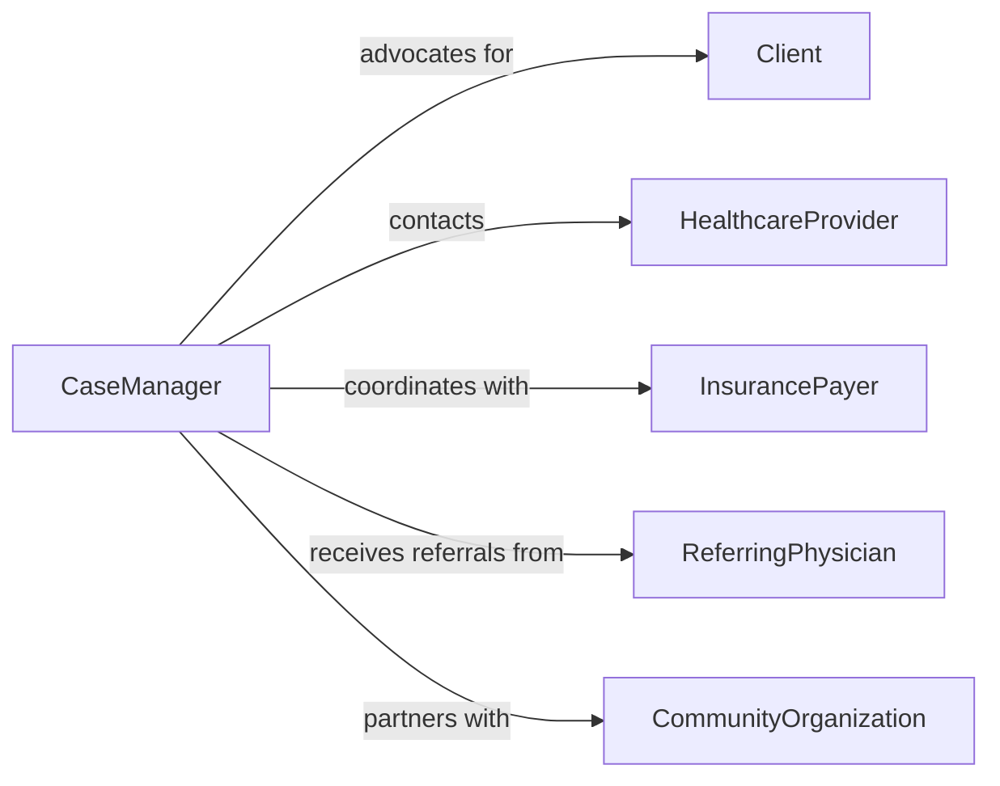

# Arrange Physical Mental Health Services

> Business-as-Code definition for coordinating healthcare service access and appointments. Models referral management, provider matching, and care coordination workflows.

## Overview

Arranging physical and mental health services involves assessing client needs, identifying appropriate providers, scheduling appointments, coordinating insurance authorization, and ensuring continuity of care. This definition exposes actions for the complete service arrangement lifecycle, events for tracking referral status, and searches for finding available providers and monitoring client access to care across healthcare networks.

## Actors

| Actor | Description |
|-------|-------------|
| Client | Individual requiring health services |
| HealthcareProvider | Physician, therapist, or specialist delivering care |
| InsurancePayer | Organization authorizing and funding services |
| ReferringPhysician | Initial provider recommending specialized care |
| CommunityOrganization | Social service agency supporting client needs |
| TransportationService | Facilitates travel to appointments |

## Roles

| Role | Description |
|------|-------------|
| CaseManager | Coordinates all aspects of client care |
| IntakeCoordinator | Processes initial service requests |
| AuthorizationSpecialist | Secures insurance approvals |
| PatientNavigator | Guides clients through healthcare system |

## Entities

| Entity | Description |
|--------|-------------|
| ServiceRequest | Client need for health services |
| Referral | Formal recommendation for specialized care |
| Appointment | Scheduled visit with healthcare provider |
| Authorization | Insurance approval for services |
| ProviderNetwork | Available healthcare professionals and facilities |
| CareGap | Unmet health service needs |

## Actions

| Action | Description |
|--------|-------------|
| assessNeeds | Evaluate client health service requirements |
| findProviders | Identify appropriate healthcare professionals |
| submitReferral | Send formal request to specialist or facility |
| requestAuthorization | Seek insurance approval for services |
| scheduleAppointment | Book client visit with provider |
| trackReferral | Monitor referral status and follow-through |
| documentOutcome | Record service arrangement results |

## Events

| Event | Description |
|-------|-------------|
| needsAssessed | Client requirements have been evaluated |
| providersIdentified | Suitable healthcare options have been found |
| referralSubmitted | Formal referral has been sent to provider |
| authorizationRequested | Insurance approval process has begun |
| authorizationApproved | Services have been authorized for payment |
| appointmentScheduled | Client visit has been confirmed |
| outcomeDocumented | Service arrangement results have been recorded |

## Searches

| Search | Description |
|--------|-------------|
| findReferrals | List referrals by status, provider, or client |
| getProviders | Retrieve healthcare professionals by specialty and location |
| getAppointments | Find scheduled visits by date or client |
| getCareGaps | Identify clients with unmet service needs |

## Workflow



## Actor Relationships



## Usage

### Calling Actions

```typescript
import { arrangePhysicalMentalHealthServices } from '@headlessly/arrange-physical-mental-health-services'

const healthServices = arrangePhysicalMentalHealthServices()

// Assess a client's health service needs
const assessment = await healthServices.assessNeeds({
  clientId: 'client-456',
  concerns: ['chronic-pain', 'anxiety'],
  urgency: 'moderate'
})

// Find appropriate providers
const providers = await healthServices.findProviders({
  specialties: ['pain-management', 'mental-health'],
  location: { zip: '94103', radius: 10 },
  insuranceAccepted: ['Medicare', 'Blue-Cross']
})

// Submit referral and request authorization
const referral = await healthServices.submitReferral({
  clientId: 'client-456',
  providerId: providers[0].id,
  serviceType: 'mental-health-counseling',
  sessions: 12
})

await healthServices.requestAuthorization({
  referralId: referral.id,
  insurerId: 'blue-cross-123'
})
```

### Event-Driven Automation

```typescript
// Auto-schedule when authorization is approved
healthServices.authorizationApproved(async ({ referralId, providerId }) => {
  await healthServices.scheduleAppointment({
    referralId,
    providerId,
    preferredDates: getNextThreeWeeks()
  })
})

// Alert case manager if referral is not completed
healthServices.referralSubmitted(async ({ referralId, clientId }) => {
  setTimeout(async () => {
    const status = await healthServices.trackReferral({ referralId })
    if (status !== 'completed') {
      await notify({
        to: 'case-manager',
        message: `Referral ${referralId} for client ${clientId} pending follow-up`
      })
    }
  }, 14 * 24 * 60 * 60 * 1000) // 14 days
})
