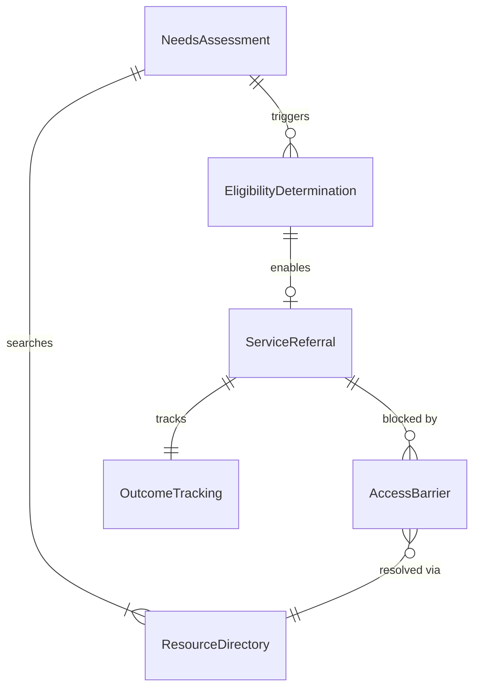
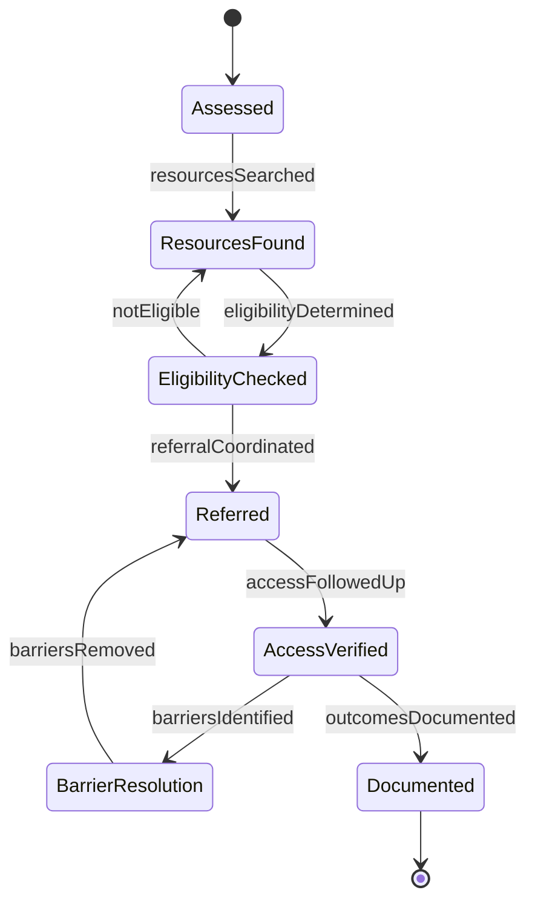
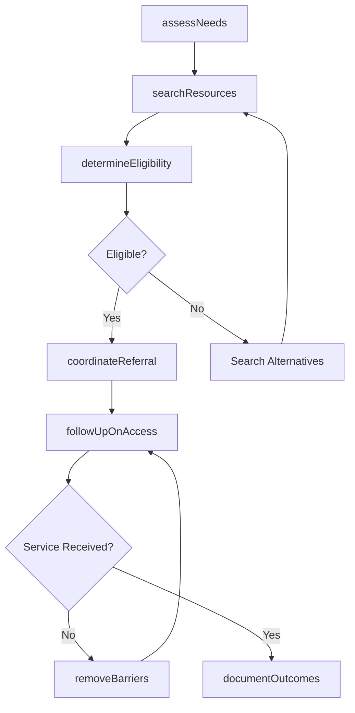
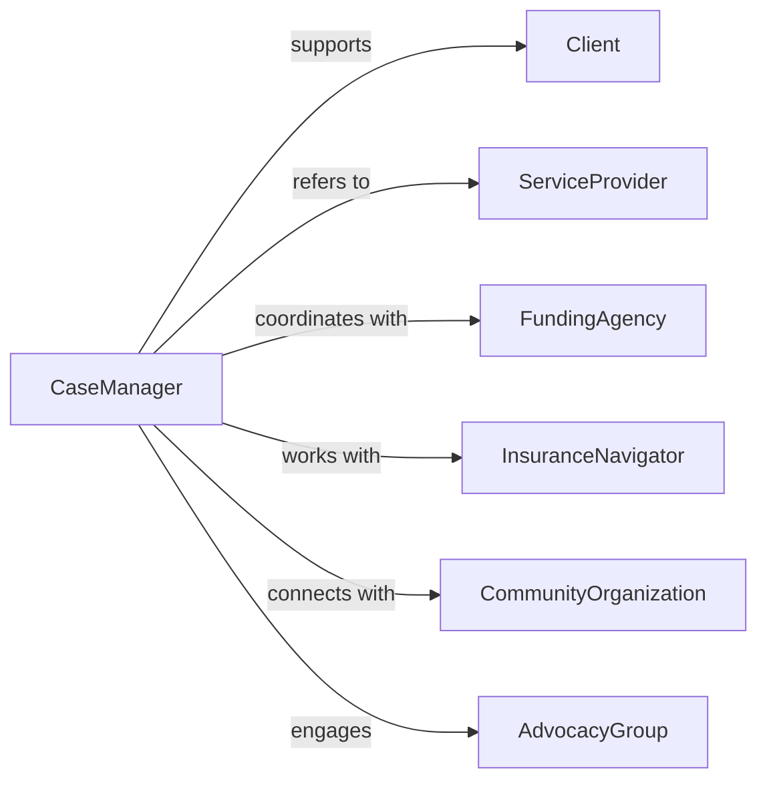

# Help Clients Get Needed Services

> Business-as-Code definition for client service navigation. Models assessment, resource matching, referral coordination, and follow-up to connect clients with essential services and community resources.

## Overview

Helping clients get needed services involves identifying gaps in care or support, researching available resources, coordinating referrals, and tracking access to services. This definition supports social work, care coordination, and community health by streamlining connections to housing, healthcare, food assistance, employment, and other vital resources.

## Actors

| Actor | Description |
|-------|-------------|
| Client | Individual seeking services or resources |
| ServiceProvider | Organization delivering needed programs or assistance |
| FundingAgency | Government or foundation providing financial support |
| InsuranceNavigator | Assists with health coverage enrollment and benefits |
| CommunityOrganization | Offers local resources and support programs |
| AdvocacyGroup | Helps clients navigate systems and resolve barriers |

## Roles

| Role | Description |
|------|-------------|
| CaseManager | Assesses needs and coordinates service access |
| ResourceNavigator | Identifies available services matching client needs |
| ReferralCoordinator | Facilitates connections between clients and providers |
| FollowUpSpecialist | Monitors service access and resolves barriers |

## Entities

| Entity | Description |
|--------|-------------|
| NeedsAssessment | Evaluation of client situation and service gaps |
| ResourceDirectory | Catalog of available services with eligibility criteria |
| ServiceReferral | Connection made between client and provider |
| EligibilityDetermination | Assessment of client qualification for services |
| AccessBarrier | Obstacle preventing client from receiving services |
| OutcomeTracking | Monitoring of service receipt and client progress |

## Actions

| Action | Description |
|--------|-------------|
| assessNeeds | Identify client situation and required services |
| searchResources | Find available programs matching client needs |
| determineEligibility | Verify client qualifies for identified services |
| coordinateReferral | Connect client with service provider |
| removeBarriers | Address obstacles preventing service access |
| followUpOnAccess | Confirm client received services successfully |
| documentOutcomes | Record service connections and client progress |

## Events

| Event | Description |
|-------|-------------|
| needsAssessed | Client situation evaluated with service gaps identified |
| resourcesSearched | Available programs found matching client needs |
| eligibilityDetermined | Client qualification for services verified |
| referralCoordinated | Connection made between client and provider |
| barriersRemoved | Obstacles to service access addressed |
| accessFollowedUp | Service receipt confirmed and documented |
| outcomesDocumented | Client progress and service effectiveness recorded |

## Searches

| Search | Description |
|--------|-------------|
| findClients | List individuals by needs, referral status, or case manager |
| getResources | Find services by type, location, or eligibility |
| getReferrals | Retrieve connections by client, provider, or date |
| getBarriers | Review obstacles by type or resolution status |

## Entity Relationships



## State Diagram



## Workflow



## Actor Relationships



## Usage

### Calling Actions

```typescript
import { helpClientsGetNeededServices } from '@headlessly/help-clients-get-needed-services'

const navigation = helpClientsGetNeededServices()

// Assess client's service needs
const assessment = await navigation.assessNeeds({
  clientId: 'CLT-2026-345',
  currentSituation: {
    housing: 'Homeless - staying in shelter',
    income: 'No current employment or benefits',
    health: 'Uninsured, untreated diabetes',
    food: 'Relies on emergency food assistance'
  },
  identifiedNeeds: [
    'Permanent housing',
    'Healthcare coverage',
    'Chronic disease management',
    'Food assistance',
    'Employment services'
  ],
  urgency: 'High - health condition worsening'
})

// Search for matching resources
const resources = await navigation.searchResources({
  assessmentId: assessment.id,
  serviceTypes: ['Housing', 'Healthcare', 'Food', 'Employment'],
  location: 'Urban County',
  filters: {
    acceptsUninsured: true,
    providesTransportation: true,
    immediateAvailability: true
  }
})

// Coordinate referral to housing program
await navigation.coordinateReferral({
  clientId: 'CLT-2026-345',
  serviceProviderId: 'PROV-HSG-001',
  programName: 'Rapid Rehousing Initiative',
  referralDate: '2026-02-05',
  contactInfo: 'intake@rapidrehousing.org, 555-0199',
  documentsNeeded: ['Photo ID', 'Proof of homelessness', 'Income statement'],
  appointmentScheduled: '2026-02-12 10:00 AM'
})

// Follow up on service access
await navigation.followUpOnAccess({
  referralId: 'REF-2026-890',
  followUpDate: '2026-02-15',
  contactMethod: 'Phone call with client',
  serviceReceived: false,
  barrier: 'Client unable to attend appointment due to lack of transportation',
  nextSteps: 'Arrange transportation assistance for rescheduled appointment'
})
```

### Event-Driven Automation

```typescript
// Auto-remove barriers when transportation needed
navigation.barriersRemoved(async ({ clientId, barrierType }) => {
  if (barrierType === 'transportation') {
    await navigation.coordinateReferral({
      clientId,
      serviceProviderId: 'PROV-TRANS-001',
      programName: 'Community Transportation Vouchers',
      priority: 'urgent'
    })
  }
})

// Alert on unsuccessful referral attempts
navigation.accessFollowedUp(async ({ clientId, referralId, attempts, serviceReceived }) => {
  if (attempts >= 3 && !serviceReceived) {
    await notify({
      to: 'case-manager-supervisor',
      message: `Client ${clientId} - referral ${referralId} unsuccessful after ${attempts} attempts. May need escalation.`
    })
  }
})
```
