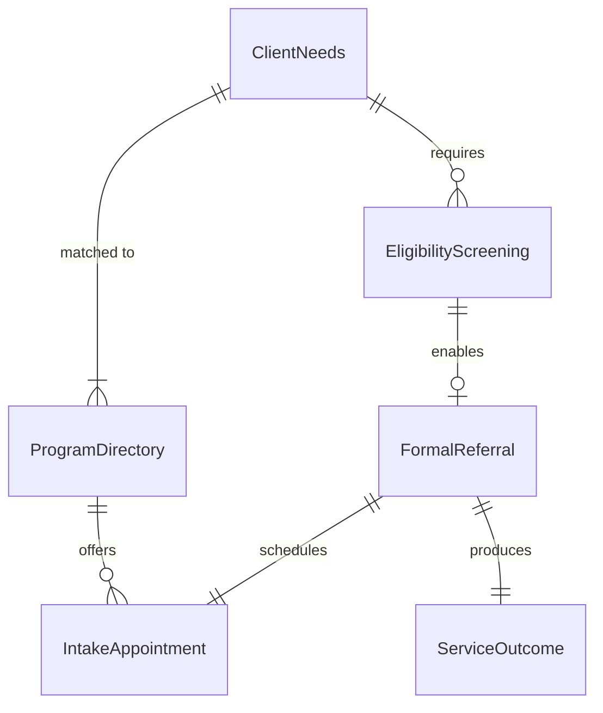
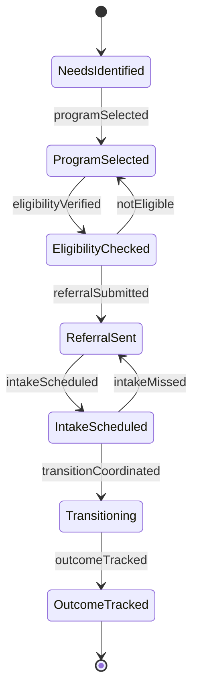
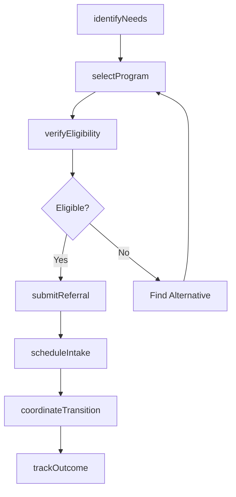
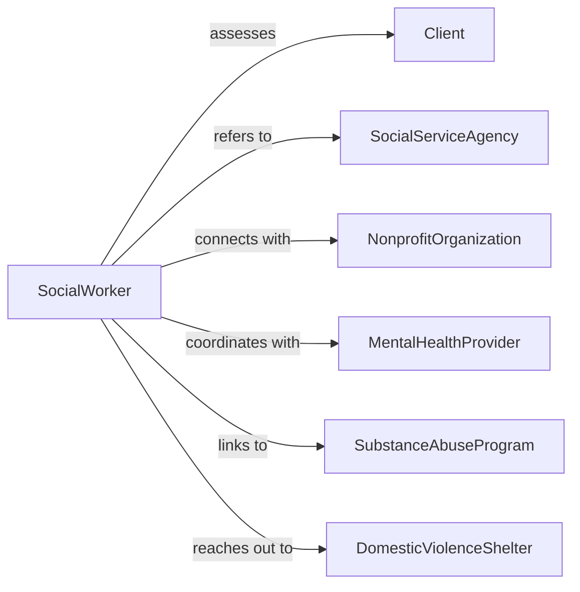

# Refer Clients Community Social Service

> Business-as-Code definition for community and social service referrals. Models the process of connecting clients to nonprofit organizations, government programs, and community resources for social support needs.

## Overview

Referring clients to community or social service programs involves identifying appropriate resources, verifying eligibility, making formal referrals, and coordinating intake with service providers. This definition supports social work, healthcare navigation, and community outreach by streamlining access to mental health, substance abuse treatment, domestic violence services, senior programs, and family support.

## Actors

| Actor | Description |
|-------|-------------|
| Client | Individual requiring community or social services |
| SocialServiceAgency | Government program providing benefits or assistance |
| NonprofitOrganization | Community-based service provider |
| MentalHealthProvider | Delivers counseling and behavioral health treatment |
| SubstanceAbuseProgram | Offers addiction treatment and recovery support |
| DomesticViolenceShelter | Provides safety and advocacy for abuse survivors |

## Roles

| Role | Description |
|------|-------------|
| SocialWorker | Assesses needs and coordinates community referrals |
| IntakeCoordinator | Manages referral receipt and client onboarding |
| CommunityLiaison | Maintains relationships with service providers |
| ReferralTracker | Monitors referral outcomes and service access |

## Entities

| Entity | Description |
|--------|-------------|
| ClientNeeds | Assessed social, emotional, or resource deficits |
| ProgramDirectory | Catalog of community services with intake processes |
| FormalReferral | Official connection made between client and agency |
| EligibilityScreening | Determination of client qualification for program |
| IntakeAppointment | Scheduled meeting to enroll in services |
| ServiceOutcome | Result of referral and service participation |

## Actions

| Action | Description |
|--------|-------------|
| identifyNeeds | Assess client's social service requirements |
| selectProgram | Choose appropriate community resource for needs |
| verifyEligibility | Confirm client qualifies for selected program |
| submitReferral | Send formal referral to service provider |
| scheduleIntake | Arrange client enrollment appointment |
| coordinateTransition | Support client through referral process |
| trackOutcome | Monitor service connection and participation |

## Events

| Event | Description |
|-------|-------------|
| needsIdentified | Client's social service needs documented |
| programSelected | Appropriate community resource chosen |
| eligibilityVerified | Client qualification confirmed for program |
| referralSubmitted | Formal referral sent to service provider |
| intakeScheduled | Enrollment appointment arranged |
| transitionCoordinated | Client supported through referral handoff |
| outcomeTracked | Service access and participation documented |

## Searches

| Search | Description |
|--------|-------------|
| findClients | List individuals by service needs or referral status |
| getPrograms | Retrieve community resources by type or location |
| getReferrals | Find connections by client, agency, or date |
| getOutcomes | Review service participation and effectiveness |

## Entity Relationships



## State Diagram



## Workflow



## Actor Relationships



## Usage

### Calling Actions

```typescript
import { referClientsCommunitySocialService } from '@headlessly/refer-clients-community-social-service'

const referrals = referClientsCommunitySocialService()

// Identify client's social service needs
const needs = await referrals.identifyNeeds({
  clientId: 'CLT-2026-567',
  assessmentFindings: {
    mentalHealth: 'Symptoms of depression and anxiety, requesting counseling',
    substanceUse: 'Denies current use, history of alcohol dependence',
    socialSupport: 'Isolated, no family nearby, few social connections',
    safetyRisk: 'None identified at this time'
  },
  priorityNeeds: ['Mental health counseling', 'Social support group']
})

// Select appropriate program
const program = await referrals.selectProgram({
  needsId: needs.id,
  programType: 'Mental health counseling',
  criteria: {
    acceptsUninsured: true,
    offersSlidingScale: true,
    location: 'Within 5 miles of client',
    specialties: ['Depression', 'Anxiety']
  }
})

// Submit formal referral
await referrals.submitReferral({
  clientId: 'CLT-2026-567',
  programId: program.id,
  agencyName: 'Community Mental Health Center',
  referralReason: 'Counseling for depression and anxiety symptoms',
  clinicalSummary: 'Client reports low mood, worry, social isolation for 6+ months',
  urgency: 'Routine - no immediate safety concerns',
  releaseOfInformation: 'Signed consent on file',
  contactInfo: {
    clientPhone: '555-0123',
    preferredContact: 'Phone, mornings best'
  }
})

// Track service outcome
await referrals.trackOutcome({
  referralId: 'REF-2026-234',
  followUpDate: '2026-03-05',
  serviceReceived: true,
  outcome: {
    attended: 'Completed intake and 3 counseling sessions',
    progress: 'Reports improved mood and learning coping strategies',
    ongoing: 'Continuing weekly therapy, will reassess in 3 months'
  }
})
```

### Event-Driven Automation

```typescript
// Auto-schedule follow-up after referral submitted
referrals.referralSubmitted(async ({ clientId, referralId, agencyName }) => {
  await scheduleFollowUp({
    clientId,
    referralId,
    task: `Check if ${agencyName} contacted client for intake`,
    dueDate: '14 days from referral'
  })
})

// Alert on declined or missed intake appointments
referrals.outcomeTracked(async ({ clientId, referralId, serviceReceived, reason }) => {
  if (!serviceReceived && reason === 'missed_intake') {
    await notify({
      to: 'social-worker',
      message: `Client ${clientId} missed intake for referral ${referralId}. May need barrier assessment and re-referral.`
    })
  }
})
```
