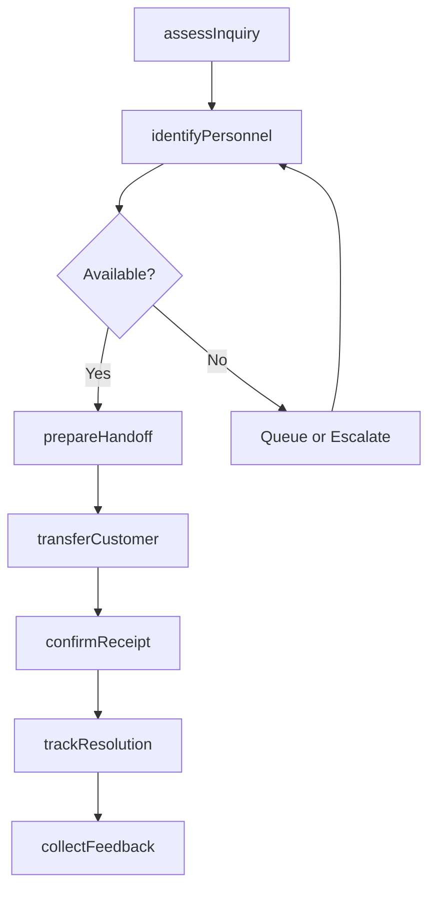
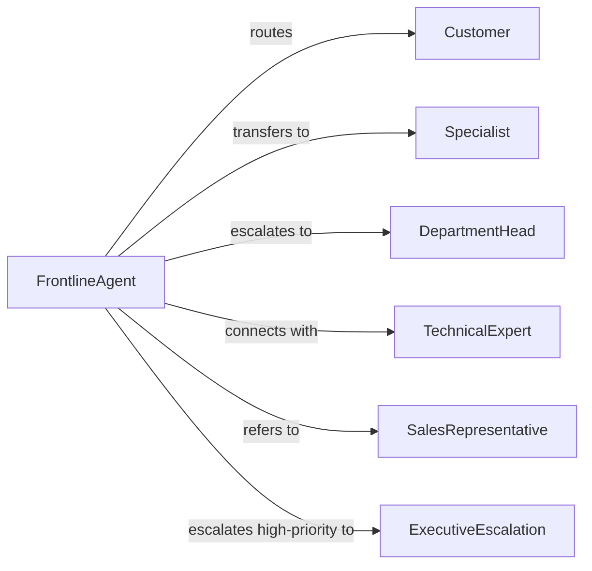

# Refer Customers Appropriate Personnel

> Business-as-Code definition for customer routing and personnel referrals. Models the process of directing customers to the right staff, specialists, or departments based on their needs and inquiry type.

## Overview

Referring customers to appropriate personnel involves assessing customer needs, identifying the correct expert or department, facilitating the handoff, and ensuring continuity of service. This definition supports customer service, sales operations, and technical support by optimizing routing, reducing wait times, and improving first-contact resolution.

## Actors

| Actor | Description |
|-------|-------------|
| Customer | Individual seeking assistance or expertise |
| Specialist | Staff member with expertise in specific area |
| DepartmentHead | Manager overseeing specialized team |
| TechnicalExpert | Handles complex product or service issues |
| SalesRepresentative | Manages purchase transactions and account relationships |
| ExecutiveEscalation | Senior leader addressing high-priority concerns |

## Roles

| Role | Description |
|------|-------------|
| FrontlineAgent | Initial contact point who assesses needs and routes |
| TransferCoordinator | Facilitates warm handoffs between personnel |
| QualityMonitor | Tracks routing accuracy and customer satisfaction |
| SkillsManager | Maintains expertise directory and routing rules |

## Entities

| Entity | Description |
|--------|-------------|
| CustomerInquiry | Request or issue requiring personnel expertise |
| RoutingCriteria | Rules for matching inquiries to appropriate staff |
| ExpertiseDirectory | Catalog of personnel skills and specializations |
| ReferralHandoff | Transfer of customer to appropriate personnel |
| EscalationPath | Defined progression for complex or unresolved issues |
| ResolutionTracking | Monitoring of issue handling and customer outcome |

## Actions

| Action | Description |
|--------|-------------|
| assessInquiry | Determine nature and complexity of customer need |
| identifyPersonnel | Match inquiry to staff member with appropriate expertise |
| prepareHandoff | Brief receiving personnel on customer context |
| transferCustomer | Connect customer to appropriate specialist or department |
| confirmReceipt | Verify specialist has accepted and engaged with customer |
| trackResolution | Monitor issue handling to completion |
| collectFeedback | Gather customer satisfaction with referral process |

## Events

| Event | Description |
|-------|-------------|
| inquiryAssessed | Customer need evaluated and categorized |
| personnelIdentified | Appropriate staff member selected for referral |
| handoffPrepared | Context provided to receiving specialist |
| customerTransferred | Connection made to appropriate personnel |
| receiptConfirmed | Specialist acknowledged customer engagement |
| resolutionTracked | Issue handling monitored through completion |
| feedbackCollected | Customer satisfaction documented |

## Searches

| Search | Description |
|--------|-------------|
| findInquiries | List customer requests by type, status, or urgency |
| getPersonnel | Find staff by expertise, availability, or department |
| getReferrals | Retrieve transfers by customer, date, or specialist |
| getResolutions | Review completed inquiries by outcome or satisfaction |

## Workflow



## Actor Relationships



## Usage

### Calling Actions

```typescript
import { referCustomersAppropriatePersonnel } from '@headlessly/refer-customers-appropriate-personnel'

const routing = referCustomersAppropriatePersonnel()

// Assess customer inquiry
const assessment = await routing.assessInquiry({
  customerId: 'CUST-2026-890',
  inquiryType: 'Technical support',
  complexity: 'High - requires product engineering expertise',
  summary: 'Customer experiencing intermittent API errors with enterprise integration',
  urgency: 'High - production system impacted',
  attemptedSolutions: ['Basic troubleshooting', 'Documentation review']
})

// Identify appropriate personnel
const personnel = await routing.identifyPersonnel({
  assessmentId: assessment.id,
  requiredSkills: ['API integration', 'Enterprise architecture', 'Production debugging'],
  availability: 'Immediate',
  department: 'Engineering'
})

// Prepare and transfer customer
await routing.prepareHandoff({
  inquiryId: assessment.id,
  targetPersonnelId: personnel.id,
  context: {
    customerName: 'Acme Corporation',
    accountTier: 'Enterprise',
    issue: 'Intermittent 503 errors on /api/v2/sync endpoint',
    impact: 'Production data sync failing 30% of requests',
    attemptedFixes: ['Increased timeout', 'Reduced payload size'],
    urgency: 'Revenue-impacting - customer threatening escalation'
  }
})

await routing.transferCustomer({
  customerId: 'CUST-2026-890',
  fromAgent: 'AGENT-123',
  toPersonnel: personnel.id,
  transferType: 'Warm handoff',
  customerNotified: true
})

// Track resolution to completion
await routing.trackResolution({
  inquiryId: assessment.id,
  updates: [
    { time: '14:15', status: 'Engineer investigating logs' },
    { time: '14:45', status: 'Root cause identified - rate limiting misconfiguration' },
    { time: '15:20', status: 'Fix deployed and verified in production' }
  ],
  resolution: 'Rate limit rules updated, sync errors resolved',
  resolutionTime: 95 // minutes
})
```

### Event-Driven Automation

```typescript
// Auto-escalate on long wait times
routing.personnelIdentified(async ({ inquiryId, personnelId, availability }) => {
  if (availability === 'unavailable' || availability > 30) {
    await routing.identifyPersonnel({
      inquiryId,
      escalate: true,
      targetLevel: 'department_head'
    })
  }
})

// Alert on negative feedback
routing.feedbackCollected(async ({ customerId, inquiryId, satisfaction, comments }) => {
  if (satisfaction <= 2) {
    await notify({
      to: 'quality-monitor',
      priority: 'high',
      message: `Low satisfaction (${satisfaction}/5) for inquiry ${inquiryId}: ${comments}`
    })
  }
})
```
