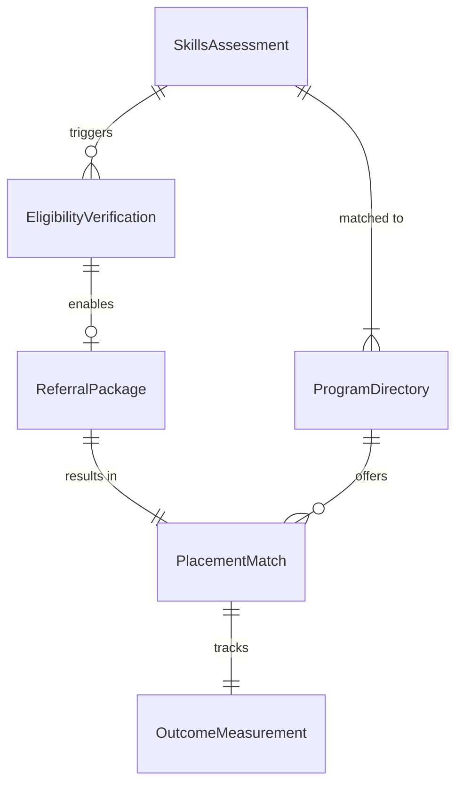
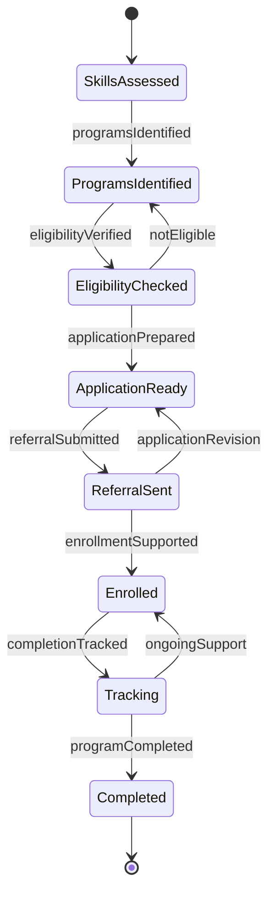
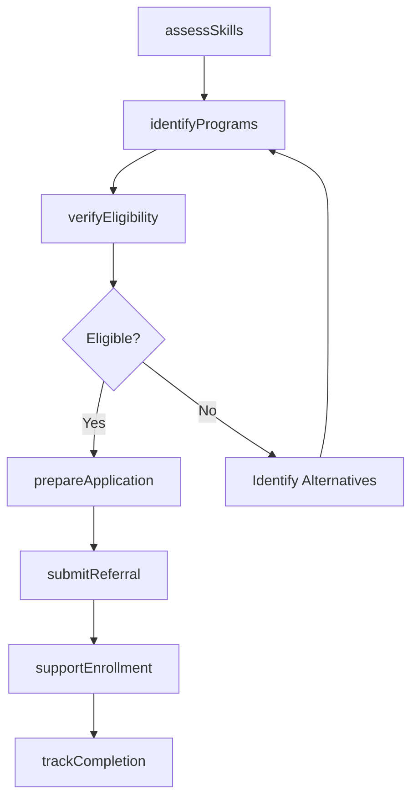
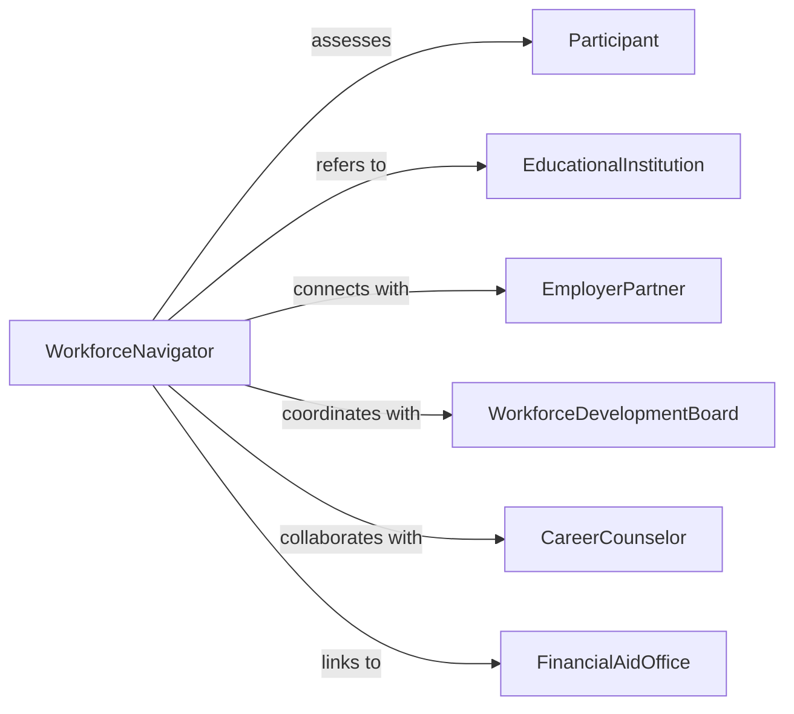

# Refer Individuals Educational Work Programs

> Business-as-Code definition for educational and workforce program referrals. Models the process of connecting individuals to training, education, job placement, and career development opportunities.

## Overview

Referring individuals to educational or work programs involves assessing skills and career goals, matching to appropriate training or employment opportunities, coordinating enrollment or placement, and tracking program completion and outcomes. This definition supports workforce development, career counseling, and economic mobility initiatives.

## Actors

| Actor | Description |
|-------|-------------|
| Participant | Individual seeking education or employment services |
| EducationalInstitution | College, vocational school, or training provider |
| EmployerPartner | Business offering job placement or apprenticeships |
| WorkforceDevelopmentBoard | Funds and oversees employment programs |
| CareerCounselor | Provides vocational guidance and planning |
| FinancialAidOffice | Assists with education funding and scholarships |

## Roles

| Role | Description |
|------|-------------|
| WorkforceNavigator | Assesses skills and coordinates program referrals |
| EnrollmentSpecialist | Facilitates admission to educational programs |
| JobPlacementCoordinator | Connects individuals with employment opportunities |
| ProgramMonitor | Tracks participation, completion, and outcomes |

## Entities

| Entity | Description |
|--------|-------------|
| SkillsAssessment | Evaluation of participant abilities and career interests |
| ProgramDirectory | Catalog of education and workforce opportunities |
| EligibilityVerification | Confirmation of qualification for programs |
| ReferralPackage | Application materials and support for enrollment |
| PlacementMatch | Connection between participant and opportunity |
| OutcomeMeasurement | Tracking of program completion and employment results |

## Actions

| Action | Description |
|--------|-------------|
| assessSkills | Evaluate participant education, experience, and goals |
| identifyPrograms | Find training or employment opportunities matching profile |
| verifyEligibility | Confirm participant meets program requirements |
| prepareApplication | Assist with enrollment paperwork and supporting documents |
| submitReferral | Send completed application to program or employer |
| supportEnrollment | Help participant navigate intake and orientation |
| trackCompletion | Monitor progress through program to credential or placement |

## Events

| Event | Description |
|-------|-------------|
| skillsAssessed | Participant capabilities and goals documented |
| programsIdentified | Matching education or work opportunities found |
| eligibilityVerified | Participant qualification confirmed for program |
| applicationPrepared | Enrollment materials completed and ready |
| referralSubmitted | Application sent to educational institution or employer |
| enrollmentSupported | Participant assisted through intake process |
| completionTracked | Progress and outcomes monitored |

## Searches

| Search | Description |
|--------|-------------|
| findParticipants | List individuals by career goals, skills, or status |
| getPrograms | Retrieve opportunities by type, location, or cost |
| getReferrals | Find applications by participant, program, or date |
| getOutcomes | Review completion rates and employment results |

## Entity Relationships



## State Diagram



## Workflow



## Actor Relationships



## Usage

### Calling Actions

```typescript
import { referIndividualsEducationalWorkPrograms } from '@headlessly/refer-individuals-educational-work-programs'

const workforce = referIndividualsEducationalWorkPrograms()

// Assess participant skills and goals
const assessment = await workforce.assessSkills({
  participantId: 'PART-2026-456',
  education: {
    highestLevel: 'High school diploma',
    certifications: []
  },
  experience: {
    years: 3,
    industries: ['Retail', 'Food service'],
    skills: ['Customer service', 'Cash handling', 'Inventory management']
  },
  careerGoals: {
    targetIndustry: 'Healthcare',
    targetRole: 'Medical assistant or patient care technician',
    timeline: 'Ready to start training within 3 months'
  },
  barriers: ['Limited computer skills', 'Need daytime schedule for childcare']
})

// Identify matching programs
const programs = await workforce.identifyPrograms({
  assessmentId: assessment.id,
  programTypes: ['Certificate training', 'Job placement'],
  criteria: {
    industry: 'Healthcare',
    duration: '<= 12 months',
    schedule: 'Flexible or evening options',
    cost: 'Free or financial aid available'
  }
})

// Submit referral to certified nursing assistant program
await workforce.submitReferral({
  participantId: 'PART-2026-456',
  programId: 'PROG-CNA-001',
  institutionName: 'Community College Healthcare Institute',
  programName: 'Certified Nursing Assistant Certificate',
  applicationPackage: {
    transcripts: 'High school diploma submitted',
    backgroundCheck: 'Cleared',
    healthScreening: 'TB test and immunizations verified',
    personalStatement: 'Completed',
    financialAid: 'WIOA funding approved'
  },
  expectedStartDate: '2026-03-15'
})

// Track program completion
await workforce.trackCompletion({
  referralId: 'REF-2026-678',
  milestones: [
    { date: '2026-03-15', event: 'Started CNA training program' },
    { date: '2026-05-20', event: 'Completed classroom instruction' },
    { date: '2026-06-30', event: 'Finished clinical practicum' },
    { date: '2026-07-15', event: 'Passed state certification exam' }
  ],
  outcome: {
    completed: true,
    credentialEarned: 'Certified Nursing Assistant',
    employmentStatus: 'Placed with hospital partner, full-time position',
    startingWage: 18.50
  }
})
```

### Event-Driven Automation

```typescript
// Auto-connect to financial aid when cost is barrier
workforce.eligibilityVerified(async ({ participantId, programId, costBarrier }) => {
  if (costBarrier) {
    await workforce.submitReferral({
      participantId,
      referralType: 'Financial aid',
      targetService: 'FinancialAidOffice',
      programs: ['WIOA funding', 'Pell grants', 'Scholarships']
    })
  }
})

// Alert on program dropout risk
workforce.completionTracked(async ({ participantId, referralId, attendance, status }) => {
  if (attendance < 70 && status === 'active') {
    await notify({
      to: 'workforce-navigator',
      message: `Participant ${participantId} has low attendance (${attendance}%) in referral ${referralId}. May need barrier assessment.`
    })
  }
})
```
