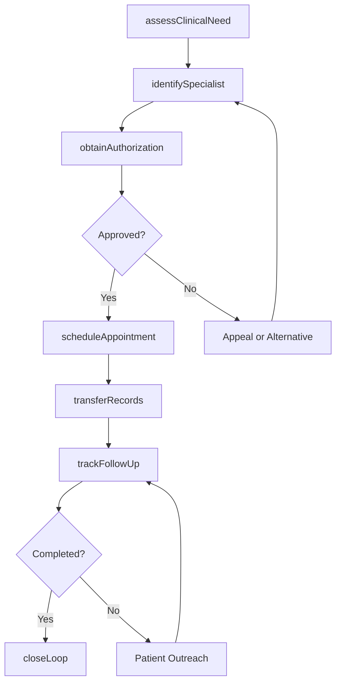
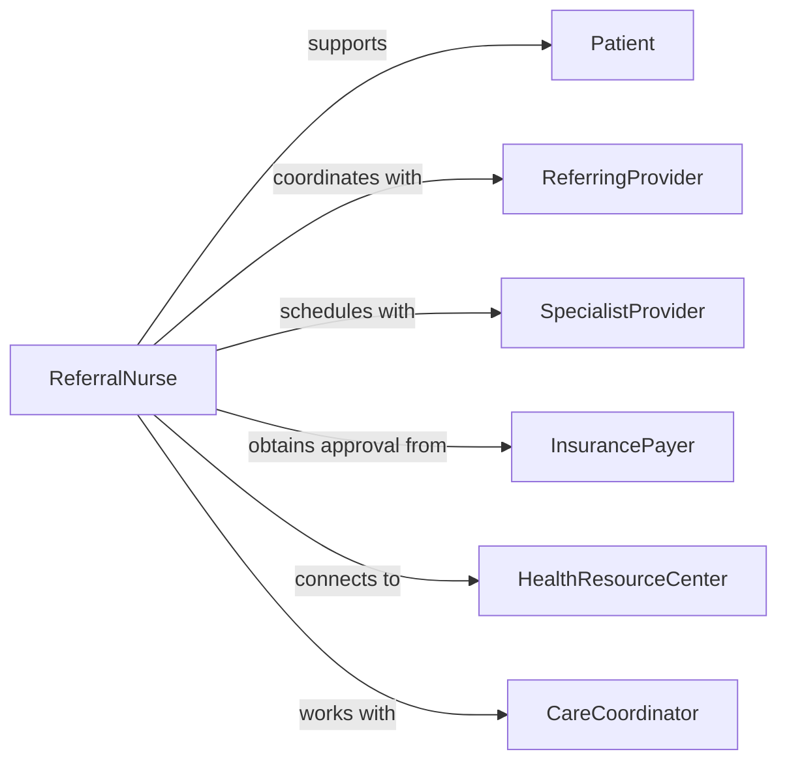

# Refer Patients Healthcare Practitioners Health

> Business-as-Code definition for patient healthcare referrals. Models the complete referral workflow from specialist identification through appointment coordination and care continuity for optimal patient outcomes.

## Overview

Referring patients to healthcare practitioners or health resources involves assessing clinical needs, identifying appropriate specialists or services, obtaining insurance authorization, coordinating appointments, and ensuring information exchange between providers. This definition supports primary care coordination, care management, and integrated health networks.

## Actors

| Actor | Description |
|-------|-------------|
| Patient | Individual requiring specialist or additional healthcare services |
| ReferringProvider | Primary care physician or practitioner making referral |
| SpecialistProvider | Physician with expertise in specific medical area |
| InsurancePayer | Authorizes coverage for specialist services |
| HealthResourceCenter | Community program or ancillary health service |
| CareCoordinator | Facilitates transitions between providers |

## Roles

| Role | Description |
|------|-------------|
| ReferralNurse | Processes referrals and coordinates appointments |
| AuthorizationSpecialist | Obtains insurance pre-approvals for services |
| PatientNavigator | Helps patients access and understand specialist care |
| MedicalRecordsClerk | Transfers clinical information between providers |

## Entities

| Entity | Description |
|--------|-------------|
| ReferralOrder | Clinical indication and request for specialist evaluation |
| ProviderDirectory | Network of specialists with credentials and availability |
| InsuranceAuthorization | Pre-approval for specialist visits and procedures |
| AppointmentScheduling | Coordination of patient visit with specialist |
| ClinicalSummary | Medical information shared with receiving provider |
| FollowUpTracking | Monitoring of referral completion and care continuity |

## Actions

| Action | Description |
|--------|-------------|
| assessClinicalNeed | Determine medical indication requiring specialist |
| identifySpecialist | Find appropriate provider based on condition and network |
| obtainAuthorization | Secure insurance approval for specialist services |
| scheduleAppointment | Coordinate patient visit with specialist office |
| transferRecords | Share relevant clinical information with specialist |
| trackFollowUp | Ensure patient attends appointment and receives care |
| closeLoop | Receive specialist findings and integrate into ongoing care |

## Events

| Event | Description |
|-------|-------------|
| clinicalNeedAssessed | Medical reason for referral documented |
| specialistIdentified | Appropriate provider selected for patient needs |
| authorizationObtained | Insurance approval secured for services |
| appointmentScheduled | Visit coordinated with specialist office |
| recordsTransferred | Clinical information sent to receiving provider |
| followUpTracked | Referral completion monitored |
| loopClosed | Specialist recommendations received and integrated |

## Searches

| Search | Description |
|--------|-------------|
| findReferrals | List referral orders by patient, status, or urgency |
| getSpecialists | Find providers by specialty, location, or insurance |
| getAuthorizations | Retrieve insurance approvals by patient or service |
| getPendingFollowUps | View referrals awaiting completion or response |

## Workflow



## Actor Relationships



## Usage

### Calling Actions

```typescript
import { referPatientsHealthcarePractitionersHealth } from '@headlessly/refer-patients-healthcare-practitioners-health'

const referrals = referPatientsHealthcarePractitionersHealth()

// Assess need for specialist referral
const assessment = await referrals.assessClinicalNeed({
  patientId: 'PT-2026-789',
  referringProviderId: 'DR-SMITH-J',
  clinicalIndication: 'Persistent atypical chest pain despite normal cardiac workup',
  symptoms: ['Chest discomfort with eating', 'Heartburn', 'Difficulty swallowing'],
  relevantHistory: ['Negative stress test', 'Normal echocardiogram'],
  requestedSpecialty: 'Gastroenterology',
  urgency: 'Routine - within 4 weeks'
})

// Identify appropriate specialist
const specialist = await referrals.identifySpecialist({
  assessmentId: assessment.id,
  specialty: 'Gastroenterology',
  criteria: {
    acceptsInsurance: 'Blue Cross PPO',
    location: 'Within 10 miles',
    availability: 'Within 4 weeks',
    subspecialty: 'Esophageal disorders'
  }
})

// Obtain insurance authorization
await referrals.obtainAuthorization({
  referralId: assessment.id,
  patientId: 'PT-2026-789',
  insuranceInfo: {
    carrier: 'Blue Cross PPO',
    memberId: 'BC123456789',
    groupNumber: 'GRP5000'
  },
  requestedServices: ['Initial consultation', 'Upper endoscopy if indicated'],
  clinicalJustification: 'Rule out GERD, esophageal stricture, or other upper GI pathology',
  authorizationObtained: 'AUTH-2026-456',
  validThrough: '2026-08-05'
})

// Schedule and coordinate appointment
await referrals.scheduleAppointment({
  referralId: assessment.id,
  specialistId: specialist.id,
  patientId: 'PT-2026-789',
  appointmentDate: '2026-02-28',
  appointmentTime: '14:30',
  specialistOffice: 'Digestive Health Associates',
  address: '456 Medical Plaza, Suite 200',
  patientNotified: true,
  prepInstructions: 'Bring list of current medications, arrive 15 minutes early'
})

// Transfer clinical records
await referrals.transferRecords({
  referralId: assessment.id,
  documentsIncluded: [
    'Referral letter with clinical summary',
    'Recent cardiac workup results',
    'Medication list',
    'Problem list and relevant history'
  ],
  transmissionMethod: 'Secure electronic health record exchange',
  sentDate: '2026-02-10'
})
```

### Event-Driven Automation

```typescript
// Alert on authorization denial
referrals.authorizationObtained(async ({ referralId, approved, denialReason }) => {
  if (!approved) {
    await notify({
      to: 'referral-nurse',
      priority: 'high',
      message: `Authorization denied for referral ${referralId}: ${denialReason}. Initiate appeal or identify alternative.`
    })
  }
})

// Track missed appointments
referrals.followUpTracked(async ({ referralId, patientId, appointmentStatus }) => {
  if (appointmentStatus === 'no_show') {
    await referrals.scheduleAppointment({
      referralId,
      patientId,
      reschedule: true,
      outreachReason: 'Missed previous appointment'
    })
  }
})

// Close the loop with referring provider
referrals.loopClosed(async ({ referralId, specialistFindings, recommendations }) => {
  await notifyReferringProvider({
    referralId,
    summary: specialistFindings,
    plan: recommendations,
    followUpNeeded: true
  })
})
```
