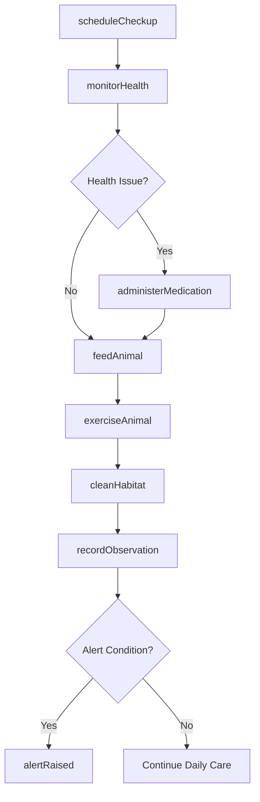
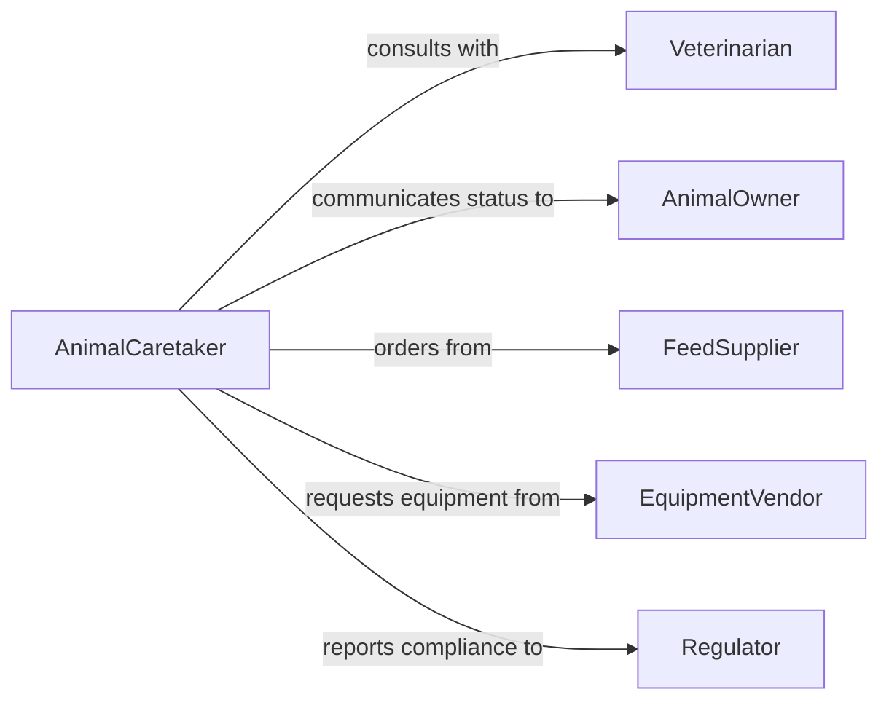

# Care Animals

> Business-as-Code definition for animal care operations. Models feeding, health monitoring, habitat maintenance, and welfare management for domestic and captive animals.

## Overview

Animal care encompasses the daily activities required to maintain animal health, comfort, and welfare in facilities such as veterinary clinics, shelters, farms, zoos, and boarding facilities. This definition provides actions for routine care tasks, events for monitoring animal status, and searches for care records and animal information.

## Actors

| Actor | Description |
|-------|-------------|
| Veterinarian | Provides medical care and health assessments |
| AnimalOwner | Responsible party who owns or has custody of animals |
| FeedSupplier | Provides food and nutrition products |
| EquipmentVendor | Supplies cages, bedding, and care equipment |
| Regulator | Enforces animal welfare standards and regulations |
| AdoptionAgency | Facilitates placement of animals into homes |

## Roles

| Role | Description |
|------|-------------|
| AnimalCaretaker | Provides daily care and monitors animal welfare |
| FacilityManager | Oversees care operations and resources |
| HealthMonitor | Tracks animal health indicators and alerts |
| FeedingCoordinator | Manages feeding schedules and nutrition |

## Entities

| Entity | Description |
|--------|-------------|
| Animal | Individual animal under care with health records |
| CareSchedule | Daily routine of feeding, cleaning, and activities |
| HealthRecord | Medical history, vaccinations, and health status |
| FeedingPlan | Nutrition requirements and feeding times |
| Habitat | Living space, enclosure, or facility housing |
| CareLog | Daily record of activities and observations |

## Actions

| Action | Description |
|--------|-------------|
| feedAnimal | Provide food and water according to schedule |
| monitorHealth | Check vital signs and behavior indicators |
| cleanHabitat | Maintain sanitary living conditions |
| administerMedication | Provide prescribed treatments and medications |
| exerciseAnimal | Facilitate physical activity and enrichment |
| recordObservation | Log behavior, health changes, or concerns |
| scheduleCheckup | Arrange veterinary examination or care appointment |

## Events

| Event | Description |
|-------|-------------|
| animalFed | Food and water have been provided |
| healthMonitored | Health check has been completed |
| habitatCleaned | Living space has been sanitized |
| medicationAdministered | Treatment has been given to animal |
| animalExercised | Physical activity session completed |
| observationRecorded | Care log entry has been created |
| alertRaised | Concerning behavior or health issue detected |

## Searches

| Search | Description |
|--------|-------------|
| findAnimals | List animals by species, facility, or health status |
| getCareLogs | Retrieve care records by animal or date range |
| getHealthRecords | Access medical history and vaccination records |
| getSchedules | Find upcoming feeding, cleaning, or care tasks |
| getAlerts | Retrieve active health or welfare alerts |

## Workflow



## Actor Relationships



## Usage

### Calling Actions

```typescript
import { careAnimals } from '@headlessly/care-animals'

const care = careAnimals()

// Record morning feeding
await care.feedAnimal({
  animalId: 'dog-2847',
  foodType: 'premium kibble',
  amount: '2 cups',
  timestamp: new Date()
})

// Monitor health during rounds
const healthCheck = await care.monitorHealth({
  animalId: 'dog-2847',
  vitals: {
    temperature: 101.5,
    heartRate: 90,
    behavior: 'alert and active'
  }
})

// Clean habitat after feeding
await care.cleanHabitat({
  animalId: 'dog-2847',
  tasks: ['remove waste', 'replace bedding', 'sanitize bowls']
})
```

### Event-Driven Automation

```typescript
// Alert staff when health concerns are detected
care.healthMonitored(async ({ animalId, vitals }) => {
  if (vitals.temperature > 103 || vitals.temperature < 100) {
    await care.recordObservation({
      animalId,
      note: 'Temperature outside normal range',
      priority: 'high'
    })
  }
})

// Schedule next checkup after medication
care.medicationAdministered(async ({ animalId, medication }) => {
  if (medication.requiresFollowup) {
    await care.scheduleCheckup({
      animalId,
      type: 'medication followup',
      daysFromNow: 3
    })
  }
})
```
