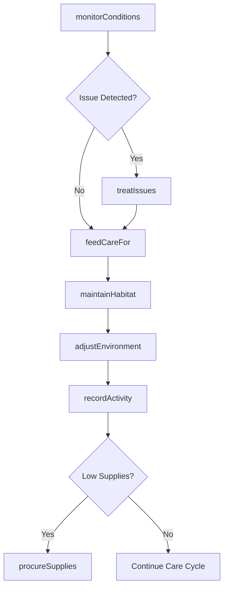
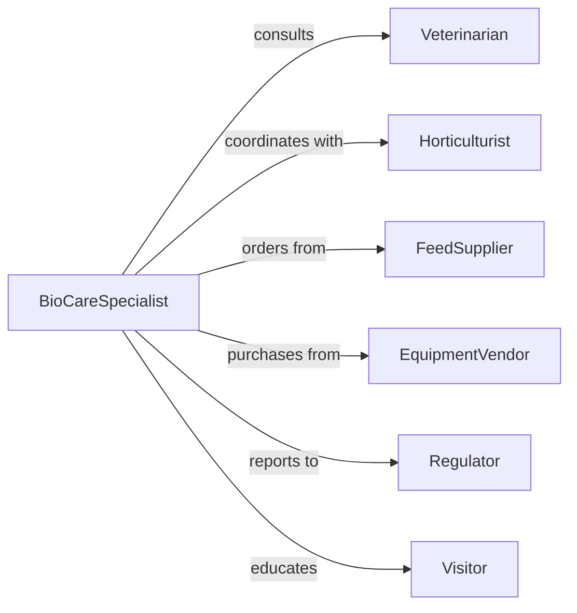

# Care Plants Animals

> Business-as-Code definition for integrated plant and animal care operations. Models dual-care facilities including botanical gardens with wildlife, agricultural operations, and conservation programs.

## Overview

Integrated plant and animal care involves managing facilities where both flora and fauna require coordinated attention, such as farms, zoos with botanical exhibits, conservation centers, and educational institutions. This definition provides actions for both plant cultivation and animal husbandry, events for monitoring ecosystem health, and searches for comprehensive care records.

## Actors

| Actor | Description |
|-------|-------------|
| Veterinarian | Provides animal medical care and health services |
| Horticulturist | Advises on plant health and cultivation techniques |
| FeedSupplier | Supplies animal nutrition and plant fertilizers |
| EquipmentVendor | Provides care tools, irrigation, and enclosures |
| Regulator | Enforces environmental and animal welfare standards |
| Visitor | Guests who observe and interact with exhibits |

## Roles

| Role | Description |
|------|-------------|
| BioCareSpecialist | Manages both plant and animal welfare |
| FacilityCoordinator | Oversees integrated care operations |
| HealthMonitor | Tracks indicators for plants and animals |
| EnvironmentManager | Maintains habitat conditions for both |

## Entities

| Entity | Description |
|--------|-------------|
| Animal | Living creature requiring food, shelter, and care |
| Plant | Flora requiring water, light, and nutrients |
| CareSchedule | Integrated routine for plants and animals |
| Habitat | Shared or adjacent living environment |
| HealthRecord | Medical and growth tracking for organisms |
| ResourceInventory | Feed, fertilizer, medication, and supplies |

## Actions

| Action | Description |
|--------|-------------|
| feedCareFor | Provide nutrition to animals and water to plants |
| monitorConditions | Check health, growth, and environmental factors |
| maintainHabitat | Clean and optimize living spaces for both |
| treatIssues | Address health problems in plants or animals |
| recordActivity | Log care tasks and observations |
| adjustEnvironment | Modify temperature, humidity, or lighting |
| procureSupplies | Order feed, fertilizer, and care materials |

## Events

| Event | Description |
|-------|-------------|
| careProvided | Feeding or watering task completed |
| conditionsMonitored | Health and environment check performed |
| habitatMaintained | Cleaning or optimization task completed |
| issuesTreated | Medical or horticultural intervention applied |
| activityRecorded | Care log entry created |
| environmentAdjusted | Climate or conditions modified |
| suppliesProcured | Resources ordered or received |

## Searches

| Search | Description |
|--------|-------------|
| findOrganisms | List animals or plants by type, location, or health |
| getCareLogs | Retrieve activity records by organism or date |
| getHealthRecords | Access medical and growth histories |
| getSupplies | Check inventory levels for feed and fertilizer |
| getAlerts | Find health or environmental concerns |

## Workflow



## Actor Relationships



## Usage

### Calling Actions

```typescript
import { carePlantsAnimals } from '@headlessly/care-plants-animals'

const care = carePlantsAnimals()

// Morning care routine
await care.feedCareFor({
  organisms: [
    { type: 'animal', id: 'parrot-401', food: 'seed mix', amount: '1 cup' },
    { type: 'plant', id: 'orchid-208', water: '200ml' }
  ]
})

// Monitor habitat conditions
const conditions = await care.monitorConditions({
  habitatId: 'tropical-exhibit',
  checks: ['temperature', 'humidity', 'animal health', 'plant vigor']
})

// Adjust environment based on monitoring
await care.adjustEnvironment({
  habitatId: 'tropical-exhibit',
  changes: {
    temperature: 78,
    humidity: 75,
    lighting: 'increase by 10%'
  }
})
```

### Event-Driven Automation

```typescript
// Alert when conditions fall outside optimal range
care.conditionsMonitored(async ({ habitatId, conditions }) => {
  if (conditions.temperature < 70 || conditions.humidity < 60) {
    await care.adjustEnvironment({
      habitatId,
      changes: { temperature: 75, humidity: 70 }
    })
  }
})

// Reorder supplies when inventory is low
care.careProvided(async ({ organisms, supplies }) => {
  const lowStock = supplies.filter(s => s.remaining < s.reorderLevel)
  if (lowStock.length > 0) {
    await care.procureSupplies({
      items: lowStock.map(s => ({ name: s.name, quantity: s.reorderQuantity }))
    })
  }
})
```
