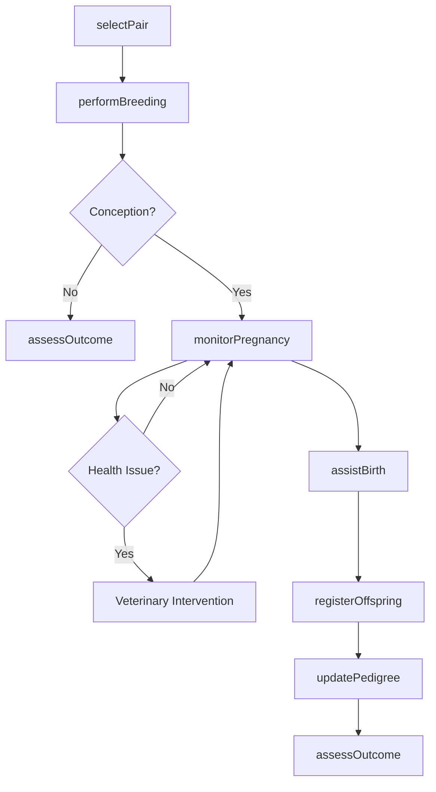
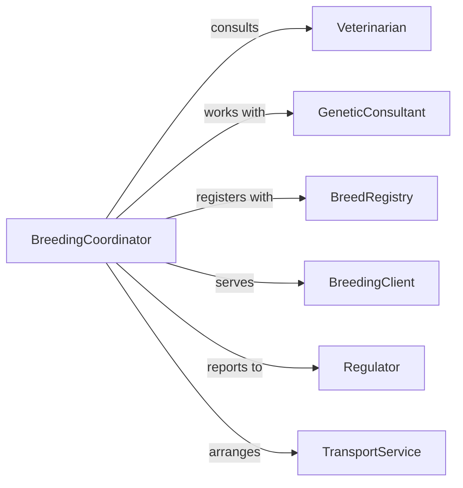

# Perform Animal Breeding Procedures

> Business-as-Code definition for animal breeding operations. Models genetic selection, reproduction management, pregnancy monitoring, and offspring care for agricultural, conservation, and companion animal programs.

## Overview

Animal breeding procedures involve systematic planning and execution of reproduction programs to achieve desired genetic outcomes, maintain population health, and support conservation or commercial objectives. This definition provides actions for breeding management, events for tracking reproduction milestones, and searches for genetic and offspring records.

## Actors

| Actor | Description |
|-------|-------------|
| Veterinarian | Provides reproductive health services and assistance |
| GeneticConsultant | Advises on breeding pairs and genetic diversity |
| BreedRegistry | Maintains pedigree records and registration |
| BreedingClient | Purchases breeding services or offspring |
| Regulator | Enforces animal welfare and breeding standards |
| TransportService | Moves animals for breeding appointments |

## Roles

| Role | Description |
|------|-------------|
| BreedingCoordinator | Plans and manages breeding programs |
| ReproductionSpecialist | Executes breeding procedures and monitoring |
| GeneticsAnalyst | Evaluates pedigrees and selects breeding pairs |
| OffspringManager | Cares for pregnant animals and newborns |

## Entities

| Entity | Description |
|--------|-------------|
| BreedingAnimal | Individual animal eligible for reproduction |
| BreedingPair | Selected male and female for mating |
| BreedingCycle | Single reproduction attempt with timeline |
| Pregnancy | Gestation period with monitoring data |
| Offspring | Individual born from breeding procedure |
| PedigreeRecord | Genetic lineage and registration documentation |

## Actions

| Action | Description |
|--------|-------------|
| selectPair | Choose compatible animals for breeding |
| performBreeding | Execute natural or assisted reproduction |
| monitorPregnancy | Track gestation progress and health |
| assistBirth | Provide delivery support and intervention |
| registerOffspring | Document and certify newborn animals |
| assessOutcome | Evaluate breeding success and offspring quality |
| updatePedigree | Record lineage and genetic information |

## Events

| Event | Description |
|-------|-------------|
| pairSelected | Breeding animals have been matched |
| breedingPerformed | Reproduction procedure completed |
| pregnancyConfirmed | Conception verified through examination |
| pregnancyMonitored | Gestation check completed |
| birthAssisted | Delivery has occurred |
| offspringRegistered | Newborn documentation created |
| outcomeAssessed | Breeding cycle evaluation completed |

## Searches

| Search | Description |
|--------|-------------|
| findBreedingAnimals | List eligible animals by genetics and health |
| getBreedingHistory | Retrieve past breeding cycles and outcomes |
| getPregnancies | Find animals currently in gestation |
| getOffspring | List progeny by parent, date, or characteristics |
| getPedigrees | Access genetic lineage records |

## Workflow



## Actor Relationships



## Usage

### Calling Actions

```typescript
import { performAnimalBreedingProcedures } from '@headlessly/perform-animal-breeding-procedures'

const breeding = performAnimalBreedingProcedures()

// Select compatible breeding pair
const pair = await breeding.selectPair({
  female: { id: 'mare-301', breed: 'Thoroughbred', age: 5 },
  male: { id: 'stallion-204', breed: 'Thoroughbred', age: 7 },
  criteria: ['genetic diversity', 'temperament', 'performance records']
})

// Perform breeding procedure
await breeding.performBreeding({
  pairId: pair.id,
  method: 'natural',
  date: '2026-03-15'
})

// Monitor pregnancy progress
const monitoring = await breeding.monitorPregnancy({
  animalId: 'mare-301',
  checks: ['ultrasound', 'weight', 'behavior', 'nutrition']
})
```

### Event-Driven Automation

```typescript
// Alert when pregnancy is confirmed
breeding.pregnancyConfirmed(async ({ animalId, expectedDate }) => {
  await breeding.updatePedigree({
    animalId,
    status: 'pregnant',
    expectedDelivery: expectedDate
  })
})

// Schedule follow-up monitoring
breeding.pregnancyMonitored(async ({ animalId, gestationDay }) => {
  if (gestationDay % 30 === 0) {
    await breeding.monitorPregnancy({
      animalId,
      checks: ['ultrasound', 'health assessment']
    })
  }
})

// Register offspring immediately after birth
breeding.birthAssisted(async ({ motherId, offspring }) => {
  for (const newborn of offspring) {
    await breeding.registerOffspring({
      parents: { mother: motherId, father: newborn.fatherId },
      birthDate: new Date(),
      characteristics: newborn
    })
  }
})
```
