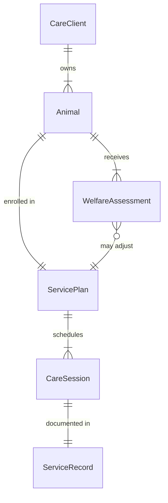
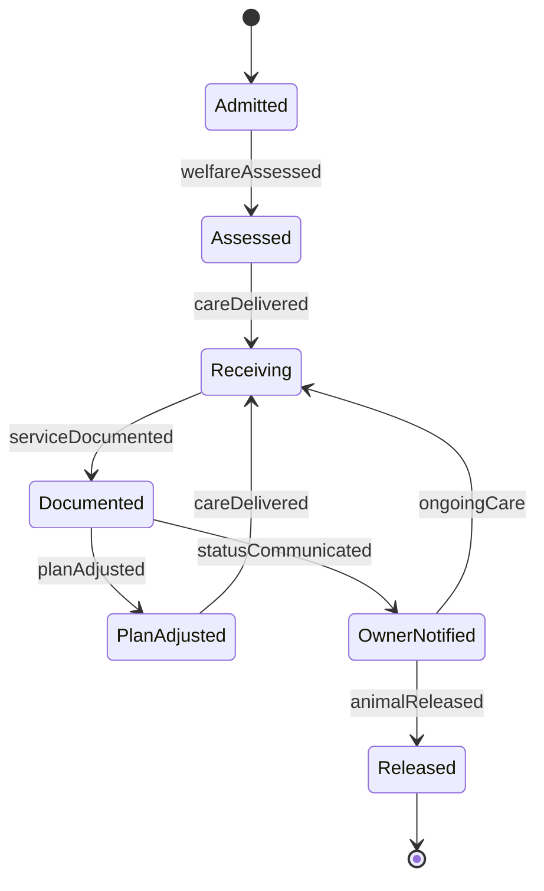
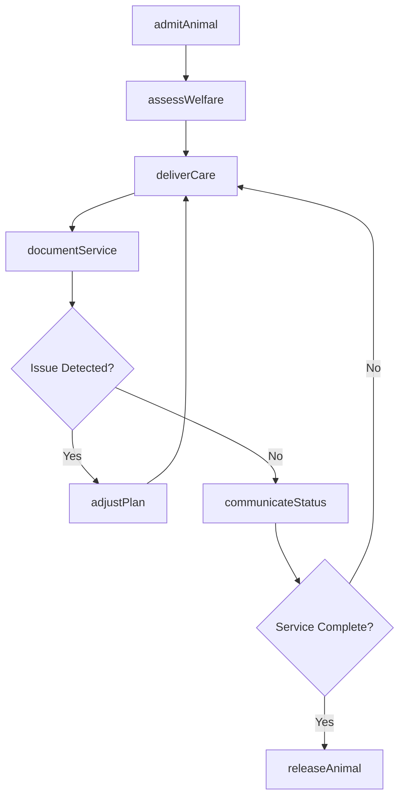
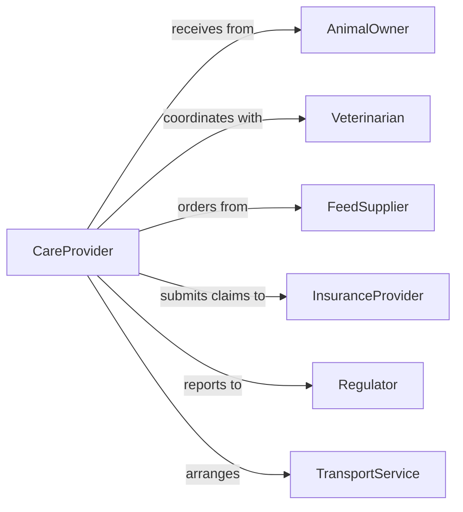

# Provide Care Animals

> Business-as-Code definition for comprehensive animal care service delivery. Models professional care operations for domestic animals, livestock, and captive wildlife across facilities including shelters, kennels, farms, and sanctuaries.

## Overview

Providing care for animals involves delivering systematic health monitoring, nutrition management, habitat maintenance, and behavioral enrichment services. This definition exposes actions for care service delivery, events for tracking care outcomes, and searches for service records and animal welfare metrics.

## Actors

| Actor | Description |
|-------|-------------|
| AnimalOwner | Client who entrusts animals to care facility |
| Veterinarian | Provides medical oversight and emergency care |
| FeedSupplier | Delivers nutrition products and supplements |
| InsuranceProvider | Covers medical treatments and liability |
| Regulator | Inspects facilities and enforces welfare standards |
| TransportService | Moves animals to and from care facility |

## Roles

| Role | Description |
|------|-------------|
| CareProvider | Delivers hands-on care services to animals |
| ServiceCoordinator | Schedules and manages care programs |
| WelfareOfficer | Ensures standards compliance and animal wellbeing |
| NutritionSpecialist | Manages dietary plans and feeding protocols |

## Entities

| Entity | Description |
|--------|-------------|
| CareClient | Customer relationship and service agreement |
| Animal | Individual animal with care plan and history |
| ServicePlan | Package of care services and schedule |
| CareSession | Single instance of care delivery |
| WelfareAssessment | Evaluation of animal health and behavior |
| ServiceRecord | Documentation of care activities provided |

## Actions

| Action | Description |
|--------|-------------|
| admitAnimal | Intake animal into care facility with assessment |
| deliverCare | Execute scheduled care services and activities |
| assessWelfare | Evaluate animal health, behavior, and comfort |
| adjustPlan | Modify care services based on needs or issues |
| documentService | Record care activities and observations |
| communicateStatus | Update owner on animal condition and care |
| releaseAnimal | Discharge animal from care facility |

## Events

| Event | Description |
|-------|-------------|
| animalAdmitted | Animal has been received into care facility |
| careDelivered | Scheduled care services have been completed |
| welfareAssessed | Health and behavior evaluation completed |
| planAdjusted | Care plan has been modified |
| serviceDocumented | Care record has been created |
| statusCommunicated | Owner notification sent |
| animalReleased | Animal has been discharged to owner |

## Searches

| Search | Description |
|--------|-------------|
| findClients | List active care clients by date or facility |
| getAnimalsInCare | Retrieve animals currently receiving services |
| getServiceRecords | Access care activity logs by animal or date |
| getWelfareScores | Find animals by welfare assessment ratings |
| getSchedule | View upcoming care sessions and activities |

## Entity Relationships



## State Diagram



## Workflow



## Actor Relationships



## Usage

### Calling Actions

```typescript
import { provideCareAnimals } from '@headlessly/provide-care-animals'

const care = provideCareAnimals()

// Admit animal for boarding
const admission = await care.admitAnimal({
  clientId: 'client-1847',
  animal: {
    name: 'Max',
    species: 'dog',
    breed: 'Labrador',
    age: 3
  },
  servicePlan: 'standard-boarding',
  duration: { start: '2026-02-10', end: '2026-02-17' }
})

// Deliver daily care services
await care.deliverCare({
  animalId: admission.animalId,
  services: ['feeding', 'exercise', 'medication', 'socialization']
})

// Assess welfare during care
const assessment = await care.assessWelfare({
  animalId: admission.animalId,
  metrics: {
    appetite: 'good',
    energy: 'high',
    behavior: 'friendly',
    physicalCondition: 'excellent'
  }
})
```

### Event-Driven Automation

```typescript
// Notify owner when welfare concerns arise
care.welfareAssessed(async ({ animalId, metrics }) => {
  if (metrics.appetite === 'poor' || metrics.energy === 'low') {
    await care.communicateStatus({
      animalId,
      message: 'We noticed your pet is showing reduced appetite. Our team is monitoring closely.'
    })
  }
})

// Auto-adjust plan if repeated issues
care.planAdjusted(async ({ animalId, adjustments }) => {
  await care.documentService({
    animalId,
    note: `Care plan modified: ${adjustments.join(', ')}`,
    timestamp: new Date()
  })
})
```
