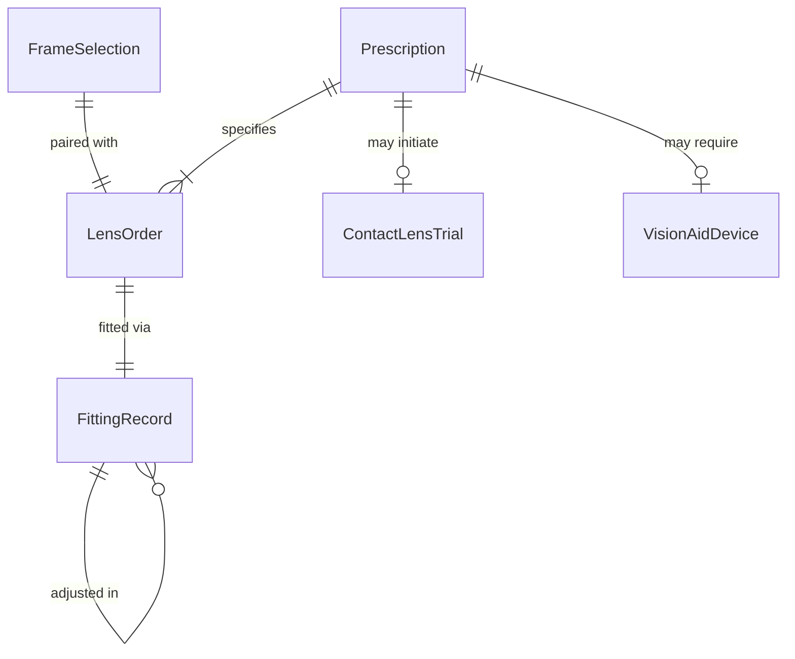
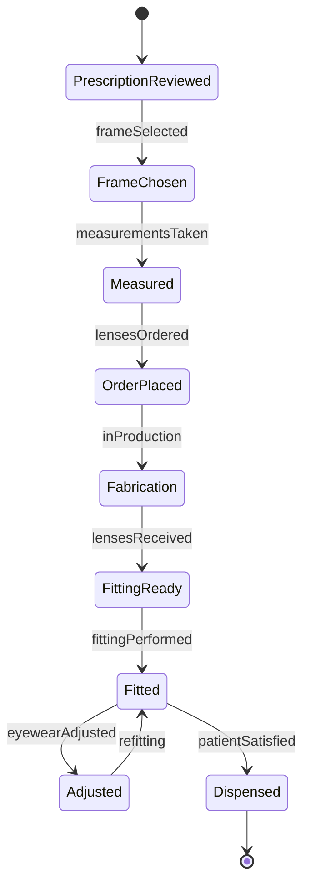
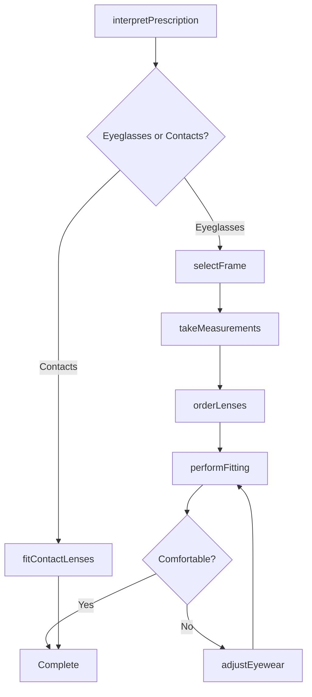
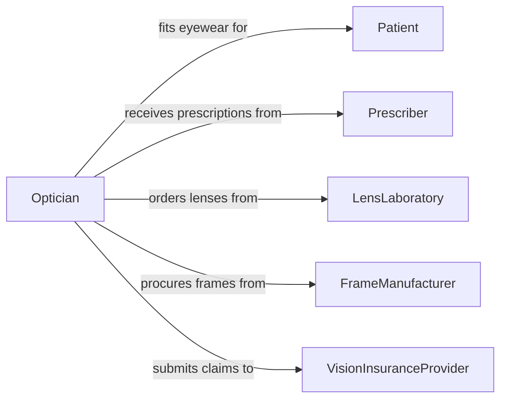

# Fit Eyeglasses Contact Lenses Vision

> Business-as-Code definition for fitting eyeglasses, contact lenses, or other vision aids. Models the optical dispensing workflow from prescription interpretation and frame selection through lens fabrication, fitting adjustments, and patient education.

## Overview

Fitting eyeglasses, contact lenses, or other vision aids involves interpreting optical prescriptions, helping patients select appropriate frames and lens options, taking precise measurements, ordering or fabricating lenses, performing fittings, and making adjustments to ensure comfort and visual accuracy. This activity spans optometric and ophthalmologic practices, retail optical shops, and specialty low-vision clinics, covering standard corrective lenses, progressive multifocals, contact lenses, sports eyewear, and assistive vision devices.

## Actors

| Actor | Description |
|-------|-------------|
| Patient | Individual receiving fitted eyeglasses, contact lenses, or vision aids |
| Prescriber | Optometrist or ophthalmologist who provides the vision prescription |
| LensLaboratory | Facility that fabricates custom lenses to prescription specifications |
| FrameManufacturer | Supplier of eyeglass frames and optical accessories |
| VisionInsuranceProvider | Organization that covers optical products and fitting services |

## Roles

| Role | Description |
|------|-------------|
| Optician | Licensed professional who fits and dispenses corrective eyewear |
| ContactLensSpecialist | Fits and manages contact lens prescriptions and follow-up |
| OpticalTechnician | Takes measurements, adjusts frames, and performs minor repairs |
| DispensaryManager | Oversees optical inventory, orders, and dispensing operations |

## Entities

| Entity | Description |
|--------|-------------|
| Prescription | An optical prescription specifying corrective lens parameters |
| FrameSelection | The chosen eyeglass frame with measurements and specifications |
| LensOrder | An order for custom-fabricated lenses to prescription |
| FittingRecord | Documentation of measurements, adjustments, and final fit |
| ContactLensTrial | A trial fitting of contact lenses with comfort and vision assessment |
| VisionAidDevice | A specialized low-vision or assistive optical device |

## Actions

| Action | Description |
|--------|-------------|
| interpretPrescription | Review and verify the optical prescription parameters |
| selectFrame | Assist the patient in choosing an appropriate frame style and fit |
| takeMeasurements | Capture pupillary distance, segment height, and fitting dimensions |
| orderLenses | Submit a lens fabrication order to the laboratory |
| performFitting | Fit the completed eyewear to the patient and verify visual acuity |
| adjustEyewear | Make frame adjustments for comfort and proper alignment |
| fitContactLenses | Evaluate, fit, and dispense contact lenses |

## Events

| Event | Description |
|-------|-------------|
| prescriptionInterpreted | An optical prescription has been reviewed and verified |
| frameSelected | A patient has chosen an eyeglass frame |
| measurementsTaken | Fitting measurements have been captured |
| lensesOrdered | A lens fabrication order has been submitted |
| fittingPerformed | Completed eyewear has been fitted to the patient |
| eyewearAdjusted | Frame adjustments have been made for the patient |
| contactLensesFitted | Contact lenses have been fitted and dispensed |

## Searches

| Search | Description |
|--------|-------------|
| findFittingRecords | Retrieve fitting records by patient, date, or eyewear type |
| getLensOrders | List lens orders by status, laboratory, or prescription type |
| findPendingPickups | Locate completed orders awaiting patient pickup |
| getContactLensTrials | Retrieve contact lens trial history for a patient |

## Entity Relationships



## State Diagram



## Workflow



## Actor Relationships



## Usage

### Calling Actions

```typescript
import { fitEyeglassesContactLensesVision } from '@headlessly/fit-eyeglasses-contact-lenses-vision'

const optical = fitEyeglassesContactLensesVision()

// Interpret the prescription
const rx = await optical.interpretPrescription({
  patientId: 'patient-4238',
  prescription: {
    rightEye: { sphere: -2.50, cylinder: -0.75, axis: 180 },
    leftEye: { sphere: -3.00, cylinder: -0.50, axis: 170 },
    add: 1.50,
    prescriberId: 'dr-optometrist-118'
  }
})

// Select frame and take measurements
const frame = await optical.selectFrame({
  patientId: rx.patientId,
  frameId: 'frame-rayban-5228',
  size: '53-17-140',
  color: 'dark-havana'
})

const measurements = await optical.takeMeasurements({
  patientId: rx.patientId,
  frameId: frame.id,
  pupillaryDistance: 63,
  segmentHeight: 18,
  vertexDistance: 12
})

// Order lenses
await optical.orderLenses({
  patientId: rx.patientId,
  prescriptionId: rx.id,
  frameId: frame.id,
  measurements: measurements.id,
  lensType: 'progressive',
  material: 'polycarbonate',
  coatings: ['anti-reflective', 'scratch-resistant', 'UV-protection']
})
```

### Event-Driven Automation

```typescript
// Notify patient when lenses are ready
optical.lensesOrdered(async ({ patientId, orderId, estimatedReady }) => {
  await notify({
    to: patientId,
    message: `Your lenses have been ordered and will be ready by ${estimatedReady}`
  })
})

// Schedule follow-up for contact lens fittings
optical.contactLensesFitted(async ({ patientId, lensType }) => {
  await scheduleAppointment({
    patientId,
    type: 'contact-lens-follow-up',
    date: addWeeks(new Date(), 1),
    reason: 'Assess comfort and fit of new contact lenses'
  })
})
```
