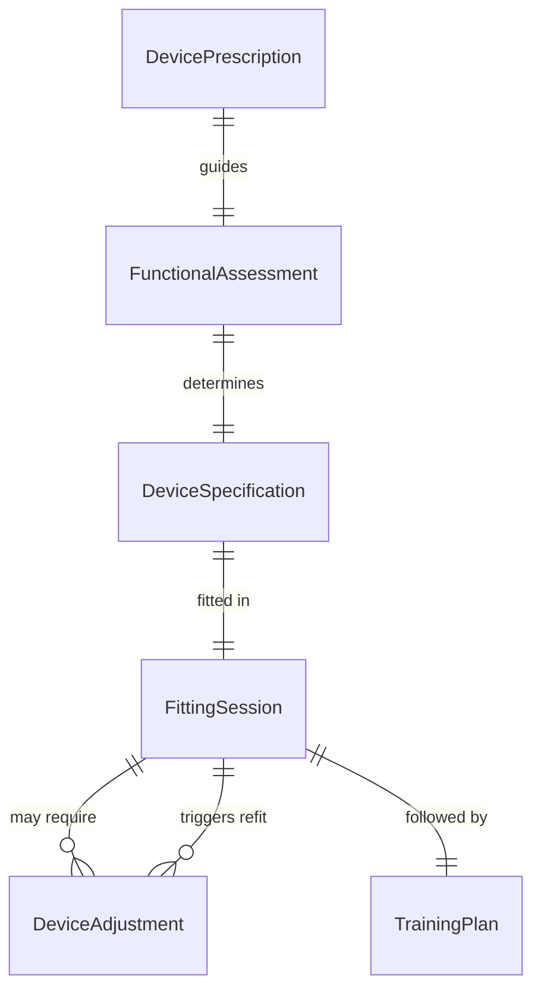
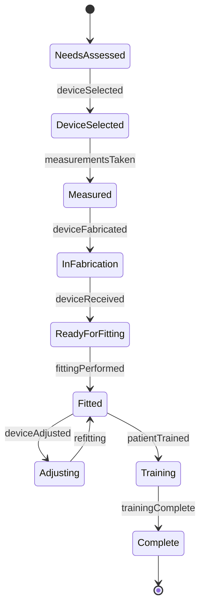
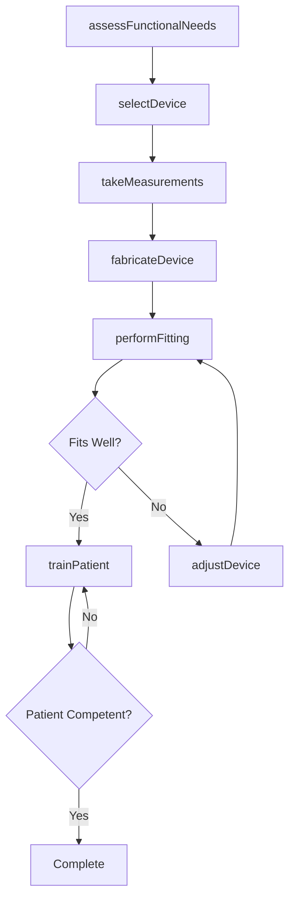
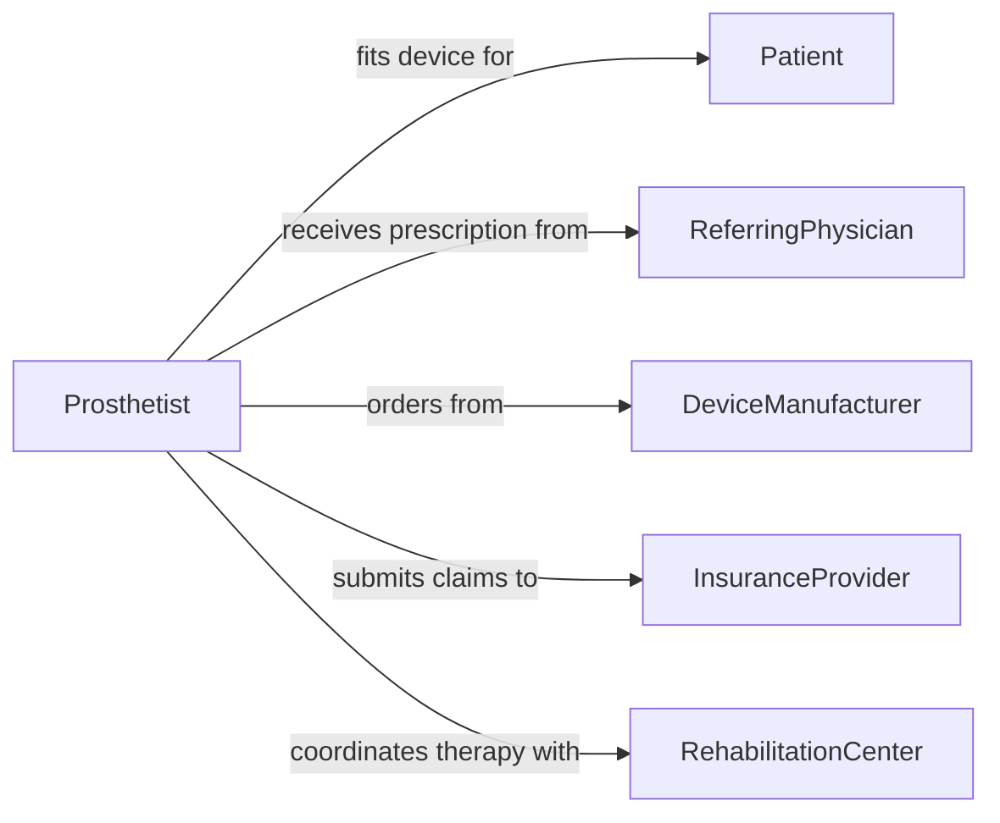

# Fit Patients Assistive Devices

> Business-as-Code definition for fitting patients for assistive devices. Models the assessment, selection, customization, fitting, and training workflow for prosthetics, orthotics, mobility aids, hearing aids, and other assistive technologies.

## Overview

Fitting patients for assistive devices involves evaluating functional needs, selecting appropriate devices, taking measurements for customization, performing fittings, making adjustments, and training patients on proper use. This activity covers prosthetic limbs, orthotic braces, wheelchairs, hearing aids, walking aids, and adaptive equipment. It requires collaboration among physicians, rehabilitation therapists, device manufacturers, and insurance providers to ensure optimal device fit, function, and patient satisfaction.

## Actors

| Actor | Description |
|-------|-------------|
| Patient | Individual who requires an assistive device for functional support |
| ReferringPhysician | Provider who prescribes the assistive device |
| DeviceManufacturer | Company that produces or custom-fabricates assistive devices |
| InsuranceProvider | Organization that authorizes and reimburses assistive device costs |
| RehabilitationCenter | Facility providing therapy and training for device use |

## Roles

| Role | Description |
|------|-------------|
| Prosthetist | Designs, fabricates, and fits prosthetic limbs |
| Orthotist | Designs, fabricates, and fits orthotic braces and supports |
| RehabilitationTherapist | Trains patients on device use and functional adaptation |
| DeviceTechnician | Performs measurements, assembly, and mechanical adjustments |
| ClinicalCoordinator | Manages referrals, authorizations, and patient scheduling |

## Entities

| Entity | Description |
|--------|-------------|
| DevicePrescription | A physician order specifying the type and requirements for an assistive device |
| FunctionalAssessment | Evaluation of the patient's physical capabilities and device needs |
| DeviceSpecification | Technical details of the selected device including model, size, and features |
| FittingSession | A documented fitting encounter with measurements and adjustments |
| TrainingPlan | A structured plan for teaching the patient to use the device |
| DeviceAdjustment | A modification made to improve device fit, comfort, or function |

## Actions

| Action | Description |
|--------|-------------|
| assessFunctionalNeeds | Evaluate the patient's physical requirements and device candidacy |
| selectDevice | Choose the appropriate assistive device based on assessment results |
| takeMeasurements | Capture body dimensions and specifications for device customization |
| fabricateDevice | Order or build a custom-fitted assistive device |
| performFitting | Fit the device to the patient and evaluate comfort and function |
| adjustDevice | Modify the device for improved fit, alignment, or performance |
| trainPatient | Instruct the patient on proper device use and maintenance |

## Events

| Event | Description |
|-------|-------------|
| functionalNeedsAssessed | A patient's functional assessment has been completed |
| deviceSelected | An appropriate assistive device has been chosen |
| measurementsTaken | Body measurements for device customization have been captured |
| deviceFabricated | A custom assistive device has been produced |
| fittingPerformed | The device has been fitted to the patient |
| deviceAdjusted | Modifications have been made to improve device performance |
| patientTrained | The patient has completed device use training |

## Searches

| Search | Description |
|--------|-------------|
| findFittingSessions | Retrieve fitting records by patient, device type, or date |
| getDeviceOrders | List device fabrication orders by status or manufacturer |
| findPatientsNeedingAdjustment | Locate patients with pending device adjustments |
| getTrainingProgress | Retrieve training plan status and completion for a patient |

## Entity Relationships



## State Diagram



## Workflow



## Actor Relationships



## Usage

### Calling Actions

```typescript
import { fitPatientsAssistiveDevices } from '@headlessly/fit-patients-assistive-devices'

const assistive = fitPatientsAssistiveDevices()

// Assess patient's functional needs
const assessment = await assistive.assessFunctionalNeeds({
  patientId: 'patient-7194',
  condition: 'below-knee-amputation-left',
  mobilityGoals: ['household-ambulation', 'community-ambulation'],
  activityLevel: 'K3-community-ambulator'
})

// Select a device
const device = await assistive.selectDevice({
  patientId: assessment.patientId,
  assessmentId: assessment.id,
  deviceType: 'below-knee-prosthesis',
  components: {
    socket: 'total-surface-bearing',
    foot: 'dynamic-response-carbon-fiber',
    liner: 'silicone-gel-cushion'
  }
})

// Take measurements and fabricate
const measurements = await assistive.takeMeasurements({
  patientId: assessment.patientId,
  deviceId: device.id,
  residualLimbCircumference: [32, 28, 25],
  residualLimbLength: 15,
  castingMethod: 'digital-scan'
})

await assistive.fabricateDevice({
  deviceId: device.id,
  measurementId: measurements.id,
  manufacturer: 'advanced-prosthetics-lab'
})
```

### Event-Driven Automation

```typescript
// Schedule fitting when device is fabricated
assistive.deviceFabricated(async ({ patientId, deviceId }) => {
  await scheduleAppointment({
    patientId,
    type: 'device-fitting',
    reason: 'Initial prosthetic fitting and alignment',
    date: addDays(new Date(), 3)
  })
})

// Enroll in training after successful fitting
assistive.fittingPerformed(async ({ patientId, deviceId, fitQuality }) => {
  if (fitQuality === 'satisfactory') {
    await assistive.trainPatient({
      patientId,
      deviceId,
      trainingPlan: ['donning-doffing', 'gait-training', 'stairs-and-ramps', 'device-care']
    })
  }
})
```
