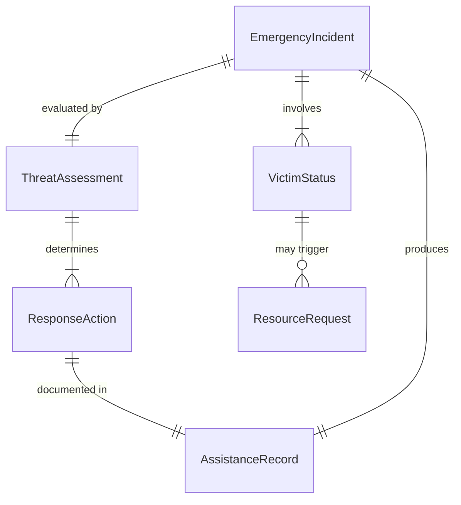
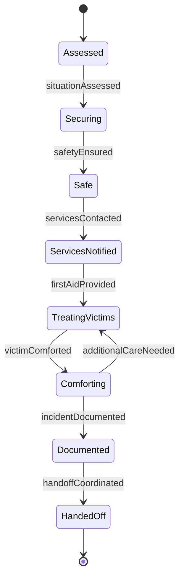
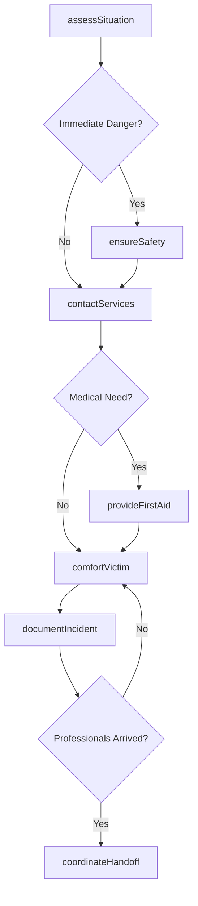
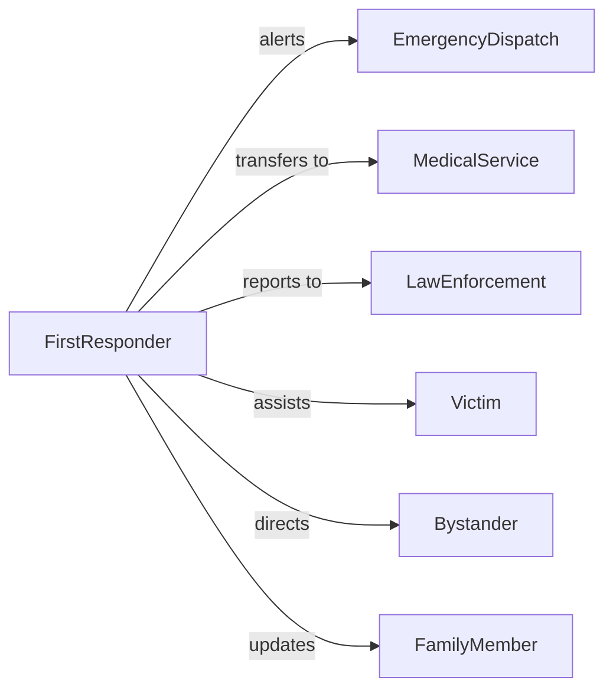

# Assist Others During Emergencies

> Business-as-Code definition for emergency assistance operations. Models rapid response, victim support, immediate care, and coordination activities during crisis events.

## Overview

Assisting others during emergencies involves providing immediate aid, ensuring safety, coordinating with emergency services, and supporting victims until professional responders arrive. This definition exposes actions for emergency assistance activities, events for tracking response effectiveness, and searches for incident and assistance records.

## Actors

| Actor | Description |
|-------|-------------|
| EmergencyDispatch | Coordinates professional emergency response |
| MedicalService | Provides advanced medical care and transport |
| LawEnforcement | Secures scene and manages public safety |
| Victim | Individual requiring assistance during emergency |
| Bystander | Witness who may help or need guidance |
| FamilyMember | Relative of person affected by emergency |

## Roles

| Role | Description |
|------|-------------|
| FirstResponder | Provides initial assistance at emergency scene |
| ThreatAssessor | Evaluates danger and determines safe actions |
| VictimAdvocate | Supports and comforts those affected |
| CommunicationLiaison | Coordinates with authorities and families |

## Entities

| Entity | Description |
|--------|-------------|
| EmergencyIncident | Crisis event requiring immediate response |
| AssistanceRecord | Documentation of aid provided |
| VictimStatus | Condition and needs of affected individual |
| ThreatAssessment | Evaluation of ongoing danger and safety |
| ResponseAction | Specific assistance activity performed |
| ResourceRequest | Call for additional help or equipment |

## Actions

| Action | Description |
|--------|-------------|
| assessSituation | Evaluate emergency type, severity, and threats |
| provideFirstAid | Deliver immediate medical assistance |
| ensureSafety | Move victims away from danger |
| contactServices | Alert professional emergency responders |
| comfortVictim | Provide emotional support and reassurance |
| documentIncident | Record details of emergency and response |
| coordinateHandoff | Transfer care to professional responders |

## Events

| Event | Description |
|-------|-------------|
| situationAssessed | Emergency evaluation completed |
| firstAidProvided | Immediate medical care delivered |
| safetyEnsured | Victims moved to secure location |
| servicesContacted | Emergency professionals notified |
| victimComforted | Emotional support provided |
| incidentDocumented | Response record created |
| handoffCoordinated | Professional responders have taken over |

## Searches

| Search | Description |
|--------|-------------|
| findIncidents | List emergency events by type, date, or location |
| getAssistanceRecords | Retrieve aid activities by responder or incident |
| getVictimStatus | Access condition reports for affected individuals |
| getThreatAssessments | Find danger evaluations by incident |
| getResponseTimes | Measure speed of assistance delivery |

## Entity Relationships



## State Diagram



## Workflow



## Actor Relationships



## Usage

### Calling Actions

```typescript
import { assistOthersDuringEmergencies } from '@headlessly/assist-others-during-emergencies'

const emergency = assistOthersDuringEmergencies()

// Assess emergency situation
const assessment = await emergency.assessSituation({
  location: '123 Main Street',
  incidentType: 'vehicle collision',
  victimCount: 2,
  threats: ['traffic', 'fuel leak']
})

// Ensure victim safety first
await emergency.ensureSafety({
  incidentId: assessment.id,
  actions: ['stop traffic', 'move victims away from vehicles']
})

// Contact emergency services
await emergency.contactServices({
  incidentId: assessment.id,
  services: ['ambulance', 'fire department', 'police'],
  urgency: 'high'
})

// Provide first aid while waiting
await emergency.provideFirstAid({
  incidentId: assessment.id,
  victimId: 'victim-1',
  treatment: ['apply pressure to wound', 'monitor breathing']
})
```

### Event-Driven Automation

```typescript
// Alert dispatch immediately after assessment
emergency.situationAssessed(async ({ incidentId, severity, threats }) => {
  if (severity === 'critical' || threats.length > 0) {
    await emergency.contactServices({
      incidentId,
      services: ['ambulance', 'fire', 'police'],
      urgency: 'critical'
    })
  }
})

// Document all first aid provided
emergency.firstAidProvided(async ({ incidentId, victimId, treatment }) => {
  await emergency.documentIncident({
    incidentId,
    entry: {
      timestamp: new Date(),
      action: 'first aid',
      victim: victimId,
      details: treatment
    }
  })
})

// Notify family when situation stabilizes
emergency.handoffCoordinated(async ({ incidentId, victims }) => {
  for (const victim of victims) {
    await notifyFamily({
      victimId: victim.id,
      status: victim.condition,
      destination: victim.transportedTo
    })
  }
})
```
