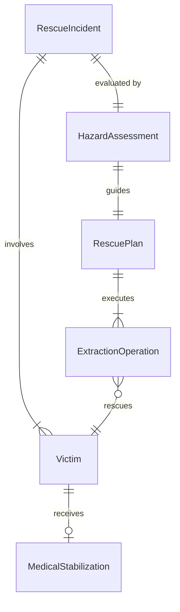
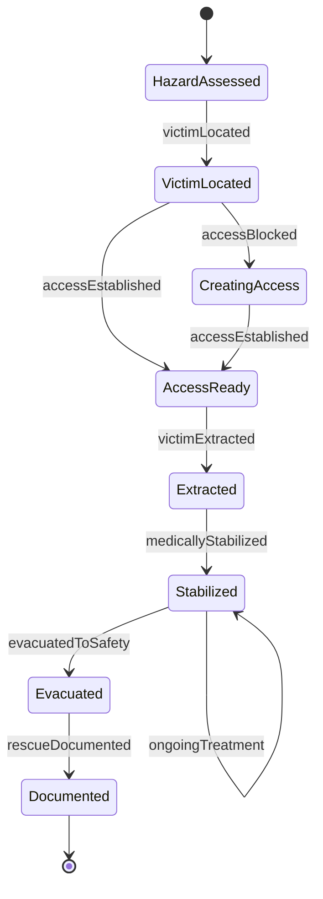
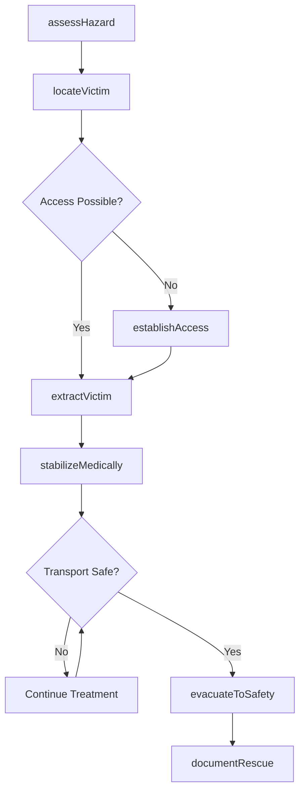
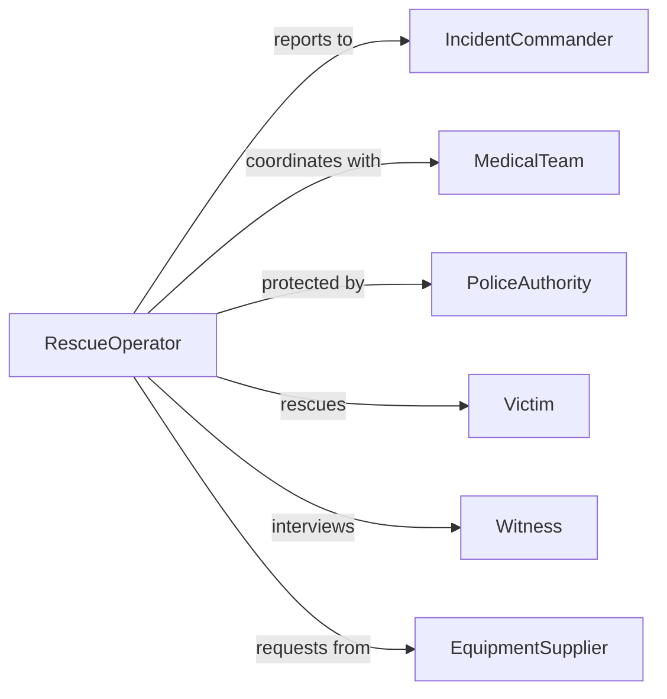

# Rescue People Hazardous Situations

> Business-as-Code definition for rescue operations in dangerous environments. Models search, extraction, medical stabilization, and evacuation procedures for fire, water, structural collapse, and confined space incidents.

## Overview

Rescuing people from hazardous situations involves specialized techniques to locate, access, stabilize, and evacuate individuals trapped or endangered by fire, water, structural failure, hazardous materials, or other life-threatening conditions. This definition provides actions for rescue operations, events for tracking rescue progress, and searches for incident and victim data.

## Actors

| Actor | Description |
|-------|-------------|
| IncidentCommander | Oversees rescue operation and strategy |
| MedicalTeam | Provides emergency medical care at scene |
| PoliceAuthority | Secures perimeter and manages civilians |
| Victim | Individual requiring rescue from danger |
| Witness | Person who reported incident or has information |
| EquipmentSupplier | Provides specialized rescue tools and gear |

## Roles

| Role | Description |
|------|-------------|
| RescueOperator | Executes extraction and evacuation procedures |
| HazardAssessor | Evaluates danger and determines approach |
| MedicalResponder | Stabilizes victims during and after rescue |
| CommunicationsCoordinator | Maintains contact and coordinates resources |

## Entities

| Entity | Description |
|--------|-------------|
| RescueIncident | Hazardous situation requiring intervention |
| Victim | Individual in danger requiring rescue |
| HazardAssessment | Evaluation of threats and rescue approach |
| RescuePlan | Strategy for victim extraction and safety |
| ExtractionOperation | Active rescue execution with timeline |
| MedicalStabilization | Emergency care provided during rescue |

## Actions

| Action | Description |
|--------|-------------|
| assessHazard | Evaluate dangers and determine rescue approach |
| locateVictim | Find and confirm position of trapped individuals |
| establishAccess | Create safe entry to hazard zone |
| extractVictim | Remove individual from dangerous situation |
| stabilizeMedically | Provide emergency medical care during rescue |
| evacuateToSafety | Move victim to secure location |
| documentRescue | Record incident details and actions taken |

## Events

| Event | Description |
|-------|-------------|
| hazardAssessed | Danger evaluation completed |
| victimLocated | Individual found and position confirmed |
| accessEstablished | Safe entry route to victim created |
| victimExtracted | Individual removed from hazard zone |
| medicallyStabilized | Emergency care provided |
| evacuatedToSafety | Victim moved to secure area |
| rescueDocumented | Incident record completed |

## Searches

| Search | Description |
|--------|-------------|
| findIncidents | List rescue operations by type, date, or location |
| getVictimStatus | Access condition and location of individuals |
| getHazardData | Retrieve danger assessments and risks |
| getRescuePlans | Find strategy documents for operations |
| getResponseTimes | Measure rescue operation durations |

## Entity Relationships



## State Diagram



## Workflow



## Actor Relationships



## Usage

### Calling Actions

```typescript
import { rescuePeopleHazardousSituations } from '@headlessly/rescue-people-hazardous-situations'

const rescue = rescuePeopleHazardousSituations()

// Assess hazardous situation
const assessment = await rescue.assessHazard({
  location: 'Warehouse fire, 456 Industrial Blvd',
  hazardType: 'fire and structural collapse',
  victimCount: 3,
  threats: ['active fire', 'smoke', 'unstable structure']
})

// Locate trapped victims
const location = await rescue.locateVictim({
  incidentId: assessment.id,
  searchArea: 'second floor, east wing',
  method: 'thermal imaging'
})

// Establish safe access route
await rescue.establishAccess({
  incidentId: assessment.id,
  route: 'exterior stairwell',
  safety: ['ventilate smoke', 'shore up structure', 'fire suppression']
})

// Extract victim from danger
await rescue.extractVictim({
  incidentId: assessment.id,
  victimId: 'victim-1',
  method: 'assisted walk',
  equipment: ['breathing apparatus', 'protective blanket']
})
```

### Event-Driven Automation

```typescript
// Deploy medical team immediately when victim located
rescue.victimLocated(async ({ incidentId, victimId, condition }) => {
  if (condition === 'injured' || condition === 'unconscious') {
    await rescue.stabilizeMedically({
      incidentId,
      victimId,
      priority: 'critical'
    })
  }
})

// Alert command when extraction complete
rescue.victimExtracted(async ({ incidentId, victimId, condition }) => {
  await notifyIncidentCommand({
    incidentId,
    message: `Victim ${victimId} extracted, condition: ${condition}`
  })
})

// Auto-document rescue milestones
rescue.evacuatedToSafety(async ({ incidentId, victimId, destination }) => {
  await rescue.documentRescue({
    incidentId,
    entry: {
      timestamp: new Date(),
      victim: victimId,
      action: 'evacuation completed',
      destination
    }
  })
})
```
