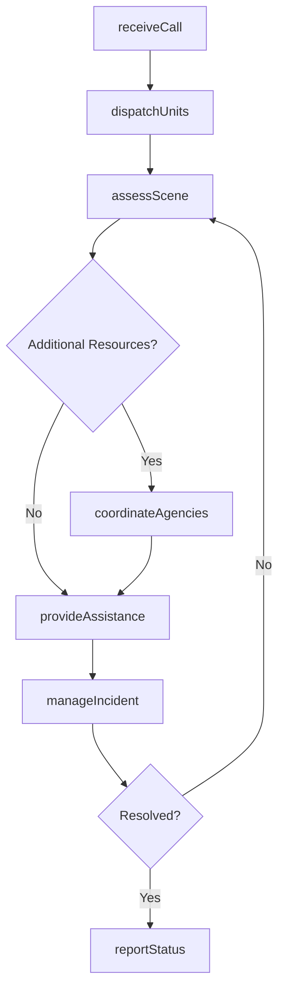
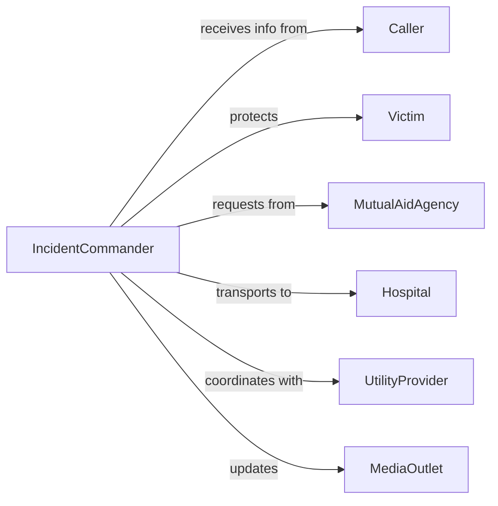

# Respond Emergencies Provide Assistance

> Business-as-Code definition for emergency response operations. Models dispatch, scene management, victim assistance, and multi-agency coordination for medical, fire, law enforcement, and natural disaster emergencies.

## Overview

Responding to emergencies involves receiving alerts, deploying resources, managing incident scenes, providing immediate assistance, and coordinating with other agencies to protect life and property. This definition exposes actions for emergency response activities, events for tracking response effectiveness, and searches for incident and resource data.

## Actors

| Actor | Description |
|-------|-------------|
| Caller | Individual reporting emergency incident |
| Victim | Person affected by emergency requiring help |
| MutualAidAgency | Partner organization providing support |
| Hospital | Receives patients from emergency scenes |
| UtilityProvider | Manages power, gas, or water during incidents |
| MediaOutlet | Communicates public information about emergency |

## Roles

| Role | Description |
|------|-------------|
| Dispatcher | Receives calls and deploys response units |
| FieldResponder | Provides on-scene emergency assistance |
| IncidentCommander | Manages overall emergency operations |
| ResourceCoordinator | Allocates personnel and equipment |

## Entities

| Entity | Description |
|--------|-------------|
| EmergencyCall | Initial report of incident requiring response |
| Incident | Active emergency situation being managed |
| ResponseUnit | Team and equipment deployed to scene |
| AssistanceActivity | Specific aid or intervention provided |
| ResourceAllocation | Personnel and equipment assigned to incident |
| IncidentReport | Comprehensive documentation of response |

## Actions

| Action | Description |
|--------|-------------|
| receiveCall | Accept and log emergency notification |
| dispatchUnits | Deploy response teams and equipment |
| assessScene | Evaluate incident scope and resource needs |
| provideAssistance | Deliver emergency aid and interventions |
| coordinateAgencies | Collaborate with partner organizations |
| manageIncident | Direct operations and resource allocation |
| reportStatus | Document incident progress and outcomes |

## Events

| Event | Description |
|-------|-------------|
| callReceived | Emergency notification logged |
| unitsDispatched | Response teams deployed |
| sceneAssessed | Incident evaluation completed |
| assistanceProvided | Emergency aid delivered |
| agenciesCoordinated | Multi-agency collaboration established |
| incidentManaged | Operations direction provided |
| statusReported | Progress documentation completed |

## Searches

| Search | Description |
|--------|-------------|
| findIncidents | List emergencies by type, status, or location |
| getResponseUnits | Retrieve available or deployed teams |
| getAssistanceRecords | Access aid activities by incident or unit |
| getResourceStatus | Check allocation of personnel and equipment |
| getResponseTimes | Measure dispatch and arrival metrics |

## Workflow



## Actor Relationships



## Usage

### Calling Actions

```typescript
import { respondEmergenciesProvideAssistance } from '@headlessly/respond-emergencies-provide-assistance'

const response = respondEmergenciesProvideAssistance()

// Receive emergency call
const call = await response.receiveCall({
  caller: { phone: '555-0123', location: '789 Oak Avenue' },
  incidentType: 'structure fire',
  urgency: 'critical',
  details: 'Residential home, smoke visible, occupants inside'
})

// Dispatch appropriate units
await response.dispatchUnits({
  callId: call.id,
  units: [
    { type: 'engine', id: 'E-14', personnel: 4 },
    { type: 'ladder', id: 'L-7', personnel: 3 },
    { type: 'ambulance', id: 'M-22', personnel: 2 }
  ]
})

// Assess scene upon arrival
const assessment = await response.assessScene({
  callId: call.id,
  conditions: {
    fire: 'active, second floor',
    victims: 'two adults evacuated, one child missing',
    hazards: ['propane tank', 'power lines']
  }
})

// Provide assistance based on assessment
await response.provideAssistance({
  incidentId: assessment.incidentId,
  activities: ['fire suppression', 'search and rescue', 'medical evaluation']
})
```

### Event-Driven Automation

```typescript
// Auto-dispatch additional units based on scene assessment
response.sceneAssessed(async ({ incidentId, conditions }) => {
  if (conditions.victims.includes('missing')) {
    await response.coordinateAgencies({
      incidentId,
      agencies: ['search and rescue', 'police']
    })
  }
})

// Alert hospital when patients incoming
response.assistanceProvided(async ({ incidentId, activities }) => {
  const medicalCases = activities.filter(a => a.type === 'medical transport')
  if (medicalCases.length > 0) {
    await notifyHospital({
      incidentId,
      patientCount: medicalCases.length,
      severity: 'urgent'
    })
  }
})

// Generate report when incident resolved
response.incidentManaged(async ({ incidentId, status }) => {
  if (status === 'resolved') {
    await response.reportStatus({
      incidentId,
      report: 'full incident documentation'
    })
  }
})
```
