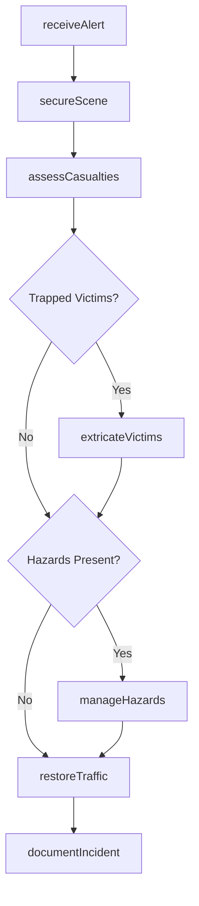
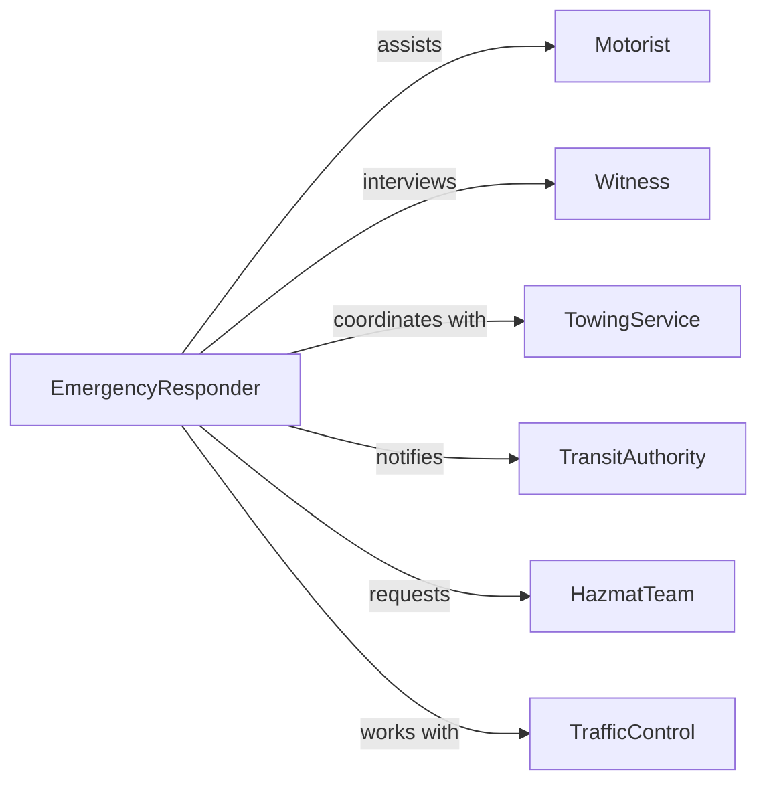

# Respond Transportation Emergencies

> Business-as-Code definition for transportation emergency response. Models collision management, vehicle extrication, hazardous material handling, and traffic incident coordination for roadway, rail, aviation, and maritime emergencies.

## Overview

Responding to transportation emergencies involves managing accidents, collisions, and incidents affecting vehicles, passengers, cargo, and infrastructure across all transport modes. This definition provides actions for incident response, events for tracking operations, and searches for accident and resource data.

## Actors

| Actor | Description |
|-------|-------------|
| Motorist | Driver or passenger involved in incident |
| Witness | Individual who observed transportation emergency |
| TowingService | Removes damaged vehicles from scene |
| TransitAuthority | Manages public transportation systems |
| HazmatTeam | Responds to dangerous cargo incidents |
| TrafficControl | Manages vehicle flow around incident |

## Roles

| Role | Description |
|------|-------------|
| EmergencyResponder | Provides immediate assistance at scene |
| IncidentCommander | Oversees multi-agency response operations |
| MedicalProvider | Treats injured parties at scene |
| SceneManager | Controls traffic and maintains safety |

## Entities

| Entity | Description |
|--------|-------------|
| TransportIncident | Accident or emergency on transportation system |
| Vehicle | Car, truck, train, aircraft, or vessel involved |
| Casualty | Injured or deceased individual |
| HazardousCondition | Danger requiring specialized response |
| TrafficDisruption | Impact on transportation flow |
| IncidentReport | Documentation of emergency and response |

## Actions

| Action | Description |
|--------|-------------|
| receiveAlert | Accept notification of transportation incident |
| secureScene | Establish safety perimeter and control traffic |
| assessCasualties | Evaluate injuries and prioritize medical care |
| extricateVictims | Remove trapped individuals from vehicles |
| manageHazards | Address fuel spills, cargo, or fire dangers |
| restoreTraffic | Clear incident and resume normal flow |
| documentIncident | Record details of emergency and response |

## Events

| Event | Description |
|-------|-------------|
| alertReceived | Incident notification logged |
| sceneSecured | Safety perimeter established |
| casualtiesAssessed | Injury evaluation completed |
| victimsExtricated | Trapped individuals removed |
| hazardsManaged | Dangerous conditions addressed |
| trafficRestored | Normal flow resumed |
| incidentDocumented | Response record completed |

## Searches

| Search | Description |
|--------|-------------|
| findIncidents | List transportation emergencies by type or location |
| getVehicles | Retrieve information about involved vehicles |
| getCasualties | Access injury and medical treatment records |
| getHazards | Find dangerous conditions requiring response |
| getResponseTimes | Measure arrival and clearance durations |

## Workflow



## Actor Relationships



## Usage

### Calling Actions

```typescript
import { respondTransportationEmergencies } from '@headlessly/respond-transportation-emergencies'

const transport = respondTransportationEmergencies()

// Receive alert about collision
const alert = await transport.receiveAlert({
  location: 'Interstate 95, Mile 142',
  incidentType: 'multi-vehicle collision',
  vehicles: 3,
  reportedInjuries: true,
  hazards: ['fuel leak']
})

// Secure scene upon arrival
await transport.secureScene({
  incidentId: alert.id,
  actions: [
    'close right two lanes',
    'establish traffic cones',
    'position emergency vehicles for protection'
  ]
})

// Assess casualties
const casualties = await transport.assessCasualties({
  incidentId: alert.id,
  victims: [
    { vehicle: 'sedan', condition: 'critical', trapped: true },
    { vehicle: 'pickup', condition: 'minor injuries', trapped: false },
    { vehicle: 'suv', condition: 'uninjured', trapped: false }
  ]
})

// Extricate trapped victim
await transport.extricateVictims({
  incidentId: alert.id,
  victimId: casualties.critical[0].id,
  method: 'hydraulic rescue tools',
  medicalSupport: true
})
```

### Event-Driven Automation

```typescript
// Deploy extrication team if victims trapped
transport.casualtiesAssessed(async ({ incidentId, casualties }) => {
  const trapped = casualties.filter(c => c.trapped)
  if (trapped.length > 0) {
    await transport.extricateVictims({
      incidentId,
      victims: trapped,
      priority: 'immediate'
    })
  }
})

// Request hazmat team for dangerous cargo
transport.sceneSecured(async ({ incidentId, hazards }) => {
  if (hazards.includes('fuel leak') || hazards.includes('chemical spill')) {
    await transport.manageHazards({
      incidentId,
      specializedTeam: 'hazmat',
      containment: true
    })
  }
})

// Notify transit authority when incident cleared
transport.trafficRestored(async ({ incidentId, location }) => {
  await notifyTransitAuthority({
    incidentId,
    message: `Incident at ${location} cleared, normal traffic flow resumed`
  })
})
```
