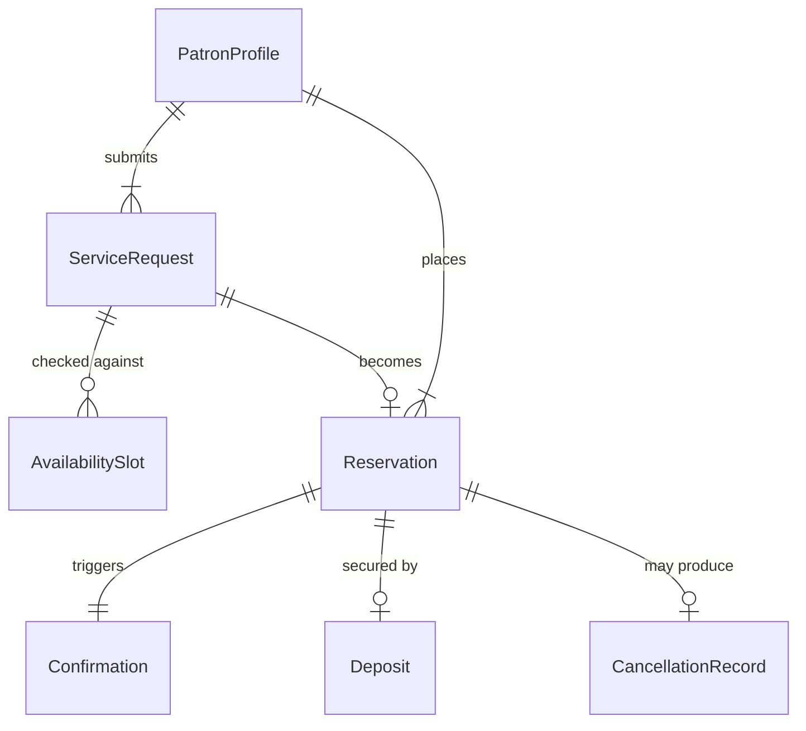
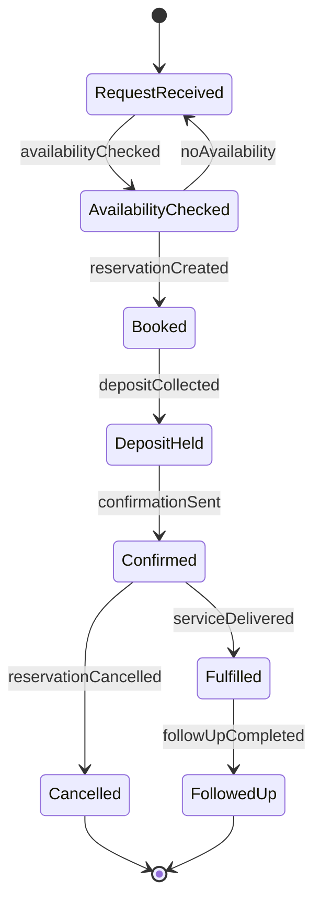
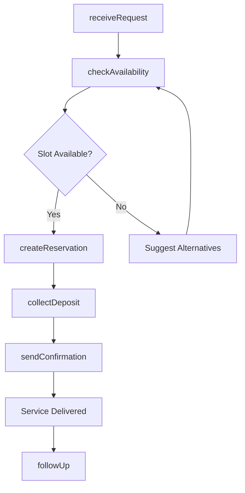
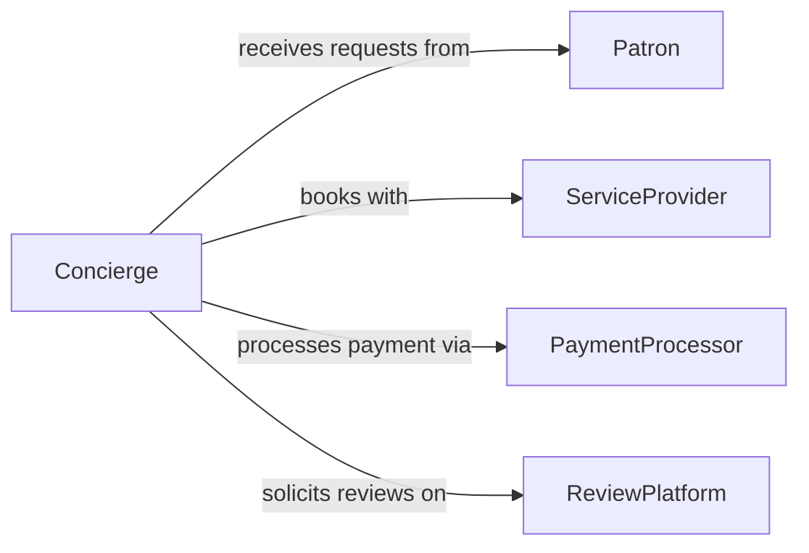

# Arrange Services or Reservations for Patrons

> Business-as-Code definition for patron service and reservation arrangement. Models the booking lifecycle from request intake through confirmation, fulfillment, and follow-up.

## Overview

Service and reservation arrangement involves receiving patron requests, checking provider availability, booking appointments or reservations, confirming details, and coordinating fulfillment across hospitality, wellness, and personal service settings. This definition exposes actions for scheduling, event triggers for booking status changes, and searches for availability and reservation records.

## Actors

| Actor | Description |
|-------|-------------|
| Patron | Individual requesting a service or reservation |
| ServiceProvider | Business or professional delivering the booked service |
| PaymentProcessor | Handles deposits, prepayments, and refunds |
| ReviewPlatform | Collects and publishes patron feedback on services |

## Roles

| Role | Description |
|------|-------------|
| Concierge | Manages patron requests and coordinates bookings |
| ReservationAgent | Handles scheduling and confirmation logistics |
| ServiceCoordinator | Ensures providers are prepared for booked appointments |
| GuestRelationsManager | Resolves booking issues and manages patron satisfaction |

## Entities

| Entity | Description |
|--------|-------------|
| Reservation | Confirmed booking for a service, table, or appointment |
| ServiceRequest | Patron inquiry or request for a specific service |
| AvailabilitySlot | Open time window at a service provider |
| Confirmation | Formal acknowledgment sent to the patron |
| CancellationRecord | Documentation of a cancelled reservation |
| PatronProfile | Stored preferences and booking history |
| Deposit | Prepayment or hold against a reservation |

## Actions

| Action | Description |
|--------|-------------|
| receiveRequest | Log a patron service or reservation inquiry |
| checkAvailability | Query provider schedules for open slots |
| createReservation | Book a confirmed appointment or table |
| sendConfirmation | Deliver booking details to the patron |
| collectDeposit | Process a prepayment or hold for the reservation |
| cancelReservation | Cancel a booking and process any refund |
| followUp | Contact the patron after service for feedback |

## Events

| Event | Description |
|-------|-------------|
| requestReceived | A patron service inquiry has been logged |
| availabilityChecked | Provider schedules have been queried |
| reservationCreated | A booking has been confirmed |
| confirmationSent | Booking details have been delivered to the patron |
| depositCollected | A prepayment has been processed |
| reservationCancelled | A booking has been cancelled |
| followUpCompleted | Post-service feedback has been collected |

## Searches

| Search | Description |
|--------|-------------|
| findAvailability | Search open slots by provider, date, and service type |
| getReservations | List bookings by patron, date, or status |
| getCancellations | Retrieve cancelled reservations by reason or date |
| getPatronHistory | View past bookings and preferences for a patron |

## Entity Relationships



## State Diagram



## Workflow



## Actor Relationships



## Usage

### Calling Actions

```typescript
import { arrangeServicesReservationsPatrons } from '@headlessly/arrange-services-reservations-patrons'

const bookings = arrangeServicesReservationsPatrons()

// Check spa availability
const slots = await bookings.checkAvailability({
  provider: 'hotel-spa',
  service: 'deep-tissue-massage',
  date: '2026-02-10',
  duration: 60
})

// Create a reservation
const reservation = await bookings.createReservation({
  patronId: 'p-2044',
  providerId: 'hotel-spa',
  slotId: slots[0].id,
  service: 'deep-tissue-massage'
})

// Send confirmation
await bookings.sendConfirmation({
  reservationId: reservation.id,
  channel: 'email'
})
```

### Event-Driven Automation

```typescript
// Send reminder 24 hours before appointment
bookings.reservationCreated(async ({ reservationId, scheduledTime }) => {
  await scheduleReminder({
    reservationId,
    sendAt: subtractHours(scheduledTime, 24),
    message: 'Reminder: Your reservation is tomorrow'
  })
})

// Auto-release deposit on cancellation
bookings.reservationCancelled(async ({ reservationId, depositAmount }) => {
  if (depositAmount > 0) {
    await processRefund({ reservationId, amount: depositAmount })
  }
})
```
