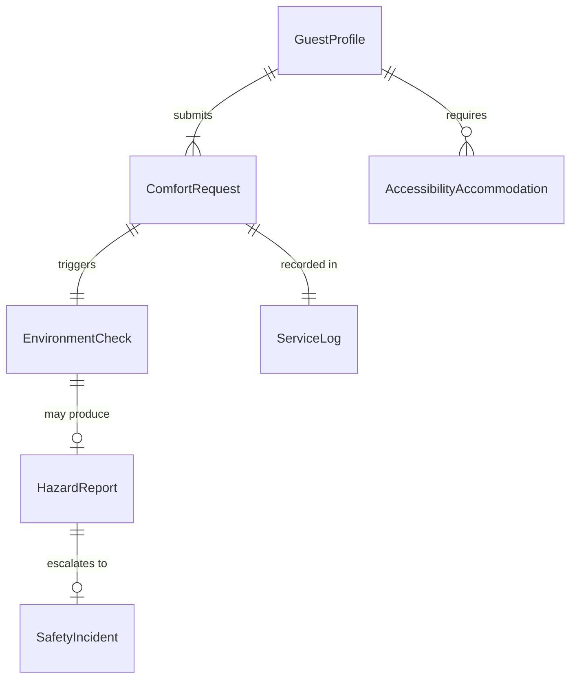
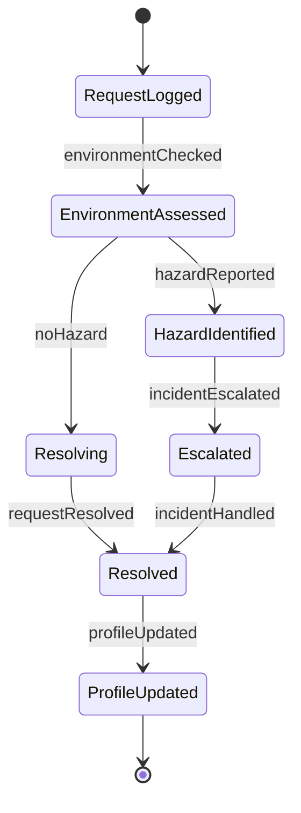
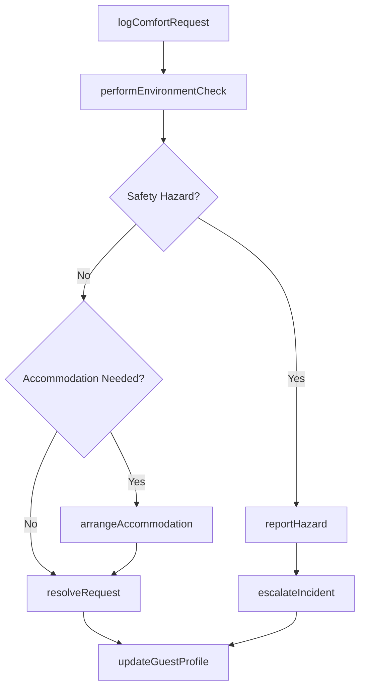
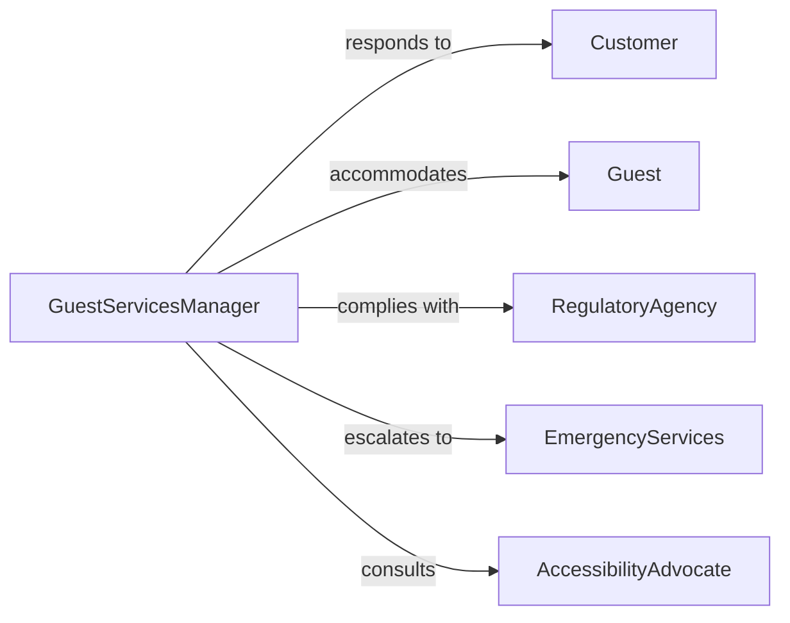

# Assist Customers to Ensure Comfort or Safety

> Business-as-Code definition for customer comfort and safety assistance. Models the proactive delivery of environmental adjustments, safety interventions, and hospitality services that protect and satisfy guests.

## Overview

Customer comfort and safety assistance involves monitoring guest environments, responding to comfort requests, enforcing safety protocols, and providing accommodations that enhance the customer experience. This definition exposes actions for managing comfort interventions, event triggers for safety incidents, and searches for service history across hospitality and retail settings.

## Actors

| Actor | Description |
|-------|-------------|
| Customer | Individual receiving comfort or safety assistance |
| Guest | Visitor to a hotel, resort, or venue |
| RegulatoryAgency | Sets safety standards for public-facing venues |
| EmergencyServices | Responds to safety incidents or medical needs |
| AccessibilityAdvocate | Represents needs of guests with disabilities |

## Roles

| Role | Description |
|------|-------------|
| FloorAttendant | Monitors guest areas and responds to comfort needs |
| SafetyOfficer | Enforces safety protocols and manages incident response |
| GuestServicesManager | Oversees comfort standards and staff assignments |
| AccessibilityCoordinator | Ensures accommodations meet accessibility requirements |

## Entities

| Entity | Description |
|--------|-------------|
| ComfortRequest | Guest request for environmental or service adjustment |
| SafetyIncident | Record of a safety concern or event |
| AccessibilityAccommodation | Special arrangement for guests with specific needs |
| EnvironmentCheck | Periodic assessment of temperature, lighting, or cleanliness |
| ServiceLog | Timestamped record of comfort or safety actions taken |
| GuestProfile | Preferences and special requirements for a customer |
| HazardReport | Documentation of a potential safety risk |

## Actions

| Action | Description |
|--------|-------------|
| logComfortRequest | Record a guest request for environmental adjustment |
| performEnvironmentCheck | Assess temperature, lighting, noise, or cleanliness |
| resolveRequest | Complete a comfort or safety intervention |
| reportHazard | Document a potential safety risk for remediation |
| arrangeAccommodation | Set up accessibility or special-needs support |
| escalateIncident | Route a safety concern to emergency services |
| updateGuestProfile | Record customer preferences for future visits |

## Events

| Event | Description |
|-------|-------------|
| comfortRequestLogged | A guest comfort request has been recorded |
| environmentChecked | A periodic area assessment has been completed |
| requestResolved | A comfort or safety intervention has been completed |
| hazardReported | A potential safety risk has been documented |
| accommodationArranged | An accessibility setup has been confirmed |
| incidentEscalated | A safety concern has been routed to emergency services |

## Searches

| Search | Description |
|--------|-------------|
| findRequests | List comfort requests by area, status, or guest |
| getEnvironmentChecks | Retrieve assessment records for a location and date |
| findHazards | Search hazard reports by type or status |
| getAccommodations | List accessibility arrangements for upcoming guests |

## Entity Relationships



## State Diagram



## Workflow



## Actor Relationships



## Usage

### Calling Actions

```typescript
import { assistCustomersEnsureComfortSafety } from '@headlessly/assist-customers-ensure-comfort-safety'

const comfort = assistCustomersEnsureComfortSafety()

// Log a comfort request
const request = await comfort.logComfortRequest({
  guestId: 'g-5012',
  area: 'lobby-east',
  issue: 'temperature-too-cold',
  priority: 'normal'
})

// Perform an environment check
const check = await comfort.performEnvironmentCheck({
  area: 'lobby-east',
  metrics: ['temperature', 'lighting', 'noise']
})

// Resolve the request
await comfort.resolveRequest({
  requestId: request.id,
  action: 'thermostat-adjusted',
  notes: 'Increased lobby temperature by 3 degrees'
})
```

### Event-Driven Automation

```typescript
// Auto-assign floor attendant on new request
comfort.comfortRequestLogged(async ({ area, priority }) => {
  const attendant = await findAvailableAttendant(area)
  await assignTask({ attendantId: attendant.id, area, priority })
})

// Alert safety officer on hazard report
comfort.hazardReported(async ({ area, hazardType, severity }) => {
  if (severity === 'high') {
    await notify({
      to: 'safety-officer',
      message: `High-severity ${hazardType} hazard reported in ${area}`
    })
  }
})
```
