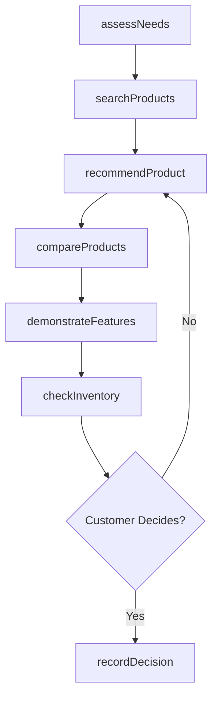
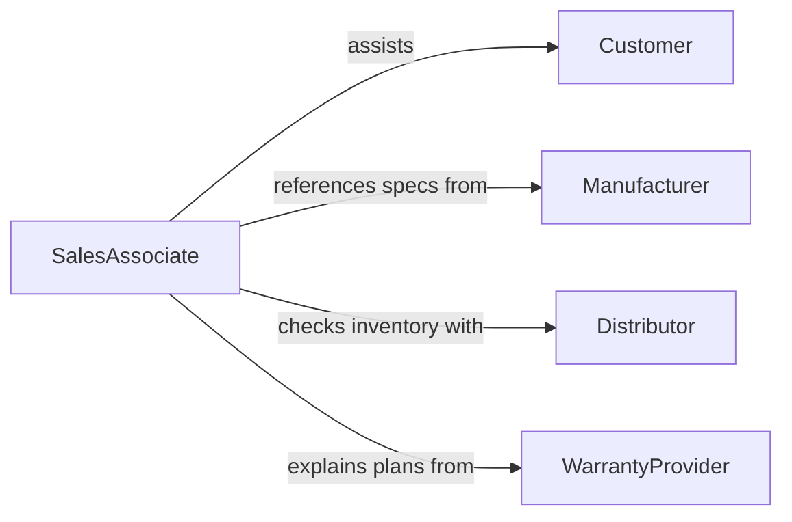

# Assist Customers with Product Selection

> Business-as-Code definition for customer product selection assistance. Models the guided buying experience from needs assessment through recommendation, comparison, and purchase decision support.

## Overview

Product selection assistance involves understanding customer requirements, recommending suitable products, providing comparison information, demonstrating features, and supporting the decision-making process. This definition exposes actions for guided selling workflows, event triggers for recommendation tracking, and searches for product catalogs and customer interaction history.

## Actors

| Actor | Description |
|-------|-------------|
| Customer | Individual seeking guidance on product choices |
| Manufacturer | Supplies product specifications and promotional materials |
| Distributor | Provides inventory availability and pricing |
| WarrantyProvider | Offers post-purchase protection and service plans |

## Roles

| Role | Description |
|------|-------------|
| SalesAssociate | Guides customers through product options |
| ProductSpecialist | Provides deep technical knowledge on specific categories |
| FloorManager | Oversees sales floor operations and escalated requests |
| PersonalShopper | Delivers curated selection services for high-value clients |

## Entities

| Entity | Description |
|--------|-------------|
| Product | Item available for purchase with specifications and pricing |
| CustomerProfile | Stored preferences, purchase history, and budget |
| Recommendation | Suggested product based on customer needs |
| ComparisonChart | Side-by-side feature and price comparison of products |
| InventoryStatus | Current stock level and availability for a product |
| Interaction | Record of a customer assistance session |
| PurchaseDecision | Outcome of the selection process |

## Actions

| Action | Description |
|--------|-------------|
| assessNeeds | Gather customer requirements, preferences, and budget |
| searchProducts | Query the catalog for items matching customer criteria |
| recommendProduct | Suggest a specific product based on assessed needs |
| compareProducts | Generate a side-by-side feature comparison |
| demonstrateFeatures | Show product capabilities to the customer |
| checkInventory | Verify stock availability for a selected product |
| recordDecision | Log the customer purchase decision or deferral |

## Events

| Event | Description |
|-------|-------------|
| needsAssessed | Customer requirements have been gathered |
| productsSearched | Catalog has been queried for matching items |
| productRecommended | A product suggestion has been presented |
| productsCompared | A comparison chart has been generated |
| featuresDemo | Product capabilities have been demonstrated |
| inventoryChecked | Stock availability has been confirmed |
| decisionRecorded | The customer purchase outcome has been logged |

## Searches

| Search | Description |
|--------|-------------|
| findProducts | Search catalog by category, feature, price range, or brand |
| getRecommendations | Retrieve product suggestions for a customer profile |
| getInteractions | List customer assistance sessions by date or associate |
| checkStock | Query real-time inventory levels by product and location |

## Workflow



## Actor Relationships



## Usage

### Calling Actions

```typescript
import { assistCustomersProductSelection } from '@headlessly/assist-customers-product-selection'

const selection = assistCustomersProductSelection()

// Assess customer needs
const needs = await selection.assessNeeds({
  customerId: 'cust-910',
  category: 'laptops',
  requirements: ['portability', '16GB-RAM', 'long-battery'],
  budget: { max: 1500 }
})

// Get recommendations
const recommendations = await selection.recommendProduct({
  needsId: needs.id,
  limit: 3
})

// Compare top options
const comparison = await selection.compareProducts({
  productIds: recommendations.map(r => r.productId),
  features: ['weight', 'battery-life', 'processor', 'price']
})
```

### Event-Driven Automation

```typescript
// Track recommendation conversion rates
selection.decisionRecorded(async ({ customerId, recommendedProductId, purchasedProductId }) => {
  await logMetric({
    event: 'selection-outcome',
    matched: recommendedProductId === purchasedProductId,
    customerId
  })
})

// Notify specialist for complex product categories
selection.needsAssessed(async ({ category, complexity }) => {
  if (complexity === 'high') {
    await notify({
      to: 'product-specialist',
      message: `High-complexity ${category} consultation requested`
    })
  }
})
```
