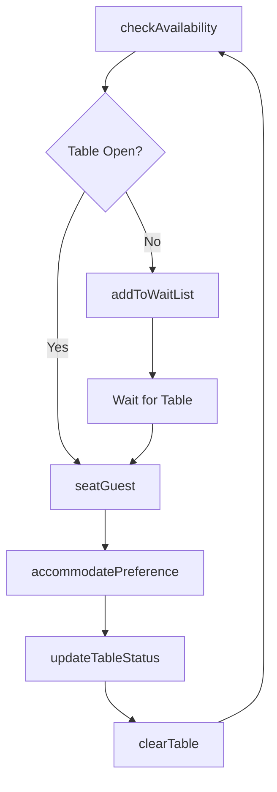
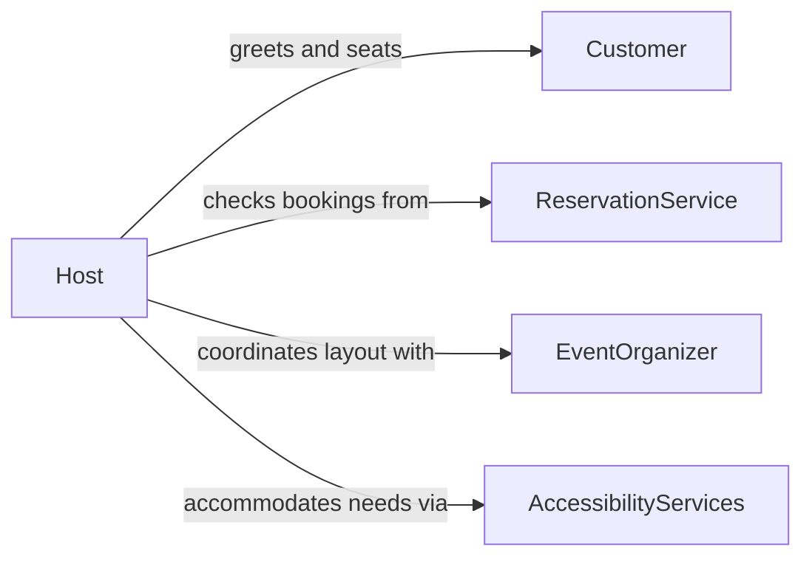

# Assist Customers with Seating Arrangements

> Business-as-Code definition for customer seating arrangement services. Models the table management, waitlist, and guest placement workflow for dining, entertainment, and event venues.

## Overview

Customer seating assistance involves managing table availability, accommodating guest preferences, processing waitlists, and coordinating group seating across restaurants, theaters, and event spaces. This definition exposes actions for reservation-to-seat workflows, event triggers for table status changes, and searches for availability and seating records.

## Actors

| Actor | Description |
|-------|-------------|
| Customer | Individual or party requesting seating |
| ReservationService | Online or phone-based booking platform |
| EventOrganizer | Coordinates seating for large-scale functions |
| AccessibilityServices | Provides adaptive seating for guests with special needs |

## Roles

| Role | Description |
|------|-------------|
| Host | Greets guests and manages seating assignments |
| FloorManager | Oversees table rotation and service flow |
| ReservationAgent | Handles advance bookings and special requests |
| ServerStaff | Prepares tables and serves seated guests |

## Entities

| Entity | Description |
|--------|-------------|
| Reservation | Advance booking for a specific date, time, and party size |
| Table | Physical seating unit with capacity and location attributes |
| WaitList | Queue of walk-in guests awaiting available seating |
| SeatingChart | Layout of tables and zones within a venue |
| GuestPreference | Recorded seating preferences such as window, booth, or quiet area |
| TurnoverRecord | Log of table occupancy times and turnover rates |

## Actions

| Action | Description |
|--------|-------------|
| checkAvailability | Query open tables for a given time and party size |
| createReservation | Book a table for a future date and time |
| seatGuest | Assign a party to a specific table |
| addToWaitList | Place a walk-in party on the seating queue |
| updateTableStatus | Mark a table as occupied, available, or reserved |
| accommodatePreference | Adjust seating to meet guest accessibility or comfort requests |
| clearTable | Mark a table as vacated and ready for turnover |

## Events

| Event | Description |
|-------|-------------|
| reservationCreated | A table booking has been confirmed |
| guestSeated | A party has been assigned to a table |
| waitListUpdated | The walk-in queue has changed |
| tableStatusChanged | A table availability state has been updated |
| preferenceAccommodated | A special seating request has been fulfilled |
| tableCleared | A table has been vacated and reset |

## Searches

| Search | Description |
|--------|-------------|
| findAvailableTables | List open tables by time, party size, or zone |
| getReservations | Retrieve bookings for a date or guest name |
| getWaitList | View the current walk-in queue with estimated wait times |
| getTableHistory | Review occupancy and turnover records for a table |

## Workflow



## Actor Relationships



## Usage

### Calling Actions

```typescript
import { assistCustomersSeatingArrangements } from '@headlessly/assist-customers-seating-arrangements'

const seating = assistCustomersSeatingArrangements()

// Check availability for tonight
const tables = await seating.checkAvailability({
  date: '2026-02-05',
  time: '19:00',
  partySize: 4
})

// Seat a walk-in party
await seating.seatGuest({
  tableId: tables[0].id,
  partySize: 4,
  guestName: 'Martinez'
})

// Create a future reservation
await seating.createReservation({
  guestName: 'Chen',
  date: '2026-02-14',
  time: '20:00',
  partySize: 2,
  preferences: ['window', 'quiet']
})
```

### Event-Driven Automation

```typescript
// Notify next waitlist party when table clears
seating.tableCleared(async ({ tableId, capacity }) => {
  const next = await seating.getWaitList({ minPartySize: 1, maxPartySize: capacity })
  if (next.length > 0) {
    await notify({ to: next[0].phone, message: 'Your table is ready!' })
  }
})

// Track peak turnover times
seating.guestSeated(async ({ tableId, time }) => {
  await logMetric({ event: 'guest-seated', tableId, time })
})
```
