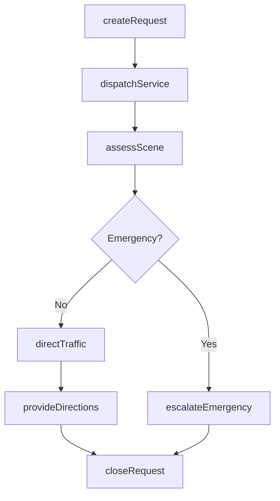
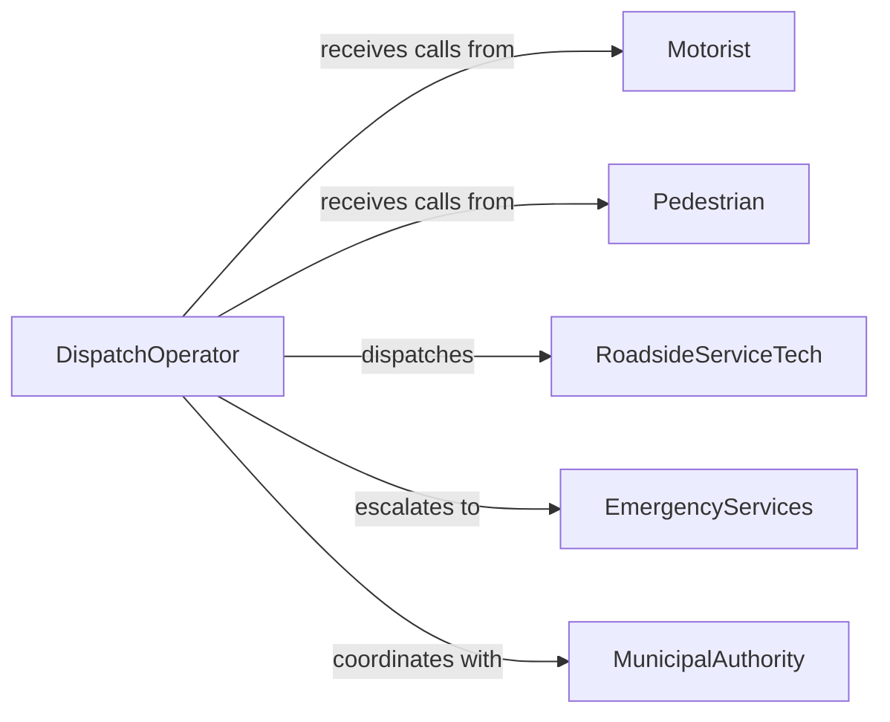

# Assist Motorists or Pedestrians

> Business-as-Code definition for motorist and pedestrian assistance services. Models roadside aid, traffic guidance, and safety support for individuals in transit or on foot.

## Overview

Motorist and pedestrian assistance involves providing directional guidance, roadside support, emergency coordination, and safety services to travelers and pedestrians. This definition exposes actions for dispatching help, logging incidents, and managing service requests across transportation corridors and public spaces.

## Actors

| Actor | Description |
|-------|-------------|
| Motorist | Driver requiring roadside or navigational assistance |
| Pedestrian | Individual on foot needing directions or safety help |
| EmergencyServices | Police, fire, or EMS responding to incidents |
| TowingCompany | Provides vehicle recovery and transport services |
| InsuranceProvider | Covers roadside assistance under policy terms |
| MunicipalAuthority | Manages roads, signals, and public rights of way |

## Roles

| Role | Description |
|------|-------------|
| PatrolOfficer | Provides on-scene traffic and safety assistance |
| DispatchOperator | Coordinates assistance requests and resource deployment |
| RoadsideServiceTech | Delivers on-site vehicle support such as tire changes or fuel delivery |
| TrafficController | Directs vehicular and pedestrian flow at incident sites |

## Entities

| Entity | Description |
|--------|-------------|
| AssistanceRequest | Formal request for motorist or pedestrian help |
| IncidentReport | Record of the situation requiring assistance |
| ServiceDispatch | Assignment of a resource to a request location |
| Location | Geographic coordinates or address of the incident |
| Vehicle | Description and status of the motorist vehicle |
| ResponseLog | Timestamped record of actions taken during assistance |

## Actions

| Action | Description |
|--------|-------------|
| createRequest | Log a new assistance request from a motorist or pedestrian |
| dispatchService | Assign a patrol unit or service technician to the location |
| assessScene | Evaluate the situation and determine required support |
| directTraffic | Guide vehicles or pedestrians around an obstruction |
| provideDirections | Give navigational guidance to a lost individual |
| closeRequest | Finalize and document the completed assistance event |
| escalateEmergency | Transfer the request to emergency services |

## Events

| Event | Description |
|-------|-------------|
| requestCreated | A new assistance request has been logged |
| serviceDispatched | A responder has been assigned to the scene |
| sceneAssessed | The situation has been evaluated on site |
| trafficDirected | Vehicles or pedestrians are being routed safely |
| requestClosed | The assistance event has been completed |
| emergencyEscalated | The request has been transferred to emergency services |

## Searches

| Search | Description |
|--------|-------------|
| findRequests | List assistance requests by location, status, or type |
| getDispatches | Retrieve active service assignments for a region |
| getResponseLogs | Find documented actions for a specific request |
| findIncidents | Search incident reports by date, severity, or location |

## Workflow



## Actor Relationships



## Usage

### Calling Actions

```typescript
import { assistMotoristsPedestrians } from '@headlessly/assist-motorists-pedestrians'

const assist = assistMotoristsPedestrians()

// Log a roadside assistance request
const request = await assist.createRequest({
  type: 'motorist',
  issue: 'flat-tire',
  location: { lat: 40.7128, lng: -74.006 },
  vehicleDescription: '2024 Honda Civic, silver'
})

// Dispatch a service technician
await assist.dispatchService({
  requestId: request.id,
  unit: 'RST-14',
  estimatedArrival: '15 minutes'
})

// Close the request after resolution
await assist.closeRequest({
  requestId: request.id,
  resolution: 'tire-changed',
  duration: 22
})
```

### Event-Driven Automation

```typescript
// Auto-dispatch nearest available unit
assist.requestCreated(async ({ requestId, location, issue }) => {
  const nearestUnit = await findNearestUnit(location)
  await assist.dispatchService({ requestId, unit: nearestUnit.id })
})

// Alert supervisor on emergency escalation
assist.emergencyEscalated(async ({ requestId, location }) => {
  await notify({
    to: 'shift-supervisor',
    message: `Emergency escalation at ${location.address} for request ${requestId}`
  })
})
```
