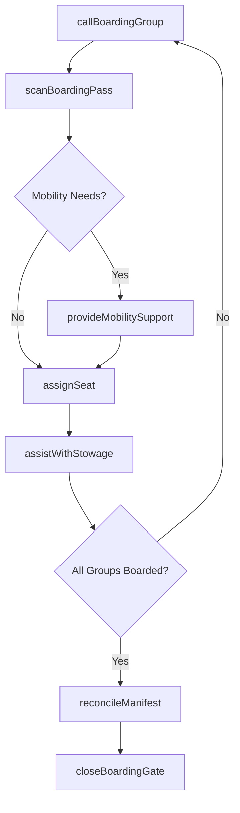
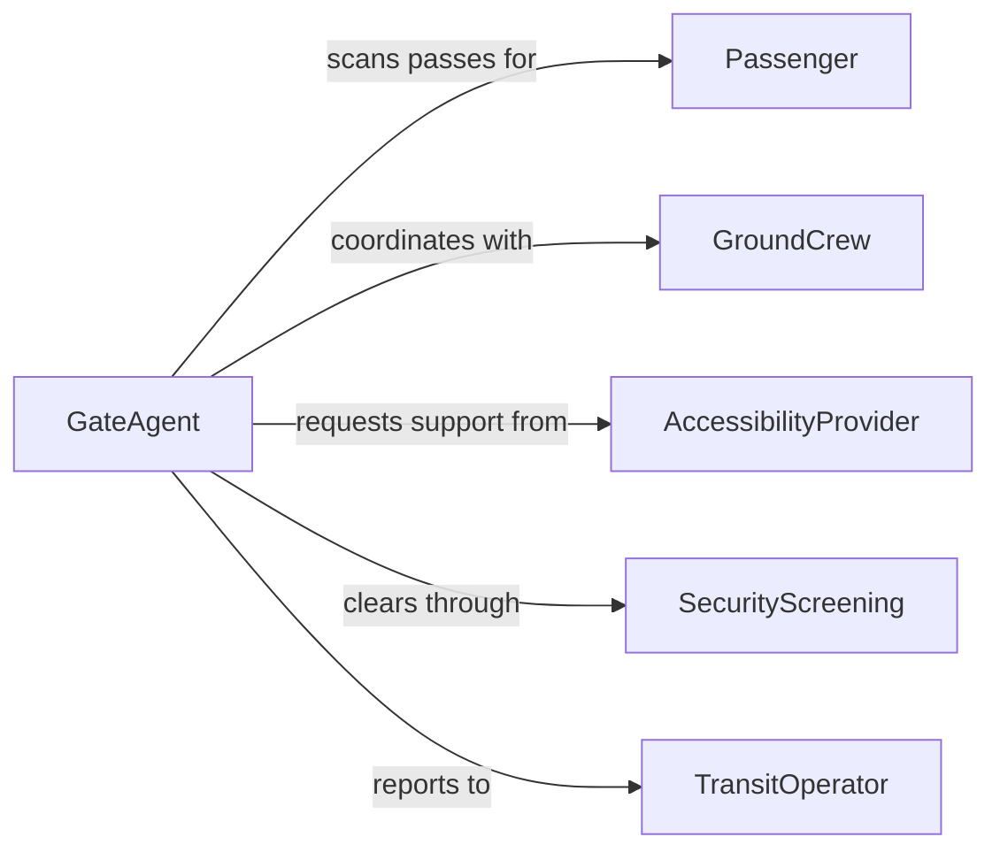

# Assist Passengers During Vehicle Boarding

> Business-as-Code definition for passenger boarding assistance operations. Models the process of guiding passengers onto aircraft, buses, trains, and other transit vehicles safely and efficiently.

## Overview

Passenger boarding assistance encompasses ticket verification, seat assignment guidance, luggage stowage support, and mobility accommodation during the vehicle loading process. This definition exposes actions for managing boarding sequences, event triggers for passenger status updates, and searches for boarding manifest and accommodation records.

## Actors

| Actor | Description |
|-------|-------------|
| Passenger | Individual boarding a transportation vehicle |
| TransitOperator | Organization operating the bus, train, or aircraft |
| SecurityScreening | Verifies passenger credentials and clears boarding |
| AccessibilityProvider | Supplies wheelchairs, ramps, and boarding assistance devices |
| GroundCrew | Handles luggage and vehicle preparation |

## Roles

| Role | Description |
|------|-------------|
| GateAgent | Manages boarding sequence and ticket scanning |
| FlightAttendant | Guides passengers to seats and assists with stowage |
| BoardingSupervisor | Oversees the overall boarding process and timing |
| MobilityAssistant | Provides physical support for passengers with limited mobility |

## Entities

| Entity | Description |
|--------|-------------|
| BoardingPass | Passenger ticket with seat assignment and boarding group |
| BoardingManifest | Complete list of passengers scheduled to board |
| SeatAssignment | Specific seat allocated to a passenger |
| MobilityRequest | Pre-arranged request for boarding accommodation |
| BoardingGroup | Sequenced cohort of passengers called to board |
| LuggageTag | Identification tag for carry-on or checked baggage |
| VehicleStatus | Current readiness state of the transport vehicle |

## Actions

| Action | Description |
|--------|-------------|
| scanBoardingPass | Verify and record a passenger boarding at the gate |
| assignSeat | Allocate or reassign a specific seat to a passenger |
| callBoardingGroup | Announce the next group to begin boarding |
| assistWithStowage | Help a passenger store carry-on luggage |
| provideMobilitySupport | Assist a passenger with limited mobility during boarding |
| closeBoardingGate | Seal the gate after the final passenger has boarded |
| reconcileManifest | Verify all expected passengers have boarded |

## Events

| Event | Description |
|-------|-------------|
| boardingPassScanned | A passenger has been verified and recorded at the gate |
| seatAssigned | A seat has been allocated to a passenger |
| boardingGroupCalled | A boarding group has been announced |
| stowageAssisted | A passenger has been helped with luggage stowage |
| mobilitySupportProvided | A mobility-assisted boarding has been completed |
| boardingGateClosed | The boarding gate has been sealed |
| manifestReconciled | All expected passengers have been accounted for |

## Searches

| Search | Description |
|--------|-------------|
| getManifest | Retrieve the boarding manifest for a specific vehicle or flight |
| findMobilityRequests | List pre-arranged mobility assistance requests |
| getBoardingStatus | Check the current boarding progress by group |
| findMissingPassengers | Identify passengers not yet boarded from the manifest |

## Workflow



## Actor Relationships



## Usage

### Calling Actions

```typescript
import { assistPassengersDuringVehicleBoarding } from '@headlessly/assist-passengers-during-vehicle-boarding'

const boarding = assistPassengersDuringVehicleBoarding()

// Call a boarding group
await boarding.callBoardingGroup({
  flightId: 'FL-1042',
  group: 1,
  description: 'First class and pre-board passengers'
})

// Scan a boarding pass
const scan = await boarding.scanBoardingPass({
  flightId: 'FL-1042',
  passengerId: 'pax-8821',
  boardingPass: 'BP-2026-1042-8821'
})

// Reconcile the manifest before departure
const reconciliation = await boarding.reconcileManifest({
  flightId: 'FL-1042'
})
```

### Event-Driven Automation

```typescript
// Auto-request mobility support for pre-arranged needs
boarding.boardingGroupCalled(async ({ flightId, group }) => {
  const requests = await boarding.findMobilityRequests({ flightId, group })
  for (const req of requests) {
    await boarding.provideMobilitySupport({ requestId: req.id })
  }
})

// Alert operations on missing passengers
boarding.manifestReconciled(async ({ flightId, missing }) => {
  if (missing.length > 0) {
    await notify({
      to: 'gate-operations',
      message: `${missing.length} passengers not boarded for ${flightId}`
    })
  }
})
```
