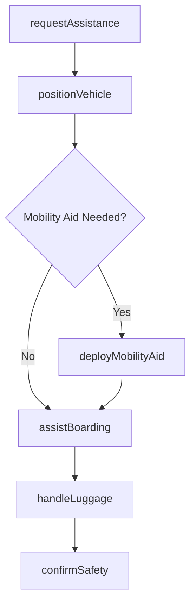
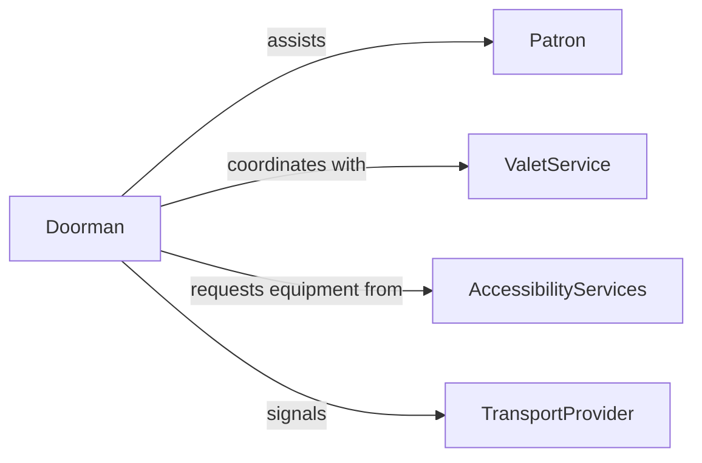

# Assist Patrons with Entering or Exiting Vehicles

> Business-as-Code definition for patron vehicle boarding and alighting assistance. Models the coordination of curbside services, mobility support, and safe vehicle access for guests and passengers.

## Overview

Patron vehicle assistance involves helping individuals board or exit cars, buses, shuttles, and other transportation modes safely. This includes managing curbside logistics, providing mobility aids, handling luggage, and ensuring accessible vehicle access for guests with special needs. This definition exposes actions for service requests, event tracking, and passenger safety documentation.

## Actors

| Actor | Description |
|-------|-------------|
| Patron | Guest requiring vehicle entry or exit assistance |
| TransportProvider | Operates the vehicle or shuttle service |
| ValetService | Manages vehicle retrieval and curbside handoff |
| AccessibilityServices | Provides mobility equipment and adapted vehicles |

## Roles

| Role | Description |
|------|-------------|
| Doorman | Assists guests at vehicle curbside |
| ValetAttendant | Retrieves and positions vehicles for patrons |
| MobilityAssistant | Provides wheelchair or physical support during boarding |
| CurbsideSupervisor | Oversees vehicle flow and guest safety at the entrance |

## Entities

| Entity | Description |
|--------|-------------|
| AssistanceRequest | Request for help entering or exiting a vehicle |
| VehicleArrival | Record of a vehicle arriving at the pickup or drop-off zone |
| MobilityAid | Equipment such as wheelchair, ramp, or step stool used during assistance |
| LuggageTicket | Tag for bags handled during the boarding process |
| SafetyCheckRecord | Documentation of a safe boarding or alighting completion |
| CurbsideZone | Designated area for passenger loading and unloading |

## Actions

| Action | Description |
|--------|-------------|
| requestAssistance | Log a patron request for vehicle boarding help |
| positionVehicle | Move or align the vehicle at the curbside zone |
| deployMobilityAid | Set up wheelchair, ramp, or other access equipment |
| assistBoarding | Help the patron enter the vehicle safely |
| assistAlighting | Help the patron exit the vehicle safely |
| handleLuggage | Load or unload baggage during the boarding process |
| confirmSafety | Verify the patron is safely seated or standing |

## Events

| Event | Description |
|-------|-------------|
| assistanceRequested | A patron has requested vehicle boarding help |
| vehiclePositioned | The vehicle has been aligned at the curbside zone |
| mobilityAidDeployed | Access equipment has been set up for use |
| boardingCompleted | The patron has safely entered the vehicle |
| alightingCompleted | The patron has safely exited the vehicle |
| luggageHandled | Bags have been loaded or unloaded |
| safetyConfirmed | Patron safety has been verified after transfer |

## Searches

| Search | Description |
|--------|-------------|
| findRequests | List assistance requests by status, time, or zone |
| getArrivals | Retrieve vehicle arrival records for a curbside zone |
| getMobilityAids | Find available mobility equipment at a location |
| getSafetyRecords | Search safety check records by date or patron |

## Workflow



## Actor Relationships



## Usage

### Calling Actions

```typescript
import { assistPatronsEnteringExitingVehicles } from '@headlessly/assist-patrons-entering-exiting-vehicles'

const curbside = assistPatronsEnteringExitingVehicles()

// Log an assistance request
const request = await curbside.requestAssistance({
  patronId: 'p-301',
  type: 'boarding',
  mobilityNeeds: 'wheelchair-ramp',
  zone: 'main-entrance'
})

// Deploy mobility equipment
await curbside.deployMobilityAid({
  requestId: request.id,
  equipment: 'portable-ramp',
  zone: 'main-entrance'
})

// Confirm safe boarding
await curbside.confirmSafety({
  requestId: request.id,
  status: 'patron-seated',
  notes: 'Seatbelt fastened, wheelchair secured'
})
```

### Event-Driven Automation

```typescript
// Pre-stage equipment for known mobility needs
curbside.assistanceRequested(async ({ patronId, mobilityNeeds }) => {
  if (mobilityNeeds) {
    await curbside.deployMobilityAid({
      patronId,
      equipment: mobilityNeeds
    })
  }
})

// Log completion metrics
curbside.safetyConfirmed(async ({ requestId, duration }) => {
  await logMetric({
    event: 'boarding-assistance-complete',
    requestId,
    durationSeconds: duration
  })
})
```
