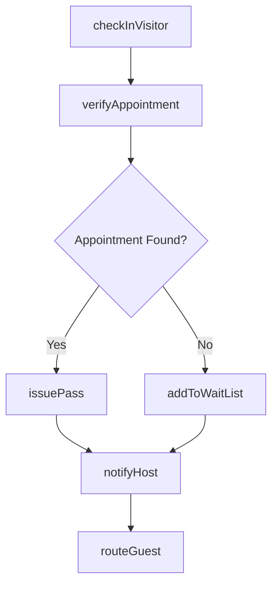
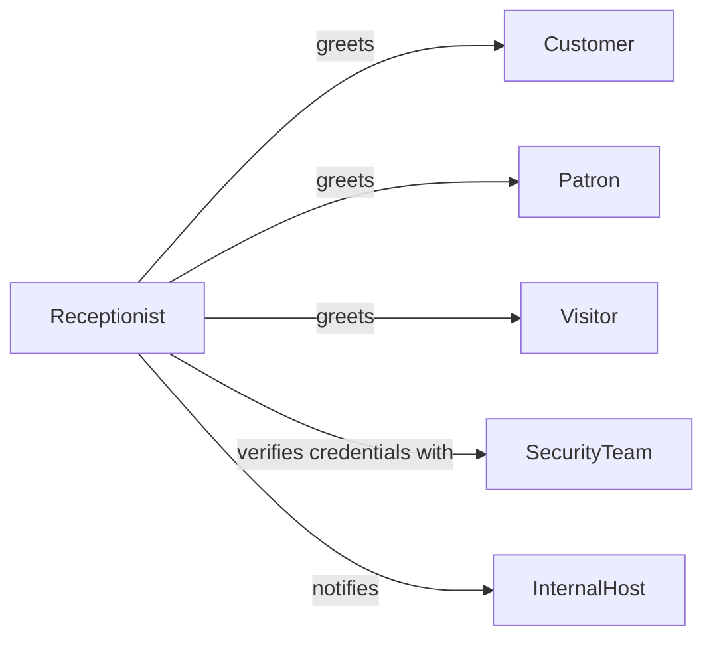

# Greet Customers, Patrons, or Visitors

> Business-as-Code definition for customer, patron, and visitor greeting operations. Models the first-contact experience from arrival through orientation and handoff.

## Overview

Customer and visitor greeting encompasses welcoming individuals upon arrival, verifying appointments or reservations, providing orientation information, and routing guests to the appropriate service area or personnel. This definition exposes actions for check-in workflows, event triggers for arrival tracking, and searches for visitor records.

## Actors

| Actor | Description |
|-------|-------------|
| Customer | Individual arriving for a purchase or service |
| Patron | Guest at an entertainment, cultural, or dining venue |
| Visitor | Person arriving for a meeting, tour, or appointment |
| Vendor | External supplier arriving for a delivery or meeting |
| SecurityTeam | Monitors access and verifies visitor credentials |

## Roles

| Role | Description |
|------|-------------|
| Receptionist | Provides front-desk greeting and routing |
| Concierge | Delivers enhanced guest assistance and local guidance |
| HostGreeter | Welcomes guests and manages waitlists or seating |
| LobbyAttendant | Monitors lobby area and directs foot traffic |

## Entities

| Entity | Description |
|--------|-------------|
| VisitorRecord | Log entry documenting guest arrival details |
| Appointment | Scheduled meeting or service reservation |
| BadgePass | Temporary access credential issued to a visitor |
| WaitList | Ordered queue of guests awaiting service or seating |
| CheckInEvent | Timestamped record of a guest checking in |
| ServiceDirectory | Listing of departments, contacts, and locations |

## Actions

| Action | Description |
|--------|-------------|
| checkInVisitor | Register a guest arrival and issue credentials |
| verifyAppointment | Confirm a scheduled meeting or reservation |
| issuePass | Generate a temporary badge or access credential |
| routeGuest | Direct the visitor to the correct department or area |
| addToWaitList | Place a guest on a queue when immediate service is unavailable |
| notifyHost | Alert the internal contact that their guest has arrived |

## Events

| Event | Description |
|-------|-------------|
| visitorCheckedIn | A guest has been registered at the front desk |
| appointmentVerified | A reservation or meeting has been confirmed |
| passIssued | A temporary access credential has been created |
| guestRouted | A visitor has been directed to their destination |
| hostNotified | The internal contact has been alerted of guest arrival |
| waitListUpdated | The guest queue has been modified |

## Searches

| Search | Description |
|--------|-------------|
| findVisitors | List visitor records by date, host, or status |
| getAppointments | Retrieve scheduled meetings for a date or host |
| getWaitList | View the current guest queue for a location |
| findPasses | Search issued badges by visitor name or date |

## Workflow



## Actor Relationships



## Usage

### Calling Actions

```typescript
import { greetCustomersPatronsVisitors } from '@headlessly/greet-customers-patrons-visitors'

const greeting = greetCustomersPatronsVisitors()

// Check in a visitor
const record = await greeting.checkInVisitor({
  name: 'Jane Doe',
  company: 'Acme Corp',
  hostContact: 'john.smith@company.com',
  purpose: 'scheduled-meeting'
})

// Verify their appointment
const appointment = await greeting.verifyAppointment({
  visitorId: record.id,
  hostEmail: 'john.smith@company.com'
})

// Issue a badge and notify the host
await greeting.issuePass({ visitorId: record.id, accessLevel: 'guest' })
await greeting.notifyHost({ appointmentId: appointment.id })
```

### Event-Driven Automation

```typescript
// Send welcome message upon check-in
greeting.visitorCheckedIn(async ({ visitorId, name }) => {
  await sendSMS({
    to: name,
    message: 'Welcome! Your host has been notified and will be with you shortly.'
  })
})

// Auto-escalate long wait times
greeting.waitListUpdated(async ({ visitorId, waitMinutes }) => {
  if (waitMinutes > 10) {
    await notify({
      to: 'floor-manager',
      message: `Visitor ${visitorId} has been waiting over 10 minutes`
    })
  }
})
```
