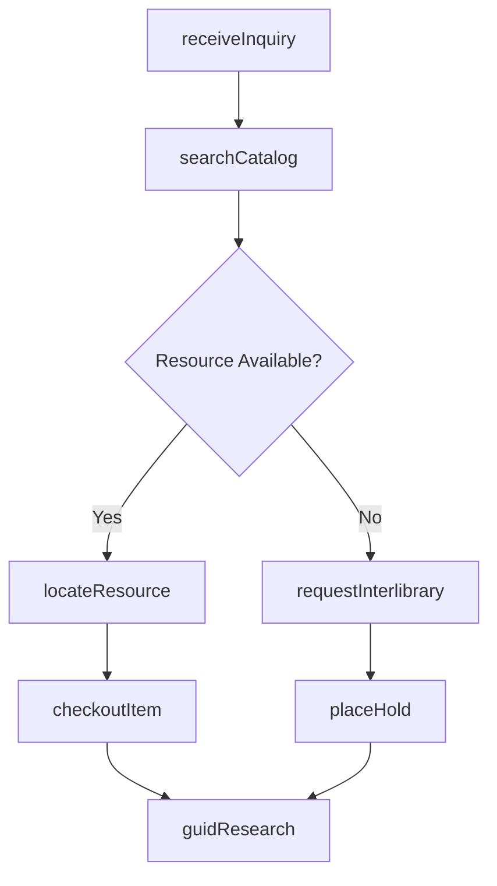
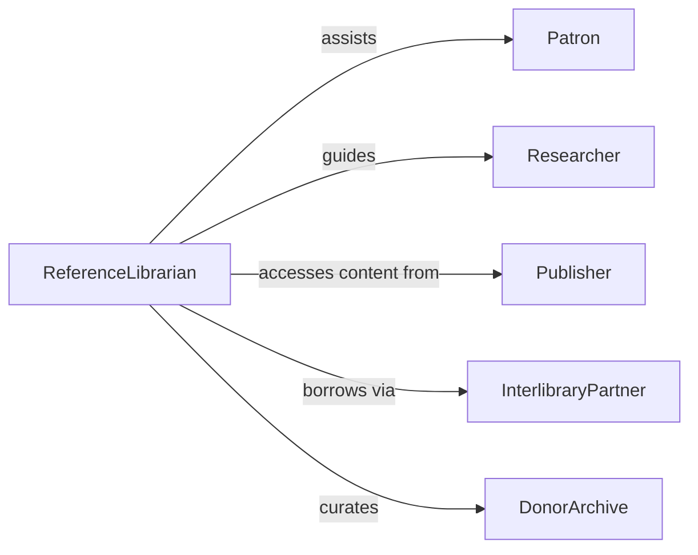

# Help Patrons Use Library or Archival Resources

> Business-as-Code definition for library and archival patron assistance. Models the reference service lifecycle from inquiry intake through resource location, retrieval, and research guidance.

## Overview

Library and archival patron assistance involves guiding individuals through catalog searches, locating physical and digital materials, explaining database interfaces, and supporting research workflows. This definition exposes actions for reference transactions, event triggers for resource usage tracking, and searches for patron inquiry and circulation records.

## Actors

| Actor | Description |
|-------|-------------|
| Patron | Individual seeking library or archival resources |
| Researcher | Academic or professional conducting structured research |
| Publisher | Provides licensed digital content and periodicals |
| InterlibraryPartner | Participates in resource sharing across library systems |
| DonorArchive | Contributes special collections or manuscript holdings |

## Roles

| Role | Description |
|------|-------------|
| ReferenceLibrarian | Answers inquiries and guides research strategies |
| CirculationClerk | Manages checkouts, holds, and returns |
| Archivist | Manages special collections and archival access |
| DigitalServicesSpecialist | Supports electronic database and catalog navigation |

## Entities

| Entity | Description |
|--------|-------------|
| ReferenceInquiry | Patron question or research request |
| CatalogRecord | Bibliographic entry for a library holding |
| CirculationTransaction | Checkout, renewal, or return of a physical item |
| DigitalResource | Licensed database, e-book, or electronic journal |
| ArchivalCollection | Group of related primary source materials |
| HoldRequest | Reservation for a currently unavailable item |
| ResearchGuide | Curated list of resources on a subject |

## Actions

| Action | Description |
|--------|-------------|
| receiveInquiry | Log a patron reference question or research request |
| searchCatalog | Query the library catalog by subject, author, or keyword |
| locateResource | Identify the physical or digital location of a resource |
| checkoutItem | Issue a library item to a patron account |
| placeHold | Reserve an item that is currently checked out |
| requestInterlibrary | Submit a request to borrow from another library |
| guidResearch | Recommend databases, collections, and search strategies |

## Events

| Event | Description |
|-------|-------------|
| inquiryReceived | A patron reference question has been logged |
| catalogSearched | A catalog query has returned results |
| resourceLocated | The location of a requested item has been identified |
| itemCheckedOut | A library item has been issued to a patron |
| holdPlaced | A reservation has been created for an unavailable item |
| interlibraryRequested | A resource sharing request has been submitted |
| researchGuided | A patron has received research strategy assistance |

## Searches

| Search | Description |
|--------|-------------|
| findResources | Search catalog records by title, author, subject, or format |
| getCirculation | Retrieve checkout and return history for a patron or item |
| findHolds | List active hold requests by patron or title |
| getCollections | Browse archival collections by subject or date range |
| findInquiries | Search reference transactions by topic or date |

## Workflow



## Actor Relationships



## Usage

### Calling Actions

```typescript
import { helpPatronsUseLibraryArchival } from '@headlessly/help-patrons-use-library-archival'

const library = helpPatronsUseLibraryArchival()

// Receive a reference inquiry
const inquiry = await library.receiveInquiry({
  patronId: 'lib-7023',
  question: 'Looking for primary sources on the Civil Rights Movement, 1955-1965',
  format: 'in-person'
})

// Search the catalog
const results = await library.searchCatalog({
  subject: 'Civil Rights Movement',
  dateRange: { start: '1955', end: '1965' },
  format: ['book', 'archival', 'periodical']
})

// Checkout an item
await library.checkoutItem({
  patronId: 'lib-7023',
  itemId: results[0].id,
  dueDate: '2026-03-05'
})
```

### Event-Driven Automation

```typescript
// Auto-notify patron when held item becomes available
library.holdPlaced(async ({ patronId, itemId }) => {
  await watchAvailability(itemId, async () => {
    await notify({
      to: patronId,
      message: `Your held item is now available for pickup`
    })
  })
})

// Track popular research topics
library.inquiryReceived(async ({ topic, format }) => {
  await logMetric({
    event: 'reference-inquiry',
    topic,
    channel: format
  })
})
```
