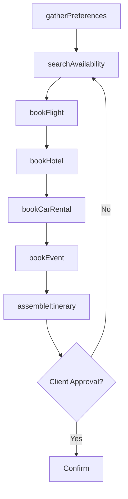
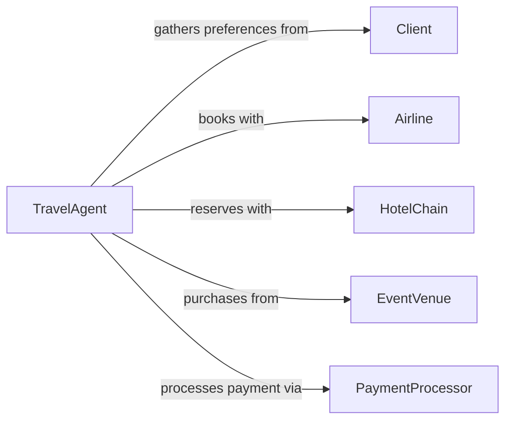

# Make Travel, Accommodations, or Entertainment Arrangements

> Business-as-Code definition for travel, lodging, and entertainment booking services. Models the end-to-end arrangement lifecycle from preference gathering through confirmation and itinerary delivery.

## Overview

Travel and entertainment arrangement involves researching options, comparing rates, booking transportation and lodging, securing event tickets, and assembling complete itineraries on behalf of clients or guests. This definition exposes actions for reservation management, event triggers for booking status changes, and searches for availability and pricing across travel and hospitality providers.

## Actors

| Actor | Description |
|-------|-------------|
| Client | Individual or group requesting travel arrangements |
| Airline | Provides flight booking and ticketing services |
| HotelChain | Offers lodging reservations and room inventory |
| EventVenue | Sells tickets and manages entertainment bookings |
| CarRentalAgency | Supplies ground transportation reservations |
| PaymentProcessor | Handles transaction authorization and settlement |

## Roles

| Role | Description |
|------|-------------|
| TravelAgent | Researches options and books travel components |
| Concierge | Arranges entertainment and dining for hotel guests |
| CorporateTravelManager | Oversees business travel policy compliance and bookings |
| ItineraryCoordinator | Assembles and distributes complete trip schedules |

## Entities

| Entity | Description |
|--------|-------------|
| Itinerary | Complete travel schedule with all booked segments |
| FlightReservation | Confirmed airline booking with ticket details |
| HotelReservation | Confirmed lodging booking with room details |
| EventTicket | Confirmed admission to an entertainment or cultural event |
| CarRental | Ground transportation reservation |
| TravelPreference | Client preferences for seating, room type, or dietary needs |
| BookingConfirmation | Formal acknowledgment of a completed reservation |
| PaymentRecord | Transaction record for a booking payment |

## Actions

| Action | Description |
|--------|-------------|
| gatherPreferences | Collect client travel and entertainment preferences |
| searchAvailability | Query providers for dates, rates, and inventory |
| bookFlight | Reserve and ticket an airline itinerary |
| bookHotel | Reserve lodging for specified dates |
| bookEvent | Purchase tickets for an entertainment or cultural event |
| bookCarRental | Reserve a ground transportation vehicle |
| assembleItinerary | Compile all bookings into a unified travel plan |
| cancelReservation | Cancel a previously confirmed booking |

## Events

| Event | Description |
|-------|-------------|
| preferencesGathered | Client travel preferences have been recorded |
| availabilitySearched | Provider inventory has been queried |
| flightBooked | An airline reservation has been confirmed |
| hotelBooked | A lodging reservation has been confirmed |
| eventBooked | An entertainment ticket has been purchased |
| itineraryAssembled | A complete travel plan has been compiled |
| reservationCancelled | A booking has been cancelled |

## Searches

| Search | Description |
|--------|-------------|
| findFlights | Search available flights by route, date, and class |
| findHotels | Search lodging by location, date, and rate |
| findEvents | Search entertainment options by city, date, and category |
| getItineraries | Retrieve itineraries by client, trip date, or status |
| getBookings | List all reservations for a client or trip |

## Workflow



## Actor Relationships



## Usage

### Calling Actions

```typescript
import { makeTravelAccommodationsEntertainmentArrangements } from '@headlessly/make-travel-accommodations-entertainment-arrangements'

const travel = makeTravelAccommodationsEntertainmentArrangements()

// Gather client preferences
await travel.gatherPreferences({
  clientId: 'cl-450',
  destination: 'Paris',
  dates: { start: '2026-06-15', end: '2026-06-22' },
  preferences: { seatClass: 'business', roomType: 'suite' }
})

// Book a flight
const flight = await travel.bookFlight({
  clientId: 'cl-450',
  route: { from: 'JFK', to: 'CDG' },
  departDate: '2026-06-15',
  returnDate: '2026-06-22',
  class: 'business'
})

// Assemble the full itinerary
const itinerary = await travel.assembleItinerary({
  clientId: 'cl-450',
  bookings: [flight.id, hotel.id, event.id]
})
```

### Event-Driven Automation

```typescript
// Send itinerary upon assembly
travel.itineraryAssembled(async ({ clientId, itineraryId }) => {
  await sendEmail({
    to: clientId,
    subject: 'Your Travel Itinerary is Ready',
    attachment: await generatePDF(itineraryId)
  })
})

// Auto-rebook on cancellation
travel.reservationCancelled(async ({ bookingType, clientId, dates }) => {
  await travel.searchAvailability({
    clientId,
    type: bookingType,
    dates
  })
})
```
