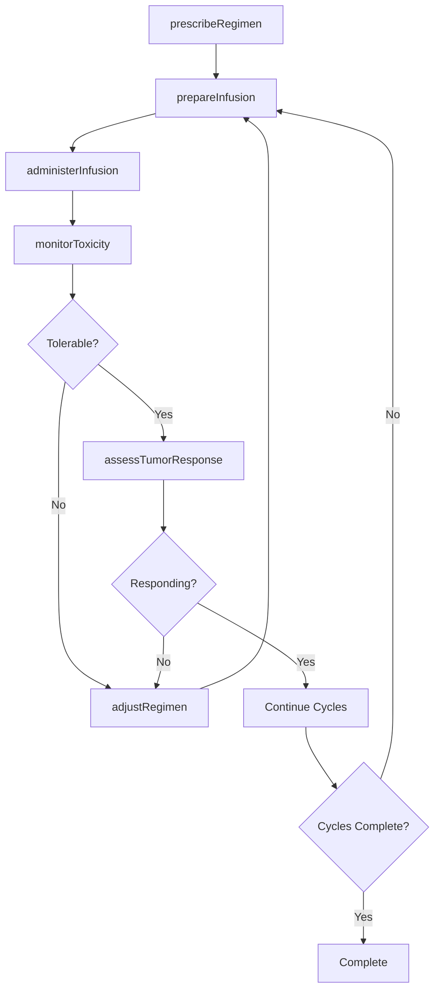
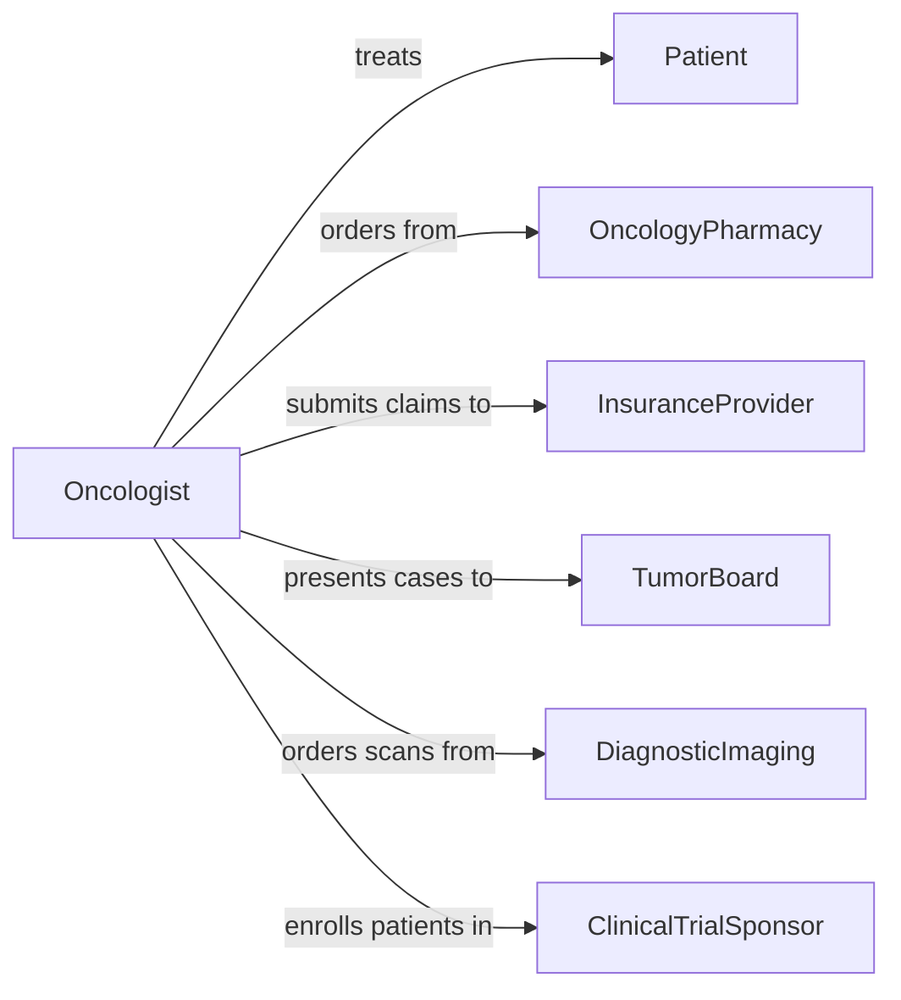

# Administer Cancer Treatments

> Business-as-Code definition for administering cancer treatments. Models the oncology treatment lifecycle including chemotherapy, radiation therapy, immunotherapy, and targeted therapy delivery with patient monitoring and outcome tracking.

## Overview

Administering cancer treatments encompasses the planning, preparation, delivery, and monitoring of oncology therapies including chemotherapy, radiation, immunotherapy, hormone therapy, and targeted biological agents. This activity involves verifying treatment orders against established protocols, preparing and dispensing cytotoxic agents, managing infusion schedules, monitoring patients for adverse reactions, and tracking tumor response over treatment cycles. It requires close coordination among oncologists, pharmacists, nursing staff, and support services.

## Actors

| Actor | Description |
|-------|-------------|
| Patient | Individual diagnosed with cancer receiving treatment |
| OncologyPharmacy | Prepares and dispenses chemotherapy agents and supportive medications |
| InsuranceProvider | Authorizes and reimburses cancer treatment procedures |
| TumorBoard | Multidisciplinary panel that reviews complex cases and recommends treatment |
| DiagnosticImaging | Provides scans and imaging to assess tumor response |
| ClinicalTrialSponsor | Organization conducting research trials for new cancer therapies |

## Roles

| Role | Description |
|------|-------------|
| Oncologist | Physician who diagnoses cancer and prescribes treatment regimens |
| OncologyNurse | Administers chemotherapy infusions and monitors patient responses |
| RadiationTherapist | Delivers radiation therapy treatments according to plan |
| OncologyPharmacist | Verifies dosing, prepares agents, and manages drug interactions |
| CareCoordinator | Manages scheduling, referrals, and supportive care logistics |

## Entities

| Entity | Description |
|--------|-------------|
| TreatmentRegimen | A defined protocol specifying drugs, doses, cycles, and schedule |
| InfusionSession | A single chemotherapy or immunotherapy administration event |
| RadiationPlan | A mapped radiation delivery plan with dosage and target fields |
| ToxicityReport | Documentation of adverse reactions and side effects during treatment |
| TumorAssessment | Evaluation of tumor size, markers, or response to therapy |
| TreatmentCycle | A complete round of therapy within a multi-cycle regimen |

## Actions

| Action | Description |
|--------|-------------|
| prescribeRegimen | Order a cancer treatment regimen with drug protocols and scheduling |
| prepareInfusion | Compound and verify chemotherapy or immunotherapy agents |
| administerInfusion | Deliver intravenous cancer therapy to the patient |
| deliverRadiation | Execute a radiation therapy session per the treatment plan |
| monitorToxicity | Assess and document adverse reactions during or after treatment |
| assessTumorResponse | Evaluate tumor markers and imaging to gauge treatment effectiveness |
| adjustRegimen | Modify drug dosages or treatment schedule based on patient response |

## Events

| Event | Description |
|-------|-------------|
| regimenPrescribed | A cancer treatment regimen has been ordered |
| infusionPrepared | Chemotherapy agents have been compounded and verified |
| infusionAdministered | A chemotherapy or immunotherapy session has been completed |
| radiationDelivered | A radiation therapy session has been executed |
| toxicityMonitored | Adverse reactions have been assessed and documented |
| tumorResponseAssessed | Tumor response to treatment has been evaluated |
| regimenAdjusted | Treatment protocol has been modified based on patient response |

## Searches

| Search | Description |
|--------|-------------|
| findTreatmentRegimens | Retrieve regimens by patient, cancer type, or drug protocol |
| getInfusionHistory | List infusion sessions by patient, cycle, or date range |
| findToxicityReports | Locate adverse reaction records by severity or treatment type |
| getTumorAssessments | Retrieve tumor response evaluations by patient or assessment date |

## Workflow



## Actor Relationships



## Usage

### Calling Actions

```typescript
import { administerCancerTreatments } from '@headlessly/administer-cancer-treatments'

const oncology = administerCancerTreatments()

// Prescribe a treatment regimen
const regimen = await oncology.prescribeRegimen({
  patientId: 'patient-8294',
  cancerType: 'non-small-cell-lung-cancer',
  protocol: 'carboplatin-pemetrexed',
  cycles: 4,
  intervalDays: 21,
  startDate: '2026-02-10'
})

// Prepare the infusion
const infusion = await oncology.prepareInfusion({
  regimenId: regimen.id,
  cycle: 1,
  drugs: [
    { name: 'Carboplatin', dose: 'AUC 5', route: 'IV' },
    { name: 'Pemetrexed', dose: '500mg/m2', route: 'IV' }
  ]
})

// Administer the infusion
await oncology.administerInfusion({
  infusionId: infusion.id,
  patientId: 'patient-8294',
  startTime: '2026-02-10T09:00:00Z',
  nurseId: 'nurse-1147'
})
```

### Event-Driven Automation

```typescript
// Alert on severe toxicity
oncology.toxicityMonitored(async ({ patientId, regimenId, grade, symptoms }) => {
  if (grade >= 3) {
    await notify({
      to: 'oncology-team',
      message: `Grade ${grade} toxicity for patient ${patientId}: ${symptoms.join(', ')}`
    })
    await oncology.adjustRegimen({ regimenId, reason: 'severe-toxicity' })
  }
})

// Schedule imaging after cycle completion
oncology.infusionAdministered(async ({ patientId, regimenId, cycle, totalCycles }) => {
  if (cycle === Math.floor(totalCycles / 2)) {
    await scheduleImaging({
      patientId,
      type: 'CT-scan',
      reason: 'Mid-treatment tumor response assessment'
    })
  }
})
```
