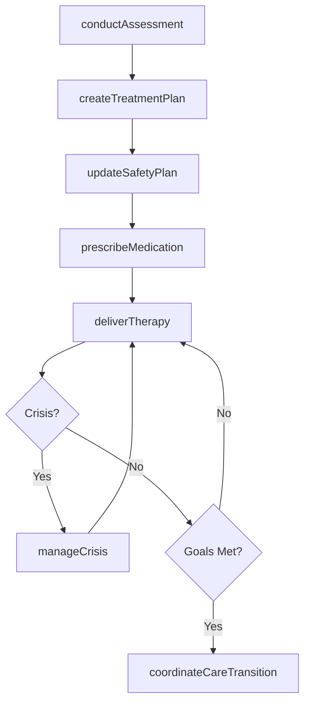
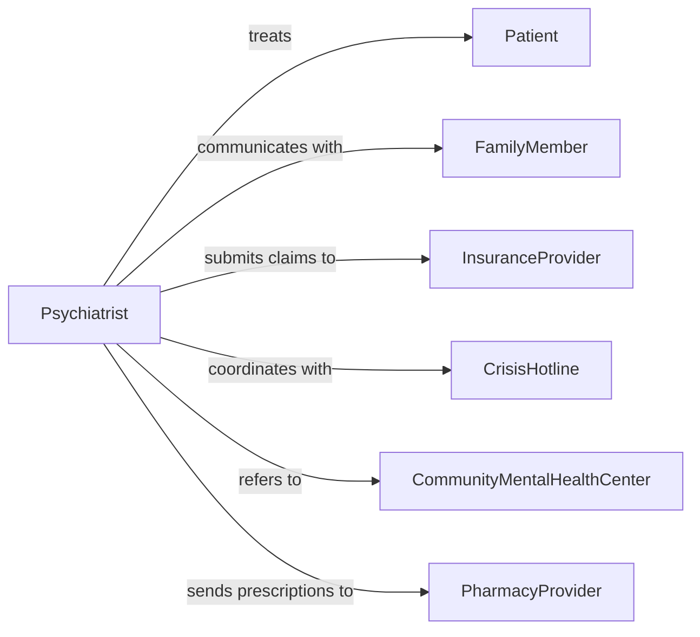

# Care Patients Mental Illnesses

> Business-as-Code definition for caring for patients with mental illnesses. Models the psychiatric and behavioral health care lifecycle including assessment, diagnosis, treatment planning, psychotherapy, medication management, and crisis intervention.

## Overview

Caring for patients with mental illnesses involves the assessment, diagnosis, and treatment of psychiatric and behavioral health conditions including mood disorders, anxiety, psychotic disorders, substance use disorders, and personality disorders. This activity encompasses psychiatric evaluation, psychotherapy delivery, psychotropic medication management, crisis intervention, and rehabilitation services. It requires coordination across psychiatrists, psychologists, counselors, social workers, and community support services to deliver comprehensive mental health care.

## Actors

| Actor | Description |
|-------|-------------|
| Patient | Individual receiving mental health care and treatment |
| FamilyMember | Family or support person involved in the patient's care |
| InsuranceProvider | Authorizes and reimburses mental health treatment services |
| CrisisHotline | Emergency support service for patients in acute distress |
| CommunityMentalHealthCenter | Provides outpatient and community-based mental health services |
| PharmacyProvider | Dispenses psychotropic medications and monitors refills |

## Roles

| Role | Description |
|------|-------------|
| Psychiatrist | Physician who diagnoses mental illness and prescribes medications |
| Psychologist | Provides psychological assessment and psychotherapy |
| ClinicalSocialWorker | Delivers counseling and connects patients with community resources |
| PsychiatricNurse | Monitors medication effects and provides therapeutic support |
| CaseManager | Coordinates treatment across providers and manages care transitions |

## Entities

| Entity | Description |
|--------|-------------|
| PsychiatricAssessment | Comprehensive evaluation of mental health status and history |
| TreatmentPlan | Individualized plan specifying therapeutic interventions and goals |
| TherapySession | A psychotherapy encounter with clinical notes and progress |
| MedicationRecord | Documentation of psychotropic medications, dosages, and responses |
| CrisisEvent | A documented instance of acute psychiatric crisis and intervention |
| SafetyPlan | A personalized plan identifying triggers, coping strategies, and emergency contacts |

## Actions

| Action | Description |
|--------|-------------|
| conductAssessment | Perform a comprehensive psychiatric evaluation |
| createTreatmentPlan | Develop an individualized plan with therapy and medication goals |
| deliverTherapy | Conduct a psychotherapy session with the patient |
| prescribeMedication | Order or adjust psychotropic medications |
| manageCrisis | Intervene during an acute psychiatric emergency |
| updateSafetyPlan | Revise the patient's crisis prevention and safety plan |
| coordinateCareTransition | Arrange transfer between levels of care or providers |

## Events

| Event | Description |
|-------|-------------|
| assessmentConducted | A psychiatric evaluation has been completed |
| treatmentPlanCreated | A mental health treatment plan has been established |
| therapyDelivered | A psychotherapy session has been completed |
| medicationPrescribed | Psychotropic medications have been ordered or adjusted |
| crisisManaged | An acute psychiatric crisis has been addressed |
| safetyPlanUpdated | A patient's safety plan has been revised |
| careTransitionCoordinated | Transfer to a new care level or provider has been arranged |

## Searches

| Search | Description |
|--------|-------------|
| findTreatmentPlans | Retrieve treatment plans by patient, diagnosis, or provider |
| getTherapySessions | List therapy sessions by patient, type, or date range |
| findActiveCrises | Locate current crisis events requiring intervention |
| getMedicationHistory | Retrieve psychotropic medication records by patient |
| findPatientsNeedingFollowUp | Identify patients overdue for scheduled appointments |

## Workflow



## Actor Relationships



## Usage

### Calling Actions

```typescript
import { carePatientsMentalIllnesses } from '@headlessly/care-patients-mental-illnesses'

const mentalHealth = carePatientsMentalIllnesses()

// Conduct psychiatric assessment
const assessment = await mentalHealth.conductAssessment({
  patientId: 'patient-2847',
  presentingConcerns: ['persistent-sadness', 'insomnia', 'loss-of-interest'],
  mentalStatusExam: { mood: 'depressed', affect: 'flat', suicidality: 'passive-ideation' },
  history: { psychiatric: ['prior-depressive-episode'], substance: 'none', family: ['depression'] }
})

// Create treatment plan
const plan = await mentalHealth.createTreatmentPlan({
  patientId: assessment.patientId,
  diagnosis: 'major-depressive-disorder-recurrent',
  interventions: ['cognitive-behavioral-therapy', 'medication-management'],
  goals: [
    { description: 'Reduce PHQ-9 score below 10', timeframe: '8-weeks' },
    { description: 'Restore regular sleep pattern', timeframe: '4-weeks' }
  ]
})

// Prescribe medication
await mentalHealth.prescribeMedication({
  patientId: 'patient-2847',
  treatmentPlanId: plan.id,
  medications: [
    { drug: 'Sertraline', dosage: '50mg', frequency: 'once-daily', notes: 'Titrate to 100mg after 2 weeks if tolerated' }
  ]
})
```

### Event-Driven Automation

```typescript
// Immediate response to crisis events
mentalHealth.crisisManaged(async ({ patientId, severity, intervention }) => {
  if (severity === 'high') {
    await notify({
      to: 'psychiatry-team',
      message: `High-severity crisis for patient ${patientId} - ${intervention}`
    })
    await mentalHealth.updateSafetyPlan({
      patientId,
      triggerUpdate: intervention
    })
  }
})

// Schedule follow-up after medication change
mentalHealth.medicationPrescribed(async ({ patientId, medications }) => {
  await scheduleAppointment({
    patientId,
    type: 'medication-follow-up',
    date: addWeeks(new Date(), 2),
    reason: 'Assess medication response and side effects'
  })
})
```
