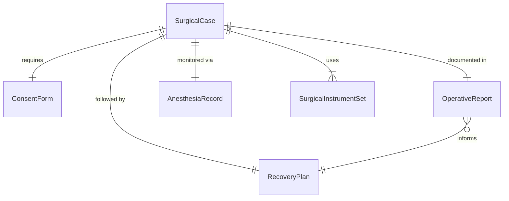
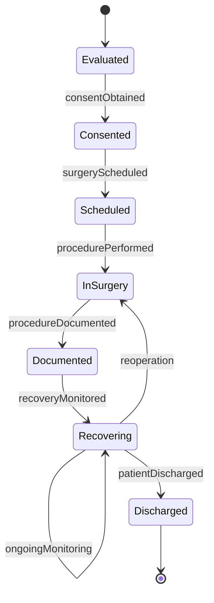
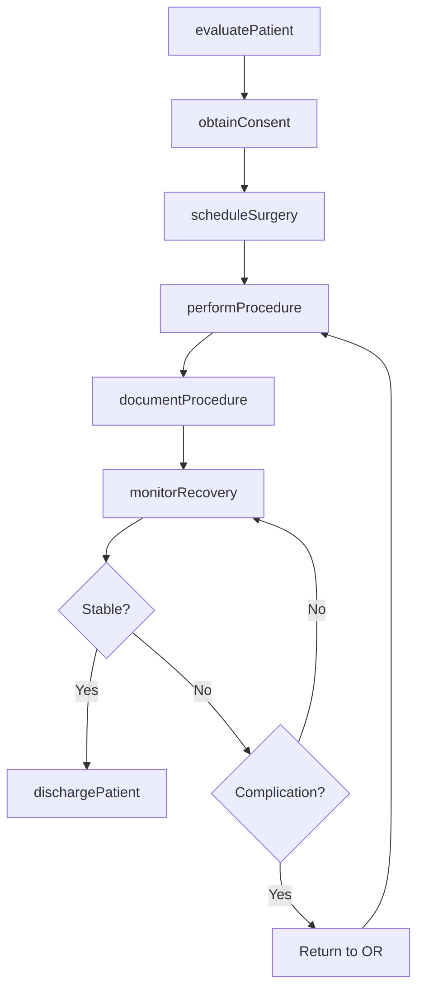
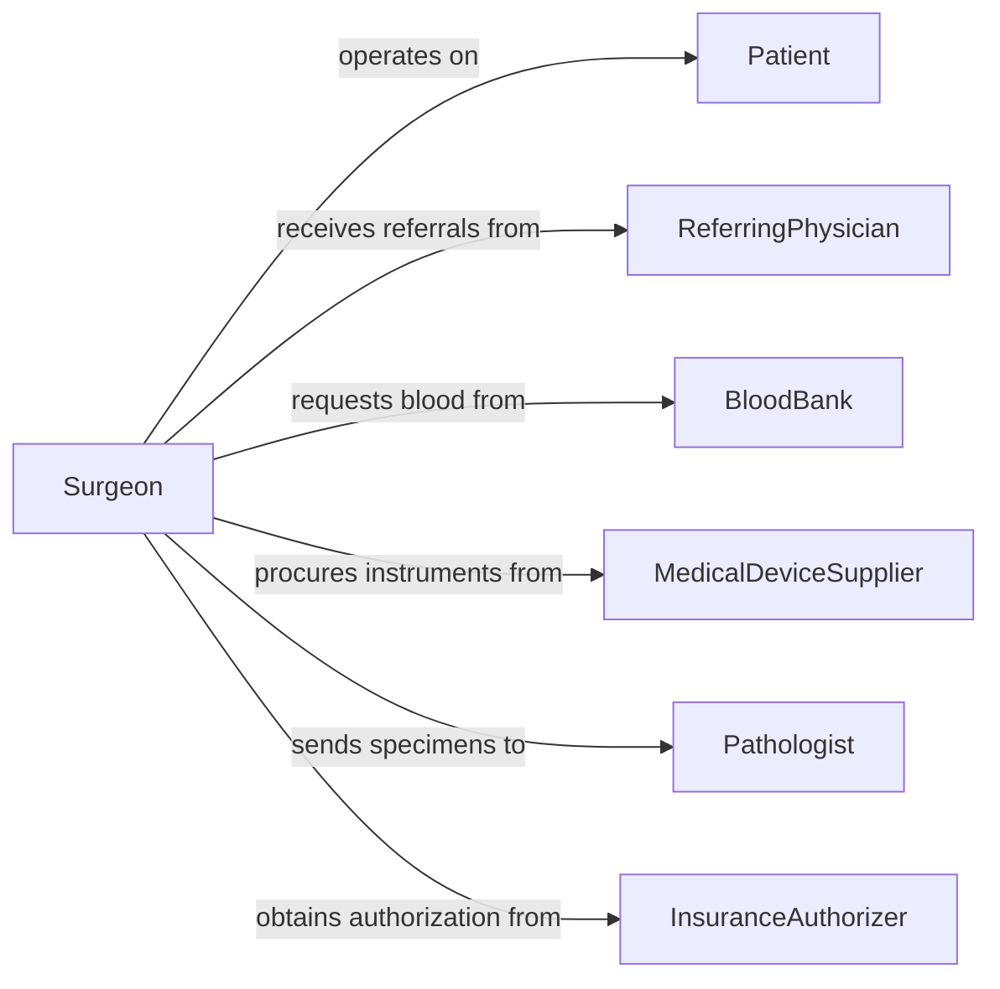

# Operate Patients Treat Conditions

> Business-as-Code definition for operating on patients to treat conditions. Models the surgical workflow from preoperative assessment and planning through intraoperative execution and postoperative recovery management.

## Overview

Operating on patients to treat conditions encompasses the full surgical lifecycle including preoperative evaluation, surgical planning, anesthesia coordination, intraoperative procedure execution, and postoperative care. This activity covers a wide range of surgical specialties including general surgery, orthopedics, cardiovascular, neurosurgery, and minimally invasive procedures. It involves coordinating surgical teams, managing operating room resources, documenting procedures, and monitoring patient outcomes through recovery.

## Actors

| Actor | Description |
|-------|-------------|
| Patient | Individual undergoing a surgical procedure |
| ReferringPhysician | Provider who identifies the surgical need and refers the patient |
| BloodBank | Facility providing blood products for transfusion during surgery |
| MedicalDeviceSupplier | Vendor providing surgical instruments, implants, and equipment |
| Pathologist | Specialist who examines tissue specimens obtained during surgery |
| InsuranceAuthorizer | Entity that pre-authorizes surgical procedures for coverage |

## Roles

| Role | Description |
|------|-------------|
| Surgeon | Licensed physician who performs the surgical procedure |
| Anesthesiologist | Manages anesthesia delivery and monitors vital signs |
| SurgicalNurse | Assists the surgeon and manages the sterile field |
| OperatingRoomCoordinator | Schedules surgical cases and manages OR resources |
| PostoperativeNurse | Monitors patient recovery in the post-anesthesia care unit |

## Entities

| Entity | Description |
|--------|-------------|
| SurgicalCase | A scheduled surgical procedure with all associated details |
| OperativeReport | Detailed documentation of the surgical procedure performed |
| AnesthesiaRecord | Log of anesthesia agents, doses, and patient vital signs |
| ConsentForm | Patient authorization for the surgical procedure and risks |
| SurgicalInstrumentSet | The specific set of tools and equipment required for a procedure |
| RecoveryPlan | Postoperative care instructions and recovery milestones |

## Actions

| Action | Description |
|--------|-------------|
| evaluatePatient | Conduct preoperative assessment and determine surgical candidacy |
| scheduleSurgery | Book the operating room, team, and resources for a procedure |
| obtainConsent | Secure informed consent from the patient for the procedure |
| performProcedure | Execute the surgical operation on the patient |
| documentProcedure | Record the operative report with findings and techniques used |
| monitorRecovery | Track patient vitals and progress in the post-anesthesia period |
| dischargePatient | Clear the patient for release with postoperative instructions |

## Events

| Event | Description |
|-------|-------------|
| patientEvaluated | Preoperative assessment has been completed |
| surgeryScheduled | An operating room and team have been booked |
| consentObtained | The patient has provided informed surgical consent |
| procedurePerformed | The surgical operation has been completed |
| procedureDocumented | The operative report has been recorded |
| recoveryMonitored | Postoperative vital signs and status have been assessed |
| patientDischarged | The patient has been cleared for release |

## Searches

| Search | Description |
|--------|-------------|
| findSurgicalCases | Retrieve cases by surgeon, patient, procedure type, or date |
| getOperativeReports | List operative reports by procedure, outcome, or surgeon |
| findPendingConsents | Locate patients who have not yet provided surgical consent |
| getRecoveryStatus | Retrieve postoperative recovery progress for a patient |

## Entity Relationships



## State Diagram



## Workflow



## Actor Relationships



## Usage

### Calling Actions

```typescript
import { operatePatientsTreatConditions } from '@headlessly/operate-patients-treat-conditions'

const surgery = operatePatientsTreatConditions()

// Evaluate patient for surgery
const evaluation = await surgery.evaluatePatient({
  patientId: 'patient-3847',
  condition: 'herniated-lumbar-disc-L4-L5',
  assessments: ['physical-exam', 'MRI-review', 'cardiac-clearance'],
  asaClass: 2
})

// Schedule the procedure
const scheduledCase = await surgery.scheduleSurgery({
  patientId: evaluation.patientId,
  procedure: 'lumbar-microdiscectomy',
  surgeonId: 'surgeon-2294',
  date: '2026-03-15',
  estimatedDuration: 90,
  orRequirements: ['microscope', 'fluoroscopy']
})

// Perform the procedure
await surgery.performProcedure({
  caseId: scheduledCase.id,
  technique: 'minimally-invasive',
  startTime: '2026-03-15T08:00:00Z',
  findings: 'Large disc fragment compressing L5 nerve root',
  implants: []
})
```

### Event-Driven Automation

```typescript
// Notify referring physician after surgery
surgery.procedurePerformed(async ({ patientId, caseId, outcome }) => {
  const surgicalCase = await surgery.findSurgicalCases({ id: caseId })
  await notify({
    to: surgicalCase.referringPhysicianId,
    message: `Surgery completed for patient ${patientId}. Outcome: ${outcome}`
  })
})

// Auto-schedule follow-up after discharge
surgery.patientDischarged(async ({ patientId, caseId }) => {
  await scheduleAppointment({
    patientId,
    type: 'post-surgical-follow-up',
    date: addWeeks(new Date(), 2),
    reason: 'Wound check and recovery assessment'
  })
})
```
