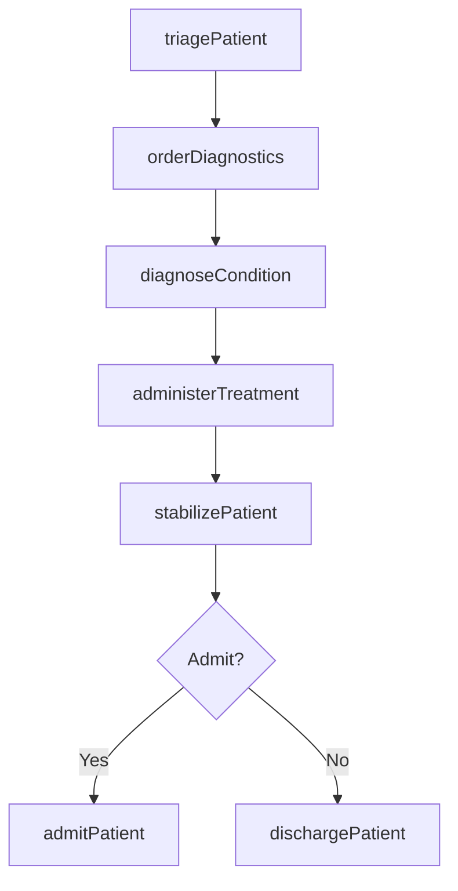
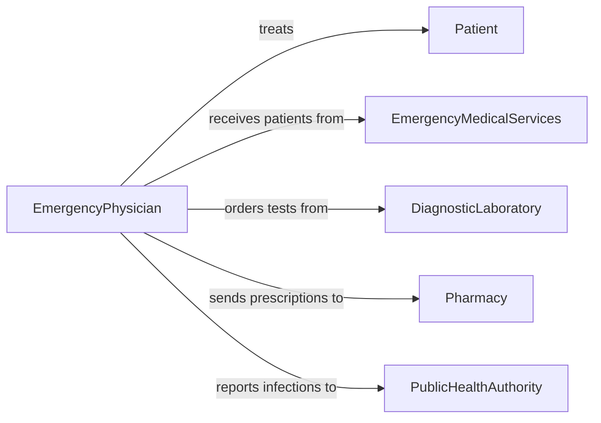

# Treat Acute Illnesses Infections Injuries

> Business-as-Code definition for treating acute illnesses, infections, or injuries. Models the clinical workflow from triage and assessment through diagnosis, treatment delivery, and discharge for urgent and episodic medical conditions.

## Overview

Treating acute illnesses, infections, or injuries involves the rapid assessment, diagnosis, and treatment of sudden-onset medical conditions including infectious diseases, traumatic injuries, acute pain, allergic reactions, and other urgent health issues. This activity spans emergency departments, urgent care facilities, and primary care settings, encompassing triage, diagnostic testing, medication administration, wound management, and patient stabilization. It requires timely clinical decision-making and coordination with diagnostic and pharmacy services.

## Actors

| Actor | Description |
|-------|-------------|
| Patient | Individual presenting with an acute illness, infection, or injury |
| EmergencyMedicalServices | Paramedics or first responders who transport patients for acute care |
| DiagnosticLaboratory | Performs urgent blood work, cultures, and pathology analysis |
| Pharmacy | Dispenses acute-care medications including antibiotics and analgesics |
| PublicHealthAuthority | Receives reports on notifiable infections and outbreaks |

## Roles

| Role | Description |
|------|-------------|
| EmergencyPhysician | Diagnoses and treats acute conditions in urgent settings |
| TriageNurse | Assesses patient acuity and prioritizes care delivery |
| TreatmentNurse | Administers medications, wound care, and therapeutic interventions |
| Hospitalist | Manages admitted patients requiring continued acute care |
| DischargeCoordinator | Prepares patients for release with follow-up instructions |

## Entities

| Entity | Description |
|--------|-------------|
| TriageAssessment | Initial evaluation of patient acuity, symptoms, and vital signs |
| AcuteDiagnosis | Clinical determination of the acute condition |
| TreatmentOrder | A set of prescribed interventions for the acute condition |
| DiagnosticResult | Lab, imaging, or test findings used to guide treatment |
| WoundRecord | Documentation of wound characteristics, treatment, and closure |
| DischargeInstructions | Written care guidelines provided to the patient at release |

## Actions

| Action | Description |
|--------|-------------|
| triagePatient | Assess patient acuity and assign treatment priority |
| diagnoseCondition | Determine the acute illness, infection, or injury |
| orderDiagnostics | Request laboratory tests, imaging, or other diagnostic studies |
| administerTreatment | Deliver medications, procedures, or wound care |
| stabilizePatient | Bring the patient to a clinically stable state |
| dischargePatient | Release the patient with instructions and prescriptions |
| admitPatient | Transfer the patient to inpatient care for ongoing treatment |

## Events

| Event | Description |
|-------|-------------|
| patientTriaged | A patient has been assessed and assigned a triage priority |
| conditionDiagnosed | An acute diagnosis has been established |
| diagnosticsOrdered | Laboratory or imaging studies have been requested |
| treatmentAdministered | Medications or procedures have been delivered |
| patientStabilized | The patient has reached a clinically stable state |
| patientDischarged | The patient has been released with follow-up instructions |
| patientAdmitted | The patient has been transferred to inpatient care |

## Searches

| Search | Description |
|--------|-------------|
| findActivePatients | Retrieve patients currently receiving acute treatment |
| getDiagnosticResults | List test results by patient, type, or urgency |
| findPendingDischarges | Locate patients cleared for discharge awaiting instructions |
| getTriageQueue | Retrieve patients awaiting assessment sorted by acuity |

## Workflow



## Actor Relationships



## Usage

### Calling Actions

```typescript
import { treatAcuteIllnessesInfectionsInjuries } from '@headlessly/treat-acute-illnesses-infections-injuries'

const acuteCare = treatAcuteIllnessesInfectionsInjuries()

// Triage a patient
const triage = await acuteCare.triagePatient({
  patientId: 'patient-9241',
  chiefComplaint: 'High fever and productive cough for 3 days',
  vitals: { temperature: 39.2, heartRate: 110, respiratoryRate: 24, bloodPressure: '128/82', spO2: 94 },
  acuityLevel: 2
})

// Order diagnostics
await acuteCare.orderDiagnostics({
  patientId: triage.patientId,
  tests: ['chest-xray', 'complete-blood-count', 'blood-culture', 'procalcitonin']
})

// Diagnose and treat
const diagnosis = await acuteCare.diagnoseCondition({
  patientId: triage.patientId,
  diagnosis: 'community-acquired-pneumonia',
  severity: 'moderate'
})

await acuteCare.administerTreatment({
  patientId: triage.patientId,
  diagnosisId: diagnosis.id,
  interventions: [
    { type: 'medication', drug: 'Ceftriaxone', dose: '1g', route: 'IV' },
    { type: 'medication', drug: 'Azithromycin', dose: '500mg', route: 'oral' },
    { type: 'supportive', therapy: 'supplemental-oxygen', target: 'SpO2 > 95%' }
  ]
})
```

### Event-Driven Automation

```typescript
// Alert on critical triage cases
acuteCare.patientTriaged(async ({ patientId, acuityLevel, vitals }) => {
  if (acuityLevel === 1) {
    await notify({
      to: 'emergency-team',
      message: `Critical patient ${patientId} requires immediate attention`
    })
  }
})

// Report notifiable infections to public health
acuteCare.conditionDiagnosed(async ({ patientId, diagnosis }) => {
  const notifiable = ['tuberculosis', 'meningococcal-disease', 'measles', 'cholera']
  if (notifiable.includes(diagnosis)) {
    await reportToPublicHealth({
      patientId,
      condition: diagnosis,
      reportDate: new Date().toISOString()
    })
  }
})
```
