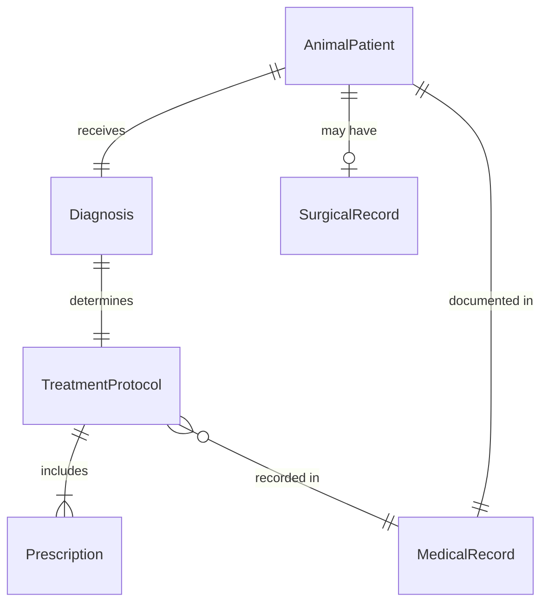
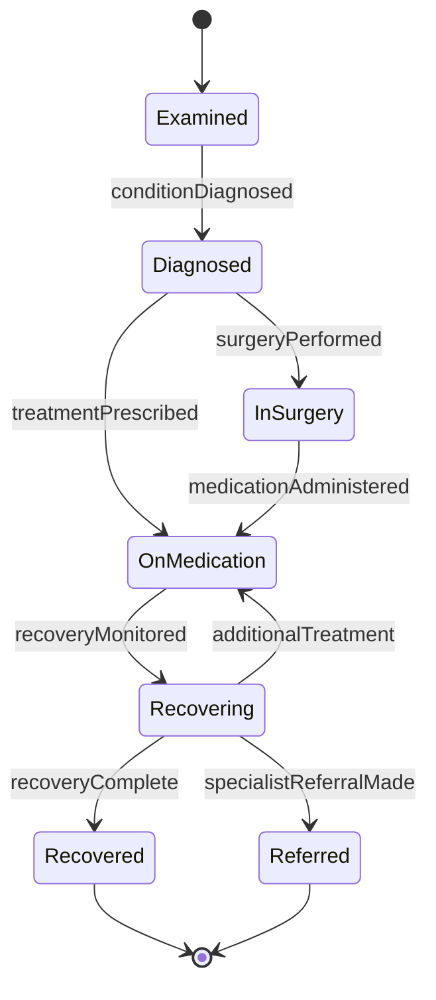
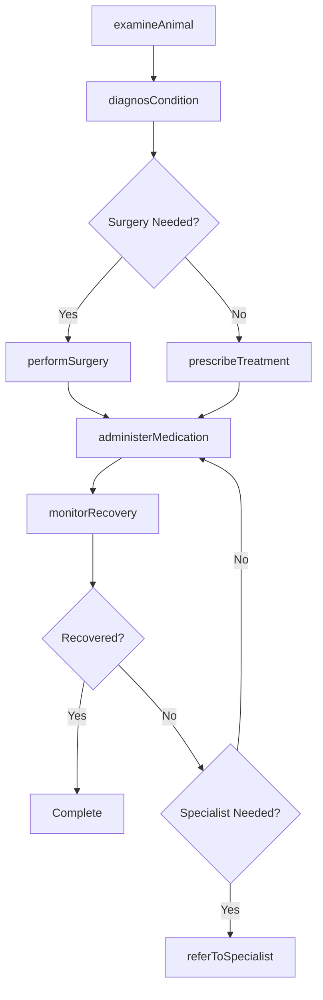
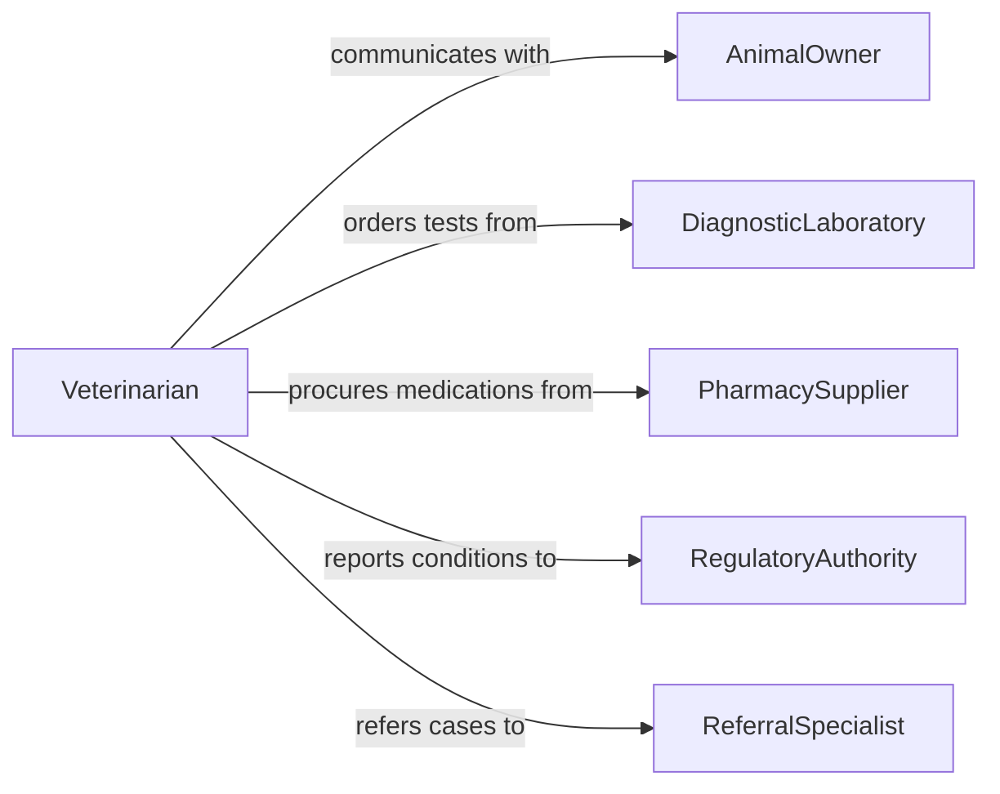

# Treat Animal Injuries Illnesses

> Business-as-Code definition for treating animal injuries or illnesses. Models veterinary care delivery from examination and diagnosis through treatment administration, surgical intervention, and recovery monitoring.

## Overview

Treating animal injuries or illnesses involves examining animals, diagnosing conditions, administering medications, performing surgical procedures, and monitoring recovery outcomes. This activity spans companion animals, livestock, equine, and wildlife, covering emergency trauma care, infectious disease treatment, orthopedic repair, and ongoing therapeutic management. It includes coordination with animal owners, laboratory services, and regulatory authorities for reportable conditions.

## Actors

| Actor | Description |
|-------|-------------|
| AnimalOwner | Individual or organization responsible for the animal receiving treatment |
| DiagnosticLaboratory | Facility that performs blood work, imaging, and pathology analysis |
| PharmacySupplier | Vendor providing veterinary medications and medical supplies |
| RegulatoryAuthority | Government body overseeing animal health standards and reportable diseases |
| ReferralSpecialist | Veterinary specialist who handles complex or specialized cases |

## Roles

| Role | Description |
|------|-------------|
| Veterinarian | Licensed professional who diagnoses and treats animal conditions |
| VeterinaryTechnician | Assists with examinations, procedures, and patient monitoring |
| VeterinarySurgeon | Performs surgical interventions on injured or ill animals |
| AnimalCareAttendant | Provides post-treatment monitoring and daily care |

## Entities

| Entity | Description |
|--------|-------------|
| AnimalPatient | An animal receiving veterinary examination and treatment |
| Diagnosis | A clinical determination of the animal's condition |
| TreatmentProtocol | A prescribed course of therapy including medications and procedures |
| SurgicalRecord | Documentation of a surgical intervention and its outcomes |
| MedicalRecord | Comprehensive health history and treatment log for an animal |
| Prescription | A medication order specifying drug, dosage, and administration schedule |

## Actions

| Action | Description |
|--------|-------------|
| examineAnimal | Conduct a physical examination and assess the animal's condition |
| diagnosCondition | Determine the nature and cause of the animal's injury or illness |
| prescribeTreatment | Order medications, therapies, or procedures for the animal |
| performSurgery | Execute a surgical procedure to treat an injury or condition |
| administerMedication | Deliver prescribed drugs or vaccines to the animal |
| monitorRecovery | Track the animal's progress following treatment |
| referToSpecialist | Transfer care to a veterinary specialist for advanced treatment |

## Events

| Event | Description |
|-------|-------------|
| animalExamined | A physical examination of the animal has been completed |
| conditionDiagnosed | A diagnosis has been established for the animal's condition |
| treatmentPrescribed | A treatment protocol has been ordered for the animal |
| surgeryPerformed | A surgical procedure has been completed |
| medicationAdministered | Medication has been delivered to the animal |
| recoveryMonitored | Post-treatment progress has been assessed |
| specialistReferralMade | The animal has been referred to a veterinary specialist |

## Searches

| Search | Description |
|--------|-------------|
| findAnimalPatients | Retrieve animal patients by species, owner, or condition |
| getTreatmentHistory | List treatments administered to a specific animal |
| findActiveProtocols | Locate ongoing treatment protocols by veterinarian or status |
| getSurgicalRecords | Retrieve surgical records by procedure type or date range |

## Entity Relationships



## State Diagram



## Workflow



## Actor Relationships



## Usage

### Calling Actions

```typescript
import { treatAnimalInjuriesIllnesses } from '@headlessly/treat-animal-injuries-illnesses'

const vetCare = treatAnimalInjuriesIllnesses()

// Examine an animal patient
const exam = await vetCare.examineAnimal({
  patientId: 'animal-7823',
  species: 'canine',
  breed: 'Labrador Retriever',
  symptoms: ['limping', 'swelling-right-forelimb', 'reduced-appetite'],
  ownerId: 'owner-3341'
})

// Diagnose the condition
const diagnosis = await vetCare.diagnosCondition({
  patientId: exam.patientId,
  examId: exam.id,
  findings: 'Fractured radius with soft tissue swelling',
  diagnosticTests: ['x-ray-forelimb']
})

// Prescribe treatment
await vetCare.prescribeTreatment({
  patientId: exam.patientId,
  diagnosisId: diagnosis.id,
  medications: [{ drug: 'Carprofen', dosage: '2.2mg/kg', frequency: 'twice-daily', duration: '14-days' }],
  procedures: ['splint-application']
})
```

### Event-Driven Automation

```typescript
// Notify owner after surgery
vetCare.surgeryPerformed(async ({ patientId, procedure, outcome }) => {
  const patient = await vetCare.findAnimalPatients({ id: patientId })
  await notify({
    to: patient.ownerId,
    message: `Surgery (${procedure}) completed for ${patient.name}. Outcome: ${outcome}`
  })
})

// Schedule follow-up for recovery monitoring
vetCare.medicationAdministered(async ({ patientId, treatmentProtocolId }) => {
  await scheduleAppointment({
    patientId,
    type: 'follow-up',
    date: addDays(new Date(), 7),
    reason: 'Recovery check and treatment assessment'
  })
})
```
