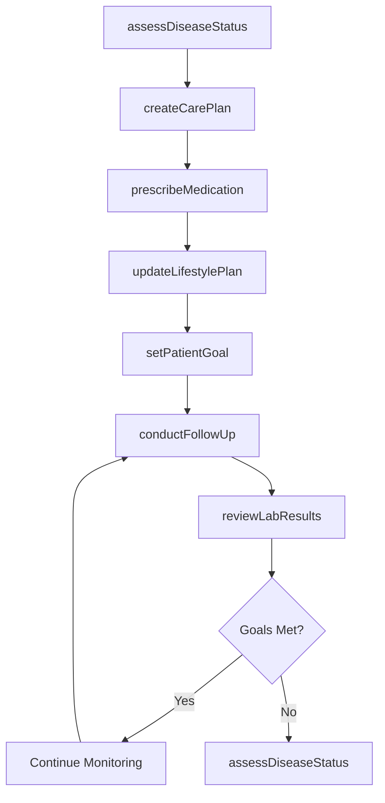
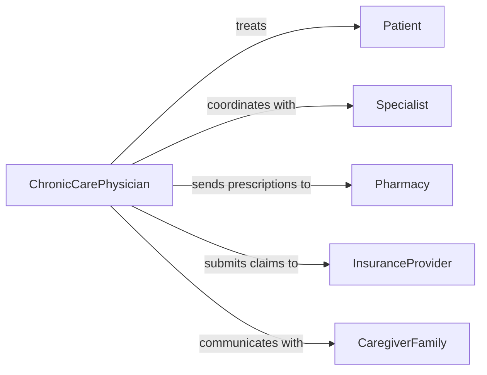

# Treat Chronic Diseases Disorders

> Business-as-Code definition for treating chronic diseases or disorders. Models the ongoing management of long-term health conditions including assessment, treatment planning, medication management, lifestyle intervention, and continuous monitoring.

## Overview

Treating chronic diseases or disorders involves the sustained management of long-term health conditions such as diabetes, hypertension, heart disease, asthma, and autoimmune disorders. This activity encompasses initial assessment, developing individualized care plans, prescribing and adjusting medications, coordinating lifestyle modifications, monitoring disease progression through regular evaluations, and managing comorbidities. It requires ongoing patient engagement and coordination across primary care, specialty providers, and allied health professionals.

## Actors

| Actor | Description |
|-------|-------------|
| Patient | Individual living with a chronic disease requiring ongoing treatment |
| PrimaryCareProvider | Physician managing the patient's overall health and chronic condition |
| Specialist | Physician with expertise in a specific chronic disease area |
| Pharmacy | Dispenses chronic disease medications and manages refills |
| InsuranceProvider | Authorizes ongoing treatment coverage and medication formularies |
| CaregiverFamily | Family members or caregivers supporting the patient's daily management |

## Roles

| Role | Description |
|------|-------------|
| ChronicCarePhysician | Leads the treatment plan and makes clinical decisions |
| CareManager | Coordinates between providers and monitors patient adherence |
| NurseEducator | Provides disease-specific education and self-management coaching |
| Dietitian | Develops nutritional plans to support chronic disease management |
| PharmacistConsultant | Reviews medication regimens and advises on drug interactions |

## Entities

| Entity | Description |
|--------|-------------|
| CarePlan | An individualized treatment plan with goals, interventions, and timelines |
| MedicationRegimen | The set of prescribed medications with dosages and schedules |
| DiseaseAssessment | A periodic evaluation of disease status and progression |
| LifestylePlan | Structured recommendations for diet, exercise, and behavior modification |
| LabResult | Clinical test values used to monitor disease biomarkers |
| PatientGoal | A measurable health objective agreed upon by patient and provider |

## Actions

| Action | Description |
|--------|-------------|
| assessDiseaseStatus | Evaluate the current state and progression of the chronic condition |
| createCarePlan | Develop an individualized plan with treatment goals and interventions |
| prescribeMedication | Order or adjust medications for chronic disease management |
| conductFollowUp | Perform a scheduled review of the patient's condition and adherence |
| updateLifestylePlan | Modify dietary, exercise, or behavioral recommendations |
| reviewLabResults | Analyze clinical test values to guide treatment adjustments |
| setPatientGoal | Establish measurable health targets with the patient |

## Events

| Event | Description |
|-------|-------------|
| diseaseStatusAssessed | A chronic condition evaluation has been completed |
| carePlanCreated | A new individualized care plan has been established |
| medicationPrescribed | Chronic disease medications have been ordered or adjusted |
| followUpConducted | A scheduled patient review has been completed |
| lifestylePlanUpdated | Dietary or behavioral recommendations have been modified |
| labResultsReviewed | Clinical test values have been analyzed and documented |
| patientGoalSet | A health target has been agreed upon with the patient |

## Searches

| Search | Description |
|--------|-------------|
| findCarePlans | Retrieve care plans by patient, condition, or status |
| getMedicationRegimens | List active medication regimens by patient or drug class |
| getLabTrends | Retrieve lab result trends over time for a specific biomarker |
| findOverdueFollowUps | Locate patients who have missed scheduled follow-up appointments |

## Workflow



## Actor Relationships



## Usage

### Calling Actions

```typescript
import { treatChronicDiseasesDisorders } from '@headlessly/treat-chronic-diseases-disorders'

const chronicCare = treatChronicDiseasesDisorders()

// Assess current disease status
const assessment = await chronicCare.assessDiseaseStatus({
  patientId: 'patient-5612',
  condition: 'type-2-diabetes',
  metrics: { hba1c: 7.8, fastingGlucose: 145, bloodPressure: '138/88' }
})

// Create a care plan
const plan = await chronicCare.createCarePlan({
  patientId: assessment.patientId,
  condition: 'type-2-diabetes',
  goals: [
    { metric: 'HbA1c', target: 6.5, timeframe: '6-months' },
    { metric: 'blood-pressure', target: '130/80', timeframe: '3-months' }
  ],
  interventions: ['medication-adjustment', 'dietary-counseling', 'exercise-program']
})

// Prescribe medication
await chronicCare.prescribeMedication({
  patientId: 'patient-5612',
  carePlanId: plan.id,
  medications: [
    { drug: 'Metformin', dosage: '1000mg', frequency: 'twice-daily' },
    { drug: 'Lisinopril', dosage: '10mg', frequency: 'once-daily' }
  ]
})
```

### Event-Driven Automation

```typescript
// Alert on concerning lab results
chronicCare.labResultsReviewed(async ({ patientId, results }) => {
  const hba1c = results.find(r => r.metric === 'HbA1c')
  if (hba1c && hba1c.value > 9.0) {
    await notify({
      to: 'care-manager',
      message: `Critical HbA1c of ${hba1c.value} for patient ${patientId} - immediate intervention needed`
    })
  }
})

// Auto-schedule follow-up after care plan creation
chronicCare.carePlanCreated(async ({ patientId, carePlanId }) => {
  await scheduleAppointment({
    patientId,
    type: 'follow-up',
    date: addWeeks(new Date(), 4),
    reason: 'Initial care plan follow-up and lab review'
  })
})
```
