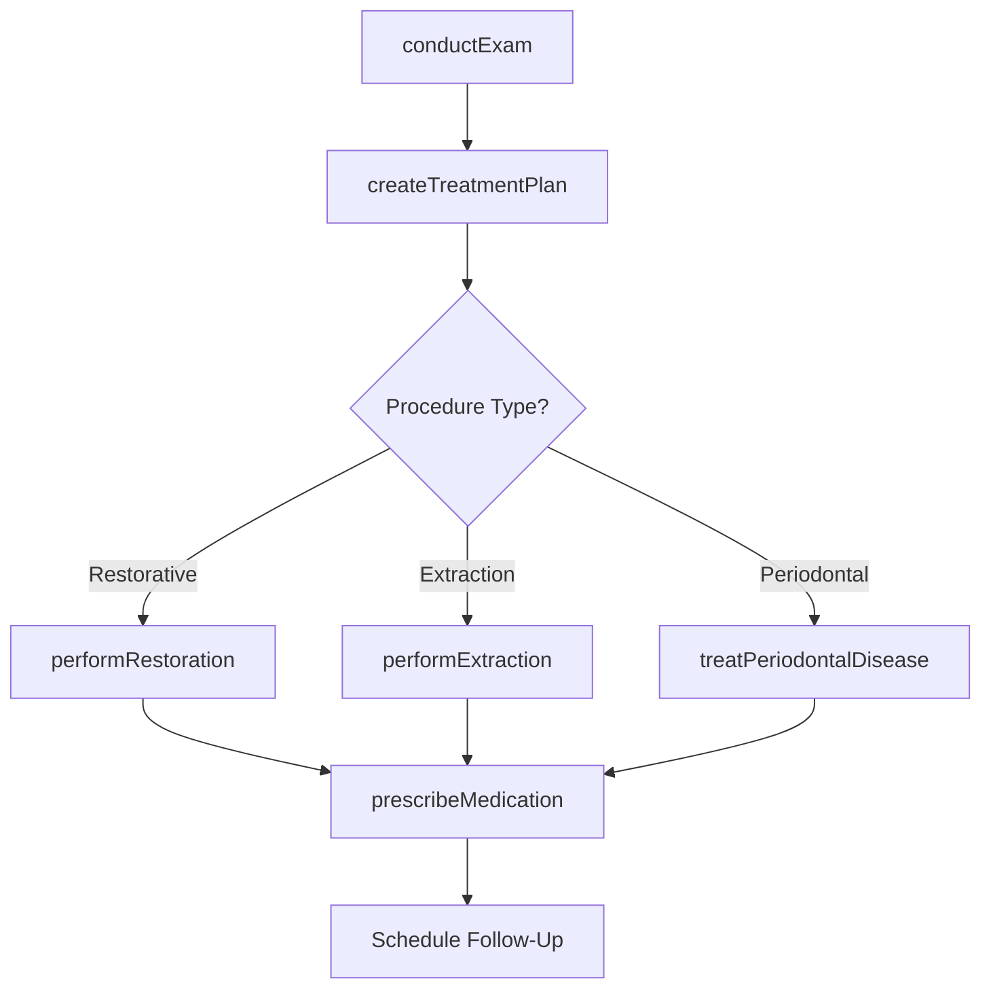
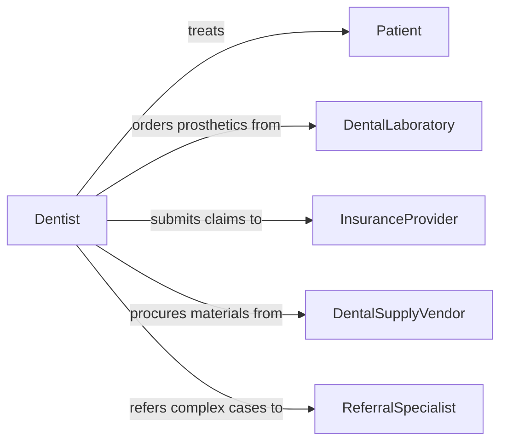

# Treat Dental Problems Diseases

> Business-as-Code definition for treating dental problems or diseases. Models the dental treatment lifecycle from examination and diagnosis through restorative, periodontal, endodontic, and surgical procedures with follow-up care.

## Overview

Treating dental problems or diseases involves diagnosing oral health conditions and performing restorative, therapeutic, and surgical dental procedures. This activity covers cavity restoration, periodontal treatment, root canal therapy, extractions, prosthodontic work, and management of oral pathology. It includes patient examination, treatment planning, procedure execution, pain management, and follow-up care, with coordination across dental specialists, laboratories, and insurance entities.

## Actors

| Actor | Description |
|-------|-------------|
| Patient | Individual seeking treatment for a dental problem or disease |
| DentalLaboratory | Fabricates crowns, bridges, dentures, and other prosthetic devices |
| InsuranceProvider | Authorizes and reimburses dental treatment claims |
| DentalSupplyVendor | Provides materials, instruments, and dental supplies |
| ReferralSpecialist | Endodontist, periodontist, or oral surgeon receiving referrals |

## Roles

| Role | Description |
|------|-------------|
| Dentist | Licensed professional who diagnoses and treats dental conditions |
| DentalHygienist | Performs cleanings, applies preventive treatments, and educates patients |
| DentalAssistant | Assists during procedures and manages instrument preparation |
| OralSurgeon | Performs surgical extractions and jaw procedures |
| TreatmentCoordinator | Manages patient scheduling, treatment plans, and financial arrangements |

## Entities

| Entity | Description |
|--------|-------------|
| DentalExam | A comprehensive oral examination with clinical findings |
| TreatmentPlan | A sequenced plan of dental procedures to address identified conditions |
| Restoration | A specific restorative procedure such as a filling, crown, or bridge |
| Radiograph | Dental X-ray image used for diagnosis and treatment planning |
| PeriodontalRecord | Documentation of gum health measurements and periodontal status |
| Prescription | Medication order for pain management or infection control |

## Actions

| Action | Description |
|--------|-------------|
| conductExam | Perform a comprehensive oral examination and document findings |
| createTreatmentPlan | Develop a sequenced plan of dental procedures for the patient |
| performRestoration | Execute a restorative procedure such as a filling or crown |
| performExtraction | Surgically remove a tooth or teeth |
| treatPeriodontalDisease | Administer scaling, root planing, or other periodontal therapies |
| prescribeMedication | Order analgesics, antibiotics, or other dental medications |
| orderProsthetic | Request fabrication of a crown, bridge, denture, or implant component |

## Events

| Event | Description |
|-------|-------------|
| examConducted | A comprehensive dental examination has been completed |
| treatmentPlanCreated | A dental treatment plan has been established |
| restorationPerformed | A restorative dental procedure has been completed |
| extractionPerformed | A tooth extraction has been completed |
| periodontalDiseaseTreated | Periodontal therapy has been administered |
| medicationPrescribed | Dental medication has been ordered for the patient |
| prostheticOrdered | A prosthetic device has been sent to the laboratory for fabrication |

## Searches

| Search | Description |
|--------|-------------|
| findTreatmentPlans | Retrieve treatment plans by patient, status, or procedure type |
| getPatientHistory | List dental procedures and examinations for a specific patient |
| findPendingRestorations | Locate incomplete restorative procedures across patients |
| getProstheticOrders | Retrieve prosthetic fabrication orders by status or laboratory |

## Workflow



## Actor Relationships



## Usage

### Calling Actions

```typescript
import { treatDentalProblemsDiseases } from '@headlessly/treat-dental-problems-diseases'

const dental = treatDentalProblemsDiseases()

// Conduct a dental examination
const exam = await dental.conductExam({
  patientId: 'patient-6732',
  findings: [
    { tooth: 14, condition: 'occlusal-caries', severity: 'moderate' },
    { tooth: 30, condition: 'cracked-cusp', severity: 'significant' }
  ],
  periodontalStatus: 'mild-gingivitis',
  radiographsTaken: ['bitewing-right', 'bitewing-left', 'periapical-30']
})

// Create a treatment plan
const plan = await dental.createTreatmentPlan({
  patientId: exam.patientId,
  examId: exam.id,
  procedures: [
    { tooth: 14, procedure: 'composite-restoration', priority: 1 },
    { tooth: 30, procedure: 'porcelain-crown', priority: 2 }
  ]
})

// Perform the restoration
await dental.performRestoration({
  treatmentPlanId: plan.id,
  tooth: 14,
  procedure: 'composite-restoration',
  material: 'composite-resin',
  anesthesia: 'lidocaine-2pct-epi'
})
```

### Event-Driven Automation

```typescript
// Order prosthetic after restoration planning
dental.treatmentPlanCreated(async ({ patientId, procedures }) => {
  const crownProcedures = procedures.filter(p => p.procedure === 'porcelain-crown')
  for (const proc of crownProcedures) {
    await dental.orderProsthetic({
      patientId,
      tooth: proc.tooth,
      type: 'porcelain-crown',
      shade: 'A2',
      laboratory: 'precision-dental-lab'
    })
  }
})

// Schedule follow-up after extraction
dental.extractionPerformed(async ({ patientId, tooth }) => {
  await scheduleAppointment({
    patientId,
    type: 'post-extraction-check',
    date: addDays(new Date(), 7),
    reason: `Healing check for tooth ${tooth} extraction`
  })
})
```
