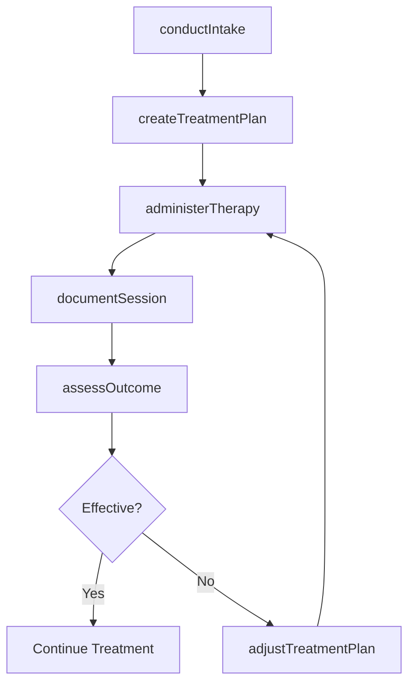
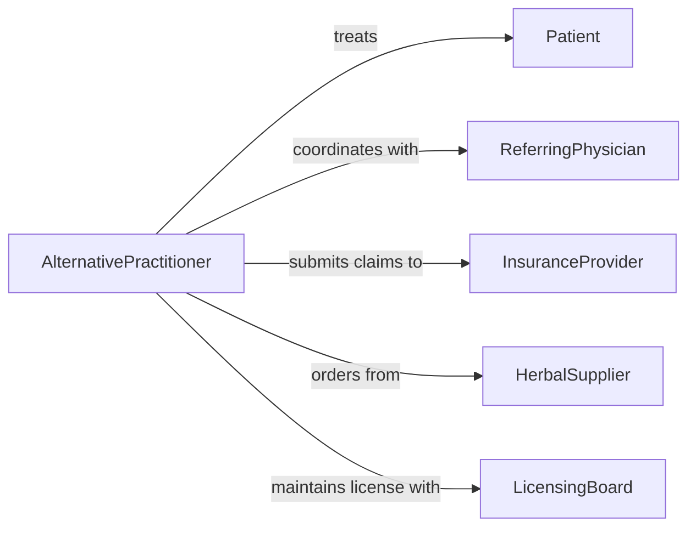

# Treat Patients Using Alternative Medical

> Business-as-Code definition for treating patients using alternative medical procedures. Models the delivery of complementary and alternative medicine therapies including acupuncture, chiropractic, naturopathic, and holistic treatment modalities.

## Overview

Treating patients using alternative medical procedures involves assessing patient conditions, selecting appropriate complementary or alternative therapies, and administering treatments such as acupuncture, chiropractic manipulation, herbal medicine, homeopathy, and other non-conventional modalities. This activity includes intake assessment, treatment planning, therapy delivery, and outcome monitoring, often coordinating with conventional medical practitioners to provide integrative care.

## Actors

| Actor | Description |
|-------|-------------|
| Patient | Individual receiving alternative medical treatment |
| ReferringPhysician | Conventional medical provider who refers patients for alternative care |
| InsuranceProvider | Organization that evaluates and reimburses alternative treatment claims |
| HerbalSupplier | Vendor providing herbal remedies, supplements, and natural products |
| LicensingBoard | Regulatory body that credentials alternative medicine practitioners |

## Roles

| Role | Description |
|------|-------------|
| AlternativePractitioner | Licensed provider who delivers alternative medical therapies |
| IntakeCoordinator | Conducts initial patient assessments and gathers health histories |
| TreatmentAssistant | Supports the practitioner during therapy sessions |
| CareNavigator | Coordinates between alternative and conventional care providers |

## Entities

| Entity | Description |
|--------|-------------|
| TreatmentPlan | A structured plan outlining alternative therapies for a patient |
| TherapySession | A single treatment encounter with documented procedures and outcomes |
| PatientIntake | Initial assessment record including health history and presenting concerns |
| Modality | A specific type of alternative therapy such as acupuncture or chiropractic |
| HerbalFormulation | A prescribed combination of natural remedies or supplements |
| OutcomeAssessment | Evaluation of treatment effectiveness and patient progress |

## Actions

| Action | Description |
|--------|-------------|
| conductIntake | Perform initial patient assessment and health history review |
| createTreatmentPlan | Develop a therapy plan based on diagnosis and modality selection |
| administerTherapy | Deliver a specific alternative medical treatment to the patient |
| prescribeFormulation | Recommend herbal remedies or supplements for the patient |
| assessOutcome | Evaluate patient response and treatment effectiveness |
| adjustTreatmentPlan | Modify therapies based on patient progress and feedback |
| documentSession | Record therapy session details and clinical observations |

## Events

| Event | Description |
|-------|-------------|
| intakeConducted | A patient intake assessment has been completed |
| treatmentPlanCreated | A new alternative therapy plan has been established |
| therapyAdministered | An alternative treatment session has been delivered |
| formulationPrescribed | Herbal remedies or supplements have been recommended |
| outcomeAssessed | Treatment effectiveness has been evaluated |
| treatmentPlanAdjusted | A therapy plan has been modified based on progress |
| sessionDocumented | Clinical notes for a therapy session have been recorded |

## Searches

| Search | Description |
|--------|-------------|
| findTreatmentPlans | Retrieve treatment plans by patient, modality, or status |
| getTherapySessions | List therapy sessions by patient, practitioner, or date range |
| findModalityOutcomes | Query treatment outcomes by modality type and effectiveness |
| getPatientHistory | Retrieve complete alternative care history for a patient |

## Workflow



## Actor Relationships



## Usage

### Calling Actions

```typescript
import { treatPatientsUsingAlternativeMedical } from '@headlessly/treat-patients-using-alternative-medical'

const altMedicine = treatPatientsUsingAlternativeMedical()

// Conduct patient intake
const intake = await altMedicine.conductIntake({
  patientId: 'patient-4921',
  chiefConcern: 'Chronic lower back pain',
  healthHistory: { allergies: [], medications: ['ibuprofen'], priorTreatments: ['physical-therapy'] }
})

// Create a treatment plan
const plan = await altMedicine.createTreatmentPlan({
  patientId: intake.patientId,
  modalities: ['acupuncture', 'chiropractic-adjustment'],
  frequency: 'weekly',
  duration: '8 weeks'
})

// Administer a therapy session
await altMedicine.administerTherapy({
  treatmentPlanId: plan.id,
  modality: 'acupuncture',
  points: ['BL-23', 'BL-25', 'GB-30'],
  duration: 45
})
```

### Event-Driven Automation

```typescript
// Schedule follow-up after therapy
altMedicine.therapyAdministered(async ({ patientId, treatmentPlanId, modality }) => {
  await scheduleFollowUp({
    patientId,
    treatmentPlanId,
    nextSessionDate: addDays(new Date(), 7)
  })
})

// Alert practitioner when outcomes decline
altMedicine.outcomeAssessed(async ({ patientId, treatmentPlanId, effectivenessScore }) => {
  if (effectivenessScore < 3) {
    await notify({
      to: 'practitioner',
      message: `Treatment plan ${treatmentPlanId} showing low effectiveness for patient ${patientId}`
    })
  }
})
```
