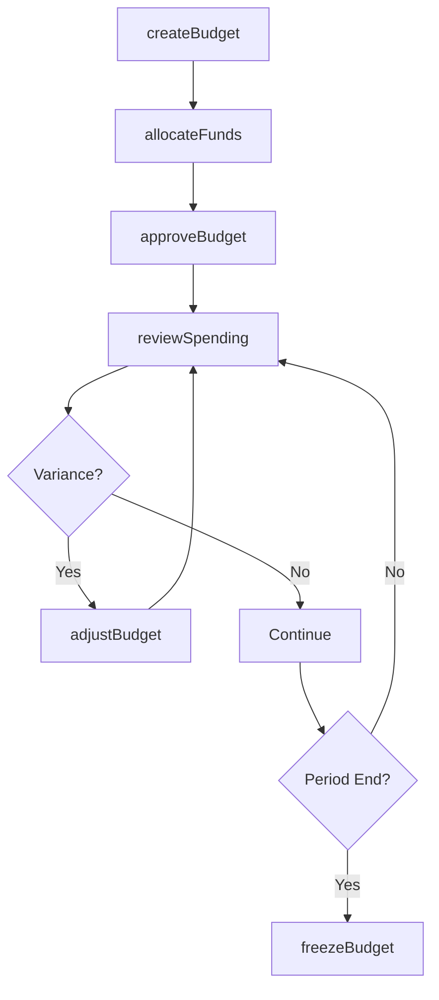
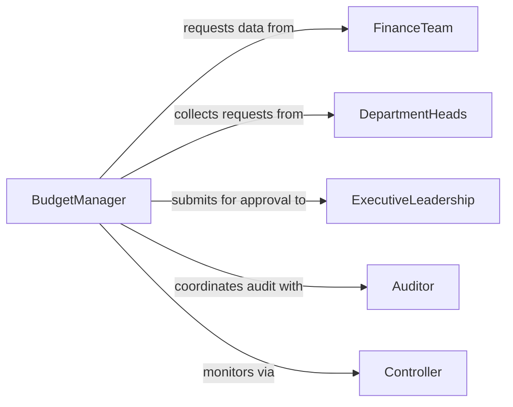

# Tasks Business-as-Code

This folder contains MDX definitions for ~2,086 O*NET Detailed Work Activities (DWAs) modeled as Business-as-Code APIs.

## Hierarchy

```
WorkActivity (41)     → top-level folders  (e.g., GettingInformation/)
  IWA (331)           → mid-level folders  (e.g., ObtainInformationAboutGoodsOrServices/)
    DWA (2,086)       → MDX files          (e.g., ReviewProductSpecifications.mdx)
```

Each DWA maps to multiple occupation-specific tasks (18,797 total) via the Task-to-DWA relationship.

## Your Task

When assigned a DWA file, fill in the TODO sections following the template below. Each DWA should be a complete, programmable API definition representing a generalized business process.

## Template Reference

Use this example as your model:

```mdx
---
name: Manage Organizational Budgets
dwaCode: 4.A.4.b.4.I09.D04
dwaTitle: Manage organizational budgets.
iwa: Plan organizational operations
iwaCode: 4.A.4.b.4.I09
workActivity: Guiding, Directing, and Motivating Subordinates
workActivityCode: 4.A.4.b.4
action: Manage
object: Organizational Budgets
---

# Manage Organizational Budgets

> Business-as-Code definition for organizational budget management. Models the complete budget lifecycle from planning through allocation and monitoring.

## Overview

Organizational budget management involves developing, reviewing, and controlling budgets for departments, projects, and programs. This definition exposes actions for each phase of the budget cycle, events for workflow automation, and searches for data retrieval.

## Actors

| Actor | Description |
|-------|-------------|
| FinanceTeam | Provides financial data and budget templates |
| DepartmentHeads | Submit budget requests and justify expenditures |
| ExecutiveLeadership | Approves final budget allocations |
| Auditor | Reviews budget compliance and spending accuracy |
| Controller | Monitors spending against approved budgets |
| Vendor | Provides goods and services that consume budget |

## Roles

| Role | Description |
|------|-------------|
| BudgetManager | Oversees the entire budget process |
| FinancialAnalyst | Analyzes spending trends and forecasts |
| Approver | Reviews and approves budget line items |
| Requester | Submits budget requests for funding |

## Entities

| Entity | Description |
|--------|-------------|
| Budget | A financial plan for a specific period |
| LineItem | An individual expense or revenue category |
| Allocation | Funds assigned to a department or project |
| Forecast | Projected spending based on trends |
| Variance | Difference between planned and actual spending |
| Request | A formal ask for budget allocation |

## Actions

| Action | Description |
|--------|-------------|
| createBudget | Initialize a new budget for a period or project |
| allocateFunds | Assign funds to departments or line items |
| reviewSpending | Analyze actual spending against plan |
| adjustBudget | Modify allocations based on changing needs |
| approveBudget | Formally approve a budget or amendment |
| forecastSpending | Project future spending from current trends |
| freezeBudget | Lock budget to prevent further changes |

## Events

| Event | Description |
|-------|-------------|
| budgetCreated | A new budget has been initialized |
| fundsAllocated | Funds have been assigned to a category |
| spendingReviewed | Spending analysis is complete |
| budgetAdjusted | Budget allocations have been modified |
| budgetApproved | Budget has been formally approved |
| varianceDetected | Spending deviates from plan beyond threshold |
| budgetFrozen | Budget has been locked for the period |

## Searches

| Search | Description |
|--------|-------------|
| findBudgets | List budgets by period, department, or status |
| getSpending | Retrieve actual spending by category or period |
| getVariances | Find line items where spending deviates from plan |
| getForecasts | Retrieve projected spending for upcoming periods |

## Workflow



## Actor Relationships



## Usage

### Calling Actions

```typescript
import { manageOrganizationalBudgets } from '@headlessly/manage-organizational-budgets'

const budgets = manageOrganizationalBudgets()

// Create a new annual budget
const budget = await budgets.createBudget({
  name: 'FY2026 Operating Budget',
  period: { start: '2026-01-01', end: '2026-12-31' },
  totalAmount: 5000000
})

// Allocate funds to departments
await budgets.allocateFunds({
  budgetId: budget.id,
  allocations: [
    { department: 'Engineering', amount: 2000000 },
    { department: 'Marketing', amount: 1500000 },
    { department: 'Operations', amount: 1500000 }
  ]
})

// Review current spending
const review = await budgets.reviewSpending({
  budgetId: budget.id,
  period: 'Q1'
})
```

### Event-Driven Automation

```typescript
// Alert on significant variance
budgets.varianceDetected(async ({ budgetId, lineItem, variance }) => {
  if (Math.abs(variance.percentage) > 15) {
    await notify({
      to: 'finance-team',
      message: `Budget variance of ${variance.percentage}% on ${lineItem}`
    })
  }
})

// Auto-freeze at period end
budgets.budgetApproved(async ({ budgetId, period }) => {
  if (isPeriodEnd(period)) {
    await budgets.freezeBudget({ budgetId })
  }
})
```
```

## Key Guidelines

1. **Actors** = External parties the business interacts with (suppliers, customers, regulators)
2. **Roles** = Internal positions/jobs within the business
3. **Entities** = Domain objects and data the business manages
4. **Actions** = Functions the business can execute (camelCase)
5. **Events** = Past-tense outcomes that trigger automation (camelCase)
6. **Searches** = Query functions to retrieve data (camelCase)

## Package Naming

The `action` and `object` frontmatter fields generate the package name:
- action: `Manage`, object: `Organizational Budgets` → `@headlessly/manage-organizational-budgets`
- action: `Review`, object: `Product Specifications` → `@headlessly/review-product-specifications`

Keep action and object in **Title Case** to preserve acronyms (IT, HVAC, HR, etc.)

## Workflow & Actor Diagrams

- Use Mermaid `graph TD` for sequential workflows
- Use Mermaid `graph LR` for actor relationship maps
- Keep diagrams focused on the 5-10 most important steps/relationships

## DO NOT

- Do not invent placeholder data - use realistic business terms
- Do not add sections not in the template
- Do not change the frontmatter structure
- Do not include the word "API" in headings
- Do not use emoji

## Source Data

Curated activity data is in `_curation/` with:
- `workActivities.tsv`: 41 top-level work activities
- `iwas.tsv`: 331 intermediate work activities
- `dwas.tsv`: 2,086 detailed work activities with action/object pairs
