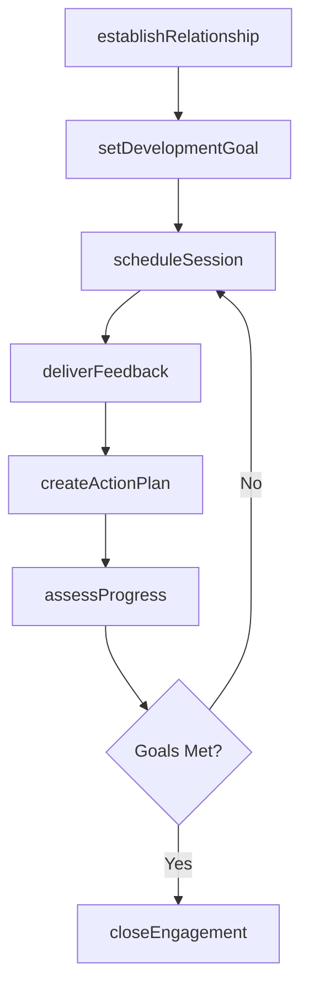
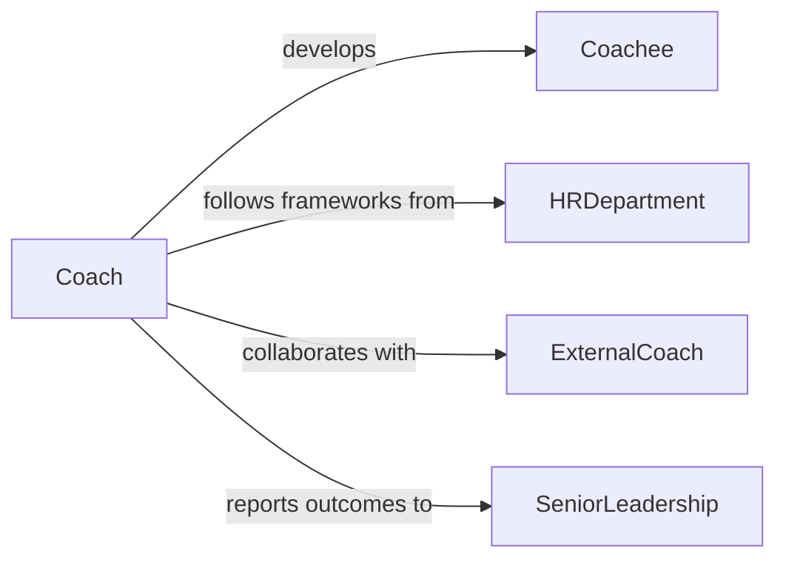

# Coach Others

> Business-as-Code definition for coaching others. Models the structured development of individuals through goal setting, skill assessment, feedback delivery, and progress tracking.

## Overview

Coaching others involves providing structured guidance, feedback, and support to help individuals develop their professional skills, overcome challenges, and achieve performance goals. This definition provides actions for establishing coaching relationships, setting development objectives, conducting coaching sessions, and measuring progress. It enables automation of coaching session scheduling, development plan tracking, and outcome assessment workflows.

## Actors

| Actor | Description |
|-------|-------------|
| Coachee | Individual receiving coaching for professional development |
| HRDepartment | Provides coaching frameworks, policies, and program support |
| ExternalCoach | Contracted professional coach for specialized development |
| SeniorLeadership | Sponsors coaching programs and provides organizational context |

## Roles

| Role | Description |
|------|-------------|
| Coach | Provides guidance, feedback, and skill development support |
| CoachingProgramManager | Administers the organizational coaching program |
| Mentor | Offers experienced perspective alongside formal coaching |
| PerformanceManager | Integrates coaching outcomes with performance evaluations |

## Entities

| Entity | Description |
|--------|-------------|
| CoachingRelationship | Formal pairing between a coach and coachee |
| DevelopmentGoal | A specific skill or competency target for the coachee |
| CoachingSession | A scheduled meeting between coach and coachee |
| FeedbackRecord | Documented observations and guidance provided |
| ProgressAssessment | Periodic evaluation of coachee development |
| ActionPlan | Concrete steps the coachee commits to between sessions |
| CompetencyModel | Framework defining skills and behaviors for development |

## Actions

| Action | Description |
|--------|-------------|
| establishRelationship | Create a formal coaching pairing with objectives |
| setDevelopmentGoal | Define a specific skill or competency target |
| scheduleSession | Plan a coaching meeting between coach and coachee |
| deliverFeedback | Provide structured observations and guidance |
| createActionPlan | Define concrete steps for coachee to work on |
| assessProgress | Evaluate advancement toward development goals |
| closeEngagement | Conclude the coaching relationship with final assessment |

## Events

| Event | Description |
|-------|-------------|
| relationshipEstablished | A coaching pairing has been formalized |
| developmentGoalSet | A skill or competency target has been defined |
| sessionScheduled | A coaching meeting has been planned |
| feedbackDelivered | Observations and guidance have been provided |
| actionPlanCreated | Concrete development steps have been defined |
| progressAssessed | A development evaluation has been completed |
| engagementClosed | The coaching relationship has been concluded |

## Searches

| Search | Description |
|--------|-------------|
| findCoachingRelationships | List active coaching pairings by coach or coachee |
| getSessionHistory | Retrieve past coaching sessions for a relationship |
| getDevelopmentGoals | List goals by status, coachee, or competency area |
| getProgressReports | Retrieve development assessments by coachee or period |
| findAvailableCoaches | List coaches with capacity for new engagements |

## Workflow



## Actor Relationships



## Usage

### Calling Actions

```typescript
import { coachOthers } from '@headlessly/coach-others'

const coaching = coachOthers()

// Establish a new coaching relationship
const relationship = await coaching.establishRelationship({
  coach: 'manager-garcia',
  coachee: 'analyst-chen',
  focus: 'leadership-development',
  duration: '6-months'
})

// Set a development goal
await coaching.setDevelopmentGoal({
  relationshipId: relationship.id,
  goal: 'Lead cross-functional project independently',
  competency: 'project-leadership',
  targetDate: '2026-09-30'
})

// Schedule a coaching session
await coaching.scheduleSession({
  relationshipId: relationship.id,
  date: '2026-04-10',
  duration: 60,
  agenda: ['review-action-items', 'discuss-challenges', 'set-next-steps']
})
```

### Event-Driven Automation

```typescript
// Auto-schedule next session after feedback delivery
coaching.feedbackDelivered(async ({ relationshipId }) => {
  await coaching.scheduleSession({
    relationshipId,
    daysFromNow: 14,
    duration: 60
  })
})

// Notify when progress assessment shows goal completion
coaching.progressAssessed(async ({ relationshipId, goalId, completion }) => {
  if (completion >= 100) {
    await coaching.closeEngagement({ relationshipId })
    await notify({
      to: 'hr-department',
      message: `Coaching goal achieved for relationship ${relationshipId}`
    })
  }
})
```
