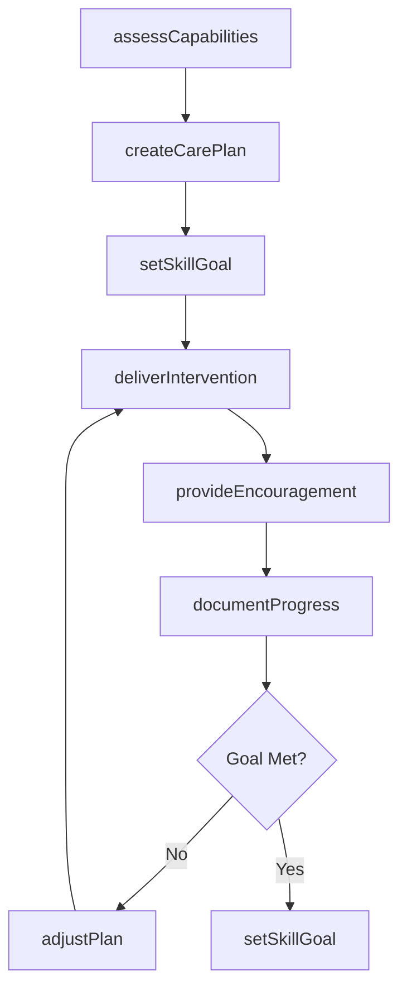
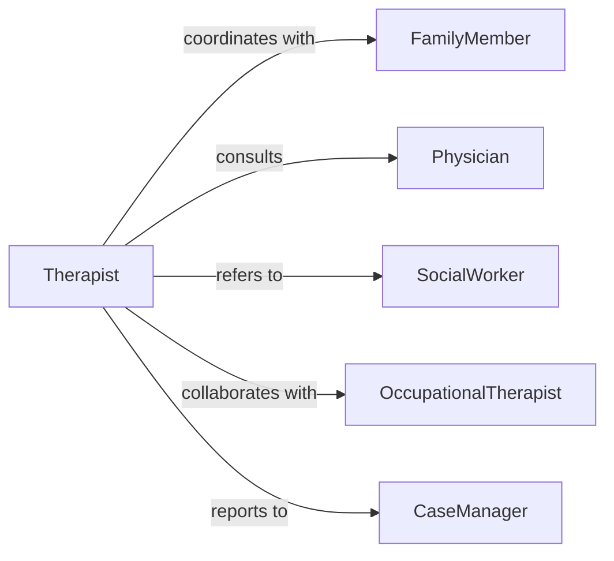

# Encourage Patients Clients Develop Life

> Business-as-Code definition for life skills development support. Models therapeutic and rehabilitative processes to help patients and clients build independence, coping strategies, and functional capabilities.

## Overview

Life skills development encouragement involves supporting patients and clients in building practical competencies for daily living, social interaction, and self-management. This definition exposes actions for assessing capabilities, setting development goals, delivering interventions, and tracking functional improvements.

## Actors

| Actor | Description |
|-------|-------------|
| FamilyMember | Provides home support and reinforcement |
| Physician | Prescribes medical aspects of treatment plans |
| SocialWorker | Coordinates community resources and support |
| OccupationalTherapist | Delivers functional skill training |
| CaseManager | Oversees integrated care and progress |
| SupportGroup | Offers peer encouragement and shared learning |

## Roles

| Role | Description |
|------|-------------|
| Therapist | Delivers therapeutic interventions and guidance |
| Counselor | Provides emotional support and coping strategies |
| LifeSkillsCoach | Teaches practical daily living competencies |
| Facilitator | Leads group skill-building sessions |

## Entities

| Entity | Description |
|--------|-------------|
| Patient | Individual receiving life skills support |
| LifeSkill | Specific functional capability to develop |
| CarePlan | Structured roadmap for skill development |
| Assessment | Evaluation of current functional abilities |
| Intervention | Targeted activity to build specific skills |
| ProgressNote | Documentation of advancement or setbacks |

## Actions

| Action | Description |
|--------|-------------|
| assessCapabilities | Evaluate current functional skill levels |
| createCarePlan | Establish structured skill development roadmap |
| setSkillGoal | Define specific life skill objectives |
| deliverIntervention | Provide targeted skill-building activity |
| provideEncouragement | Offer positive reinforcement and motivation |
| documentProgress | Record advancement and observations |
| adjustPlan | Modify care plan based on progress |

## Events

| Event | Description |
|-------|-------------|
| capabilitiesAssessed | Functional abilities have been evaluated |
| carePlanCreated | Skill development roadmap has been established |
| skillGoalSet | Life skill objective has been defined |
| interventionDelivered | Skill-building activity has been provided |
| encouragementProvided | Positive reinforcement has been offered |
| progressDocumented | Advancement has been recorded |
| planAdjusted | Care plan has been modified |

## Searches

| Search | Description |
|--------|-------------|
| findPatients | Retrieve patients by skill need or progress status |
| getCarePlans | List care plans by patient or intervention type |
| getSkillGoals | Find skill objectives by category or priority |
| getProgressNotes | Retrieve documentation by patient or timeframe |

## Workflow



## Actor Relationships



## Usage

### Calling Actions

```typescript
import { encouragePatientsClientsDevelopLife } from '@headlessly/encourage-patients-clients-develop-life'

const lifeSkills = encouragePatientsClientsDevelopLife()

// Assess patient capabilities
const assessment = await lifeSkills.assessCapabilities({
  patientId: 'pat_789',
  domains: ['personal_hygiene', 'meal_preparation', 'budgeting'],
  assessmentDate: '2026-02-05'
})

// Create a care plan
const plan = await lifeSkills.createCarePlan({
  patientId: 'pat_789',
  assessmentId: assessment.id,
  focus: ['independent_living', 'social_skills'],
  duration: '6_months'
})

// Deliver an intervention
await lifeSkills.deliverIntervention({
  patientId: 'pat_789',
  planId: plan.id,
  skillArea: 'meal_preparation',
  activity: 'guided_cooking_session',
  duration: 60
})
```

### Event-Driven Automation

```typescript
// Automatically provide encouragement after interventions
lifeSkills.interventionDelivered(async ({ patientId, skillArea, outcome }) => {
  if (outcome === 'successful') {
    await lifeSkills.provideEncouragement({
      patientId,
      message: `Excellent progress in ${skillArea}. Keep up the great work!`,
      method: 'verbal'
    })
  }
})

// Adjust plan when goals are not progressing
lifeSkills.progressDocumented(async ({ patientId, planId, progress }) => {
  if (progress.status === 'no_improvement' && progress.duration > 30) {
    await lifeSkills.adjustPlan({
      patientId,
      planId,
      modifications: ['increase_frequency', 'simplify_goals']
    })
  }
})
```
