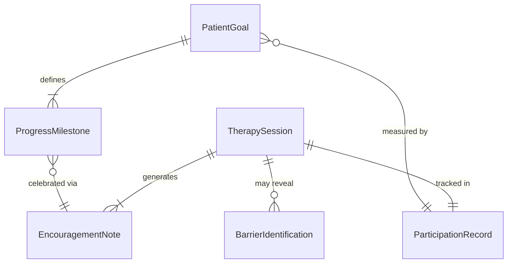
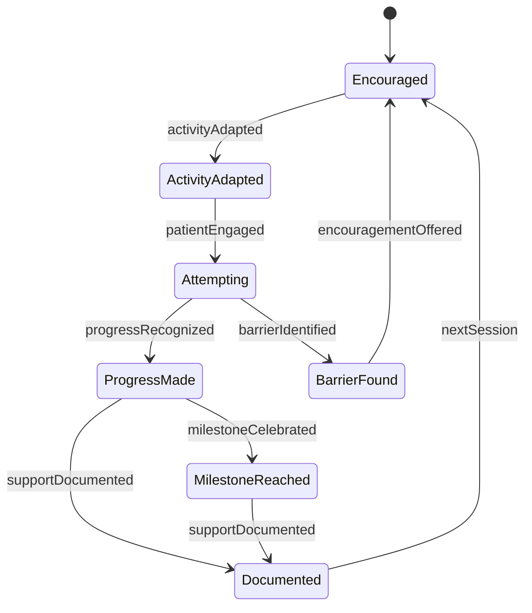
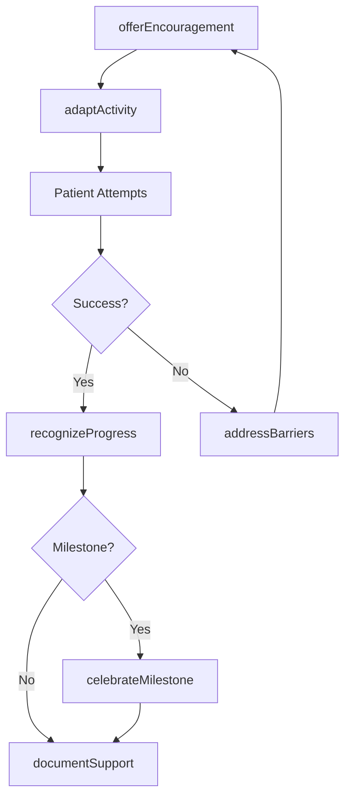
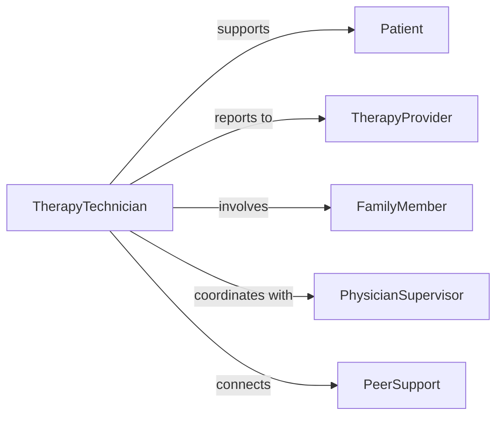

# Encourage Patients During Therapeutic Activities

> Business-as-Code definition for providing motivational support during rehabilitation and treatment. Models engagement strategies, progress recognition, and positive reinforcement workflows.

## Overview

Encouraging patients during therapeutic activities involves delivering motivational support, recognizing progress, adapting communication to individual needs, and fostering a positive treatment environment. This definition exposes actions for engagement and encouragement, events for tracking patient motivation and participation, and searches for monitoring therapeutic adherence and outcomes across physical therapy, occupational therapy, speech therapy, and mental health treatment settings.

## Actors

| Actor | Description |
|-------|-------------|
| Patient | Individual participating in therapeutic treatment |
| TherapyProvider | Licensed therapist delivering treatment |
| FamilyMember | Loved one supporting patient recovery |
| PhysicianSupervisor | Medical professional overseeing treatment plan |
| InsurancePayer | Organization funding therapeutic services |
| PeerSupport | Fellow patients sharing recovery experiences |

## Roles

| Role | Description |
|------|-------------|
| TherapyTechnician | Assists patients during therapeutic exercises |
| MotivationalCoach | Specializes in patient engagement strategies |
| ProgressTracker | Monitors and celebrates patient achievements |
| ActivityCoordinator | Designs and facilitates therapeutic sessions |

## Entities

| Entity | Description |
|--------|-------------|
| TherapySession | Scheduled treatment activity |
| PatientGoal | Specific recovery objective |
| ProgressMilestone | Measurable achievement marker |
| EncouragementNote | Documented motivational support |
| ParticipationRecord | Attendance and engagement tracking |
| BarrierIdentification | Documented obstacles to participation |

## Actions

| Action | Description |
|--------|-------------|
| offerEncouragement | Provide positive verbal or written support |
| recognizeProgress | Acknowledge patient achievements |
| adaptActivity | Modify exercise to match patient capability |
| celebrateMilestone | Formally recognize significant progress |
| addressBarriers | Identify and help overcome participation obstacles |
| provideIncentive | Offer rewards for consistent participation |
| documentSupport | Record encouragement and patient response |

## Events

| Event | Description |
|-------|-------------|
| encouragementOffered | Motivational support has been provided |
| progressRecognized | Patient achievement has been acknowledged |
| activityAdapted | Exercise modified for patient needs |
| milestoneCelebrated | Significant achievement has been honored |
| barrierIdentified | Participation obstacle has been documented |
| incentiveProvided | Reward for engagement has been delivered |
| supportDocumented | Encouragement activities have been recorded |

## Searches

| Search | Description |
|--------|-------------|
| findSessions | List therapy activities by patient or date |
| getProgress | Retrieve milestone achievements by patient |
| getParticipation | Find attendance and engagement rates |
| getBarriers | Identify obstacles affecting patient motivation |

## Entity Relationships



## State Diagram



## Workflow



## Actor Relationships



## Usage

### Calling Actions

```typescript
import { encouragePatientsDuringTherapeuticActivities } from '@headlessly/encourage-patients-during-therapeutic-activities'

const therapy = encouragePatientsDuringTherapeuticActivities()

// Offer encouragement during a session
await therapy.offerEncouragement({
  patientId: 'patient-321',
  sessionId: 'session-789',
  message: 'Great effort on that range of motion exercise',
  deliveryMethod: 'verbal'
})

// Recognize patient progress
await therapy.recognizeProgress({
  patientId: 'patient-321',
  achievement: 'Completed 10 repetitions independently',
  sessionDate: '2026-02-05'
})

// Celebrate a major milestone
await therapy.celebrateMilestone({
  patientId: 'patient-321',
  milestone: 'First unassisted walk',
  celebrationType: 'certificate',
  inviteFamily: true
})
```

### Event-Driven Automation

```typescript
// Auto-celebrate when milestones are reached
therapy.progressRecognized(async ({ patientId, achievement }) => {
  const milestones = await therapy.getProgress({ patientId })
  if (milestones.length % 5 === 0) {
    await therapy.celebrateMilestone({
      patientId,
      milestone: `${milestones.length} achievements completed`,
      celebrationType: 'recognition-card'
    })
  }
})

// Alert therapist when barriers are identified
therapy.barrierIdentified(async ({ patientId, barrier }) => {
  await notify({
    to: 'therapy-provider',
    message: `Patient ${patientId} experiencing barrier: ${barrier.description}`
  })
})
